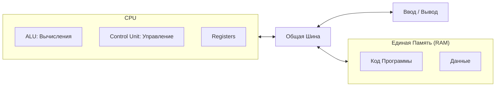
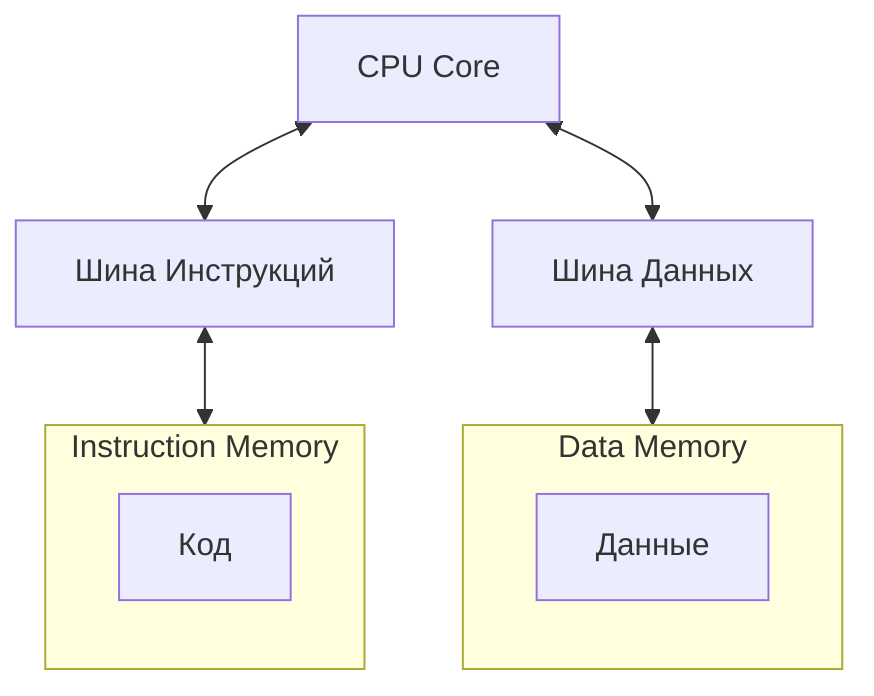
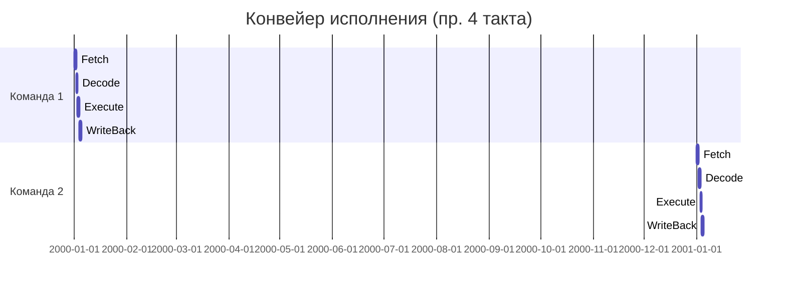
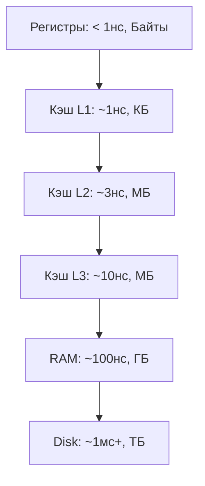

# Архитектура компьютера

## Содержание
1. [Фон-Неймановская архитектура](#1-фон-неймановская-архитектура)
2. [Гарвардская архитектура](#2-гарвардская-архитектура)
3. [Наборы инструкций (CISC vs RISC)](#3-наборы-инструкций)
4. [Микроархитектура и Конвейер](#4-микроархитектура)
5. [Иерархия памяти](#5-кэш-и-иерархия-памяти)

---

Архитектура компьютера определяет логическую организацию системы: как связаны процессор, память и устройства ввода-вывода.

---

## 1. Фон-Неймановская архитектура

Это классическая модель, по которой построено большинство современных компьютеров.

> [!NOTE]
> **Главный принцип**: Программы и данные хранятся в **одной и той же** памяти.

### Схема работы:

**Бутылочное горлышко (Bottleneck)**: Так как шина общая, процессор не может одновременно читать инструкцию и данные. Это ограничивает скорость.

---

## 2. Гарвардская архитектура

В отличие от модели фон Неймана, здесь память для кода и данных **разделена**.

### Схема:

**Где используется?** В основном в микроконтроллерах (например, Arduino/AVR) и сигнальных процессорах (DSP).

---

## 3. Наборы инструкций (ISA)

**ISA (Instruction Set Architecture)** — это "словарь" команд, которые понимает процессор.

| Тип | Полное название | Философия | Пример |
|:---|:---|:---|:---|
| **CISC** | Complex Instruction Set | "Одна команда делает много дел" | Intel x86 |
| **RISC** | Reduced Instruction Set | "Много простых команд за один такт" | ARM, Apple M1/M2 |

> [!TIP]
> Сейчас разница стирается: современные процессоры x86 внутри себя разбивают сложные команды CISC на мелкие "микрооперации", похожие на RISC.

---

## 4. Микроархитектура

Это конкретная реализация архитектуры на кристалле железа.

### Конвейер (Pipelining)
Вместо того чтобы ждать завершения одной команды, процессор начинает обрабатывать следующую сразу после того, как текущая перешла на следующий этап.

> [!WARNING]
> **Ошибки предсказания**: Если в коде есть условие (`if`), процессор пытается угадать путь. Если угадал неверно — конвейер приходится полностью "очищать", что сильно снижает скорость.

---

## 5. Иерархия памяти

Память — это баланс между **скоростью**, **объемом** и **ценой**.

> [!IMPORTANT]
> **Принцип локальности**: Процессор ожидает, что если вы обратились к ячейке памяти, то скоро обратитесь и к соседним. Поэтому он подгружает данные из RAM в Кэш целыми блоками.

---

## Ключевые выводы

- **Архитектура** — это чертеж, **Микроархитектура** — его физическое воплощение.
- **Фон-Нейман** — стандарт, **Гарвард** — для спецзадач.
- **RISC** (ARM) сейчас доминирует в мобильных устройствах и серверах за счет энергоэффективности.
- **Иерархия памяти** — это способ "обмануть" медленную RAM, используя быстрый Кэш.
