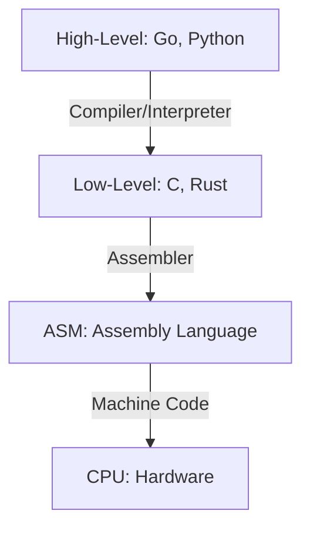
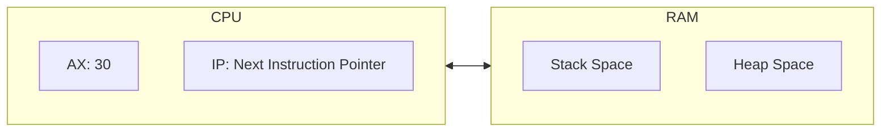
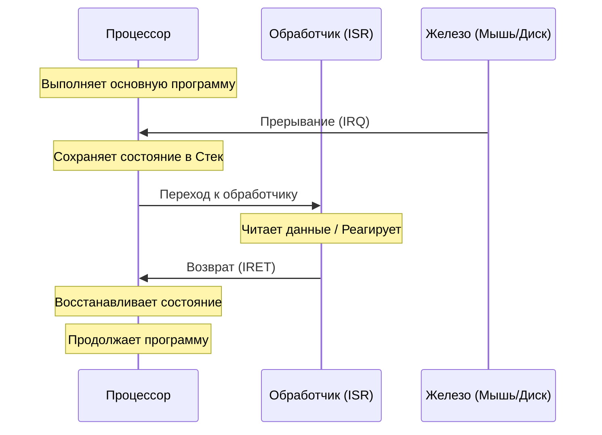

# Низкоуровневое программирование

## Содержание
1. [Машинный код](#1-машинный-код)
2. [Ассемблер](#2-ассемблер)
3. [Компиляторы и интерпретаторы](#3-компиляторы-и-интерпретаторы)
4. [Прерывания и обработка событий](#4-прерывания-и-обработка-событий)

---

Низкоуровневое программирование работает напрямую с железом. Здесь нет абстракций — только регистры, адреса памяти и инструкции процессора.



---

## 1. Машинный код

Это единственный язык, который понимает процессор. Это просто поток нулей и единиц (или HEX-кодов).

- **OpCode**: Номер операции (например, 0x01 может значить "сложить").
- **Operands**: Данные или адреса, над которыми выполняется операция.

> [!IMPORTANT]
> Машинный код **непереносим**. Код для Intel (x86) не запустится на iPhone (ARM) или Apple M1/M2 без эмулятора.

---

## 2. Ассемблер (ASM)

Это человеко-читаемая форма машинного кода. Вместо `0xB8 0x05` мы пишем `MOV AX, 5`.

### Как это выглядит (пример x86):
```asm
; Сложение двух чисел
MOV AX, 10    ; Записать 10 в регистр AX
ADD AX, 20    ; Прибавить 20 к значению в AX
; Теперь в AX лежит 30
```

### Основные понятия:
- **Регистры**: "Карманы" процессора. Очень быстрые, но их мало.
- **Стек (Stack)**: Область памяти для временного хранения адресов возврата и локальных переменных.
- **Метки (Labels)**: Имена для адресов в коде, чтобы делать прыжки (`JMP`).



---

## 3. Компиляторы vs Интерпретаторы

| Свойство | Компилятор (C, Rust, Go) | Интерпретатор (Python, JS) |
|:---|:---|:---|
| **Когда?** | До запуска | Во время работы |
| **Скорость** | Максимальная | Медленнее (оверхед) |
| **Портативность** | Нужно пересобирать под каждую ОС | Запустится везде, где есть интерпретатор |

> [!TIP]
> **JIT-компиляция (Just-In-Time)**: Браузеры (V8 в Chrome) и Java используют гибрид — они компилируют часто вызываемый код в машинный прямо на лету для ускорения.

---

## 4. Прерывания (Interrupts)

Это механизм, позволяющий железу "похлопать процессор по плечу" и сказать: "Эй, я закончил или у меня данные!".



### Типы прерываний:
1. **Аппаратные**: Нажата клавиша, пришел пакет по сети.
2. **Программные (Системные вызовы)**: Программа просит ОС:"Запиши этот файл на диск".
3. **Исключения (Exceptions)**: Деление на ноль, ошибка доступа к памяти (Segment Fault).

---

## Ключевые выводы

- **Ассемблер** — это способ говорить с CPU на его родном языке.
- **Регистры** — самые быстрые ячейки памяти в мире.
- **Компиляция** превращает код в холодный машинный бинарник.
- **Прерывания** — основа интерактивности и многозадачности системы.
