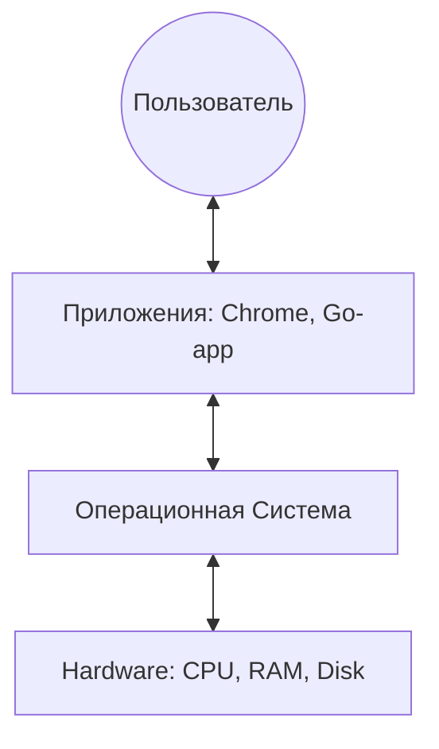
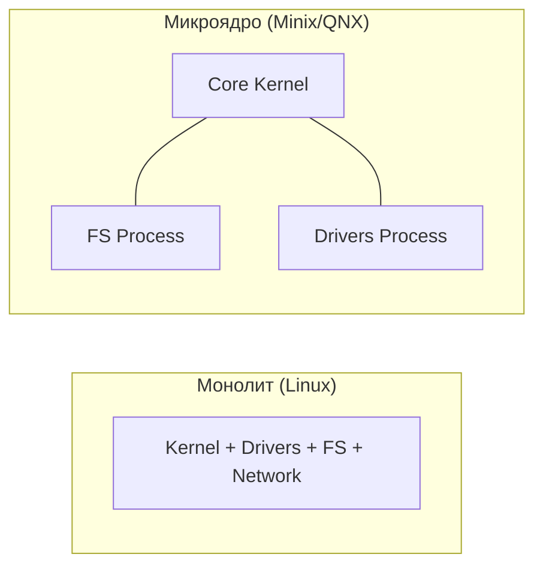
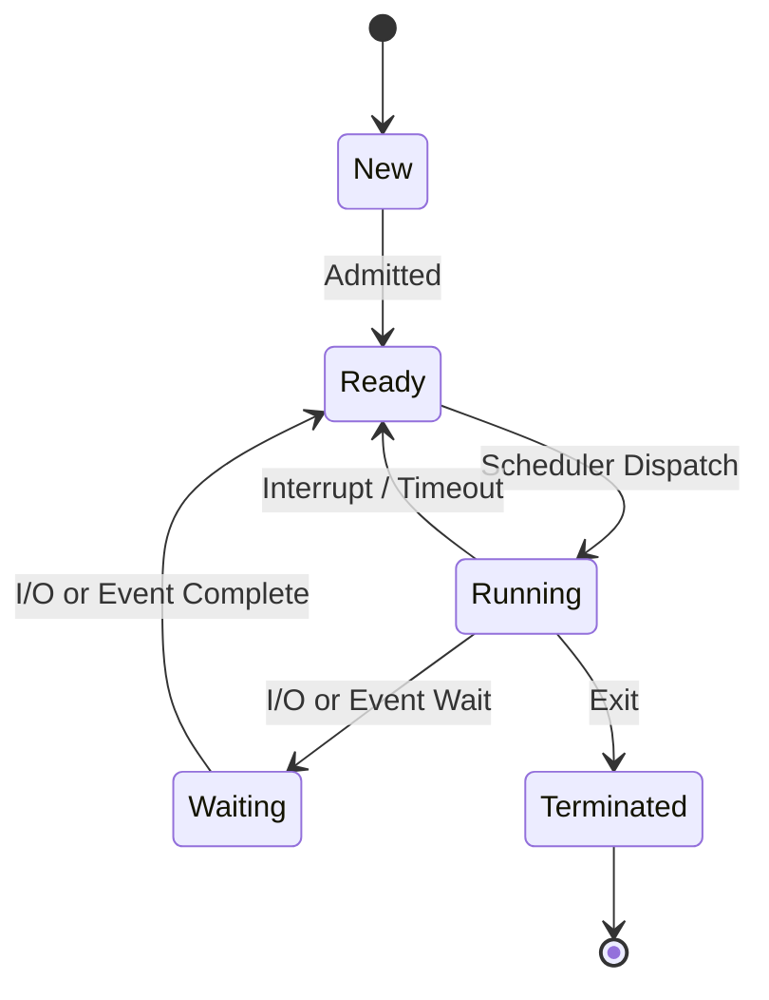
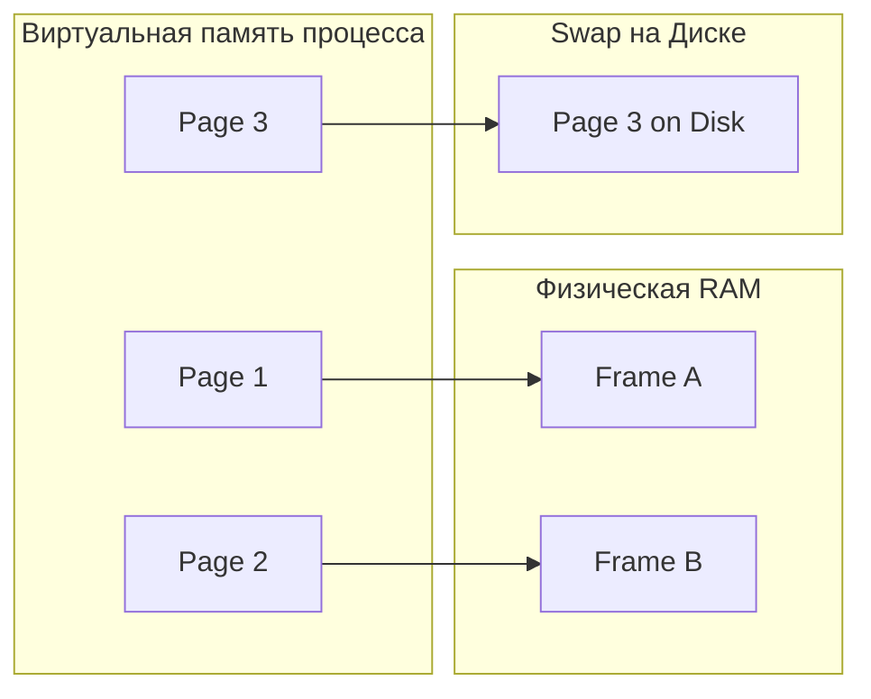

# 💻 Операционные системы (ОС)

## 📑 Содержание
1. [Роль и функции ОС](#1-что-такое-ос)
2. [Типы ОС](#2-типы-ос)
3. [Ядро ОС (Kernel)](#3-ядро-ос)
4. [Управление процессами и потоками](#31-управление-процессами)
5. [Виртуальная память](#32-управление-памятью)
6. [Файловые системы](#4-файловые-системы)
7. [Безопасность](#6-безопасность-в-ос)

---

Операционная система — это главный менеджер компьютера. Она делает так, чтобы программы могли работать с железом, не мешая друг другу.

---

## 1. 🛠️ Функции ОС

- **Абстракция**: Программисту не нужно знать, как именно записывать байты на разные модели SSD — он просто вызывает `file.Write()`.
- **Арбитраж**: Если две программы хотят напечатать документ, ОС выстраивает их в очередь.
- **Изоляция**: Если одна вкладка браузера "упадет", она не должна потянуть за собой всю систему.

---

## 2. 🧠 Ядро ОС (Kernel)

Ядро — это код, который всегда находится в памяти и имеет полный контроль над железом.

### Виды ядер:
- **Монолитное** (Linux): Все драйверы и функции внутри одного огромного бинарника. Очень быстро, но ошибка в драйвере может обрушить всё ядро.
- **Микроядро** (macOS/Darwin - частично, L4): В ядре только самое важное. Драйверы работают как обычные программы. Очень надежно, но медленнее из-за переключений контекста.

---

## 3. 🧵 Процессы и Потоки

| Понятие | Смысл | Ресурсы |
|:---|:---|:---|
| **Процесс** | Экземпляр запущенной программы | Своя память, свои файлы |
| **Поток (Thread)** | "Нить" исполнения внутри процесса | Общая память с другими потоками того же процесса |

### Состояния процесса:

---

## 4. 🏔️ Виртуальная память

Процесс "думает", что у него есть 16 ТБ памяти (на 64-бит), хотя физически в планке RAM всего 16 ГБ.

> [!IMPORTANT]
> **Страничная организация (Paging)**: ОС делит память на кусочки по **4 КБ**. Если физической памяти не хватает, ОС "скидывает" редко используемые страницы на диск (**Swap**).

---

## 5. 📁 Файловые системы

Это способ организации данных на диске. Без неё диск — это просто куча секторов.

- **NTFS** (Windows): Сложная, надежная, с правами доступа.
- **ext4** (Linux): Быстрая, стандарт для серверов.
- **APFS** (macOS): Оптимизирована под SSD и мгновенные снимки (snapshots).

> [!NOTE]
> **Журналирование**: Перед записью данных файловая система делает пометку в журнале. Если электричество выключится в момент записи, система сможет восстановить целостность.

---

## 🎯 Ключевые выводы

- **ОС** — это прослойка между кодом и физическим миром.
- **Планировщик** ОС решает, какая программа получит CPU прямо сейчас.
- **Виртуальная память** позволяет запускать приложения, размер которых больше физической RAM.
- **Ядро** — сердце системы, работающее в привилегированном режиме (`Ring 0`).
