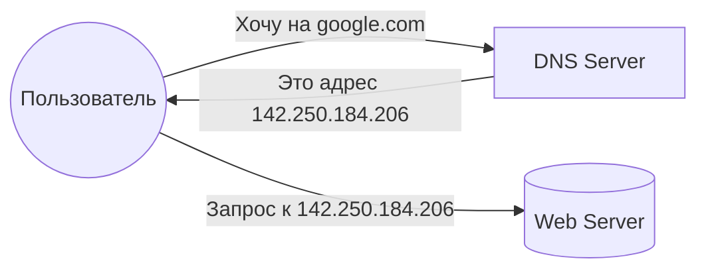
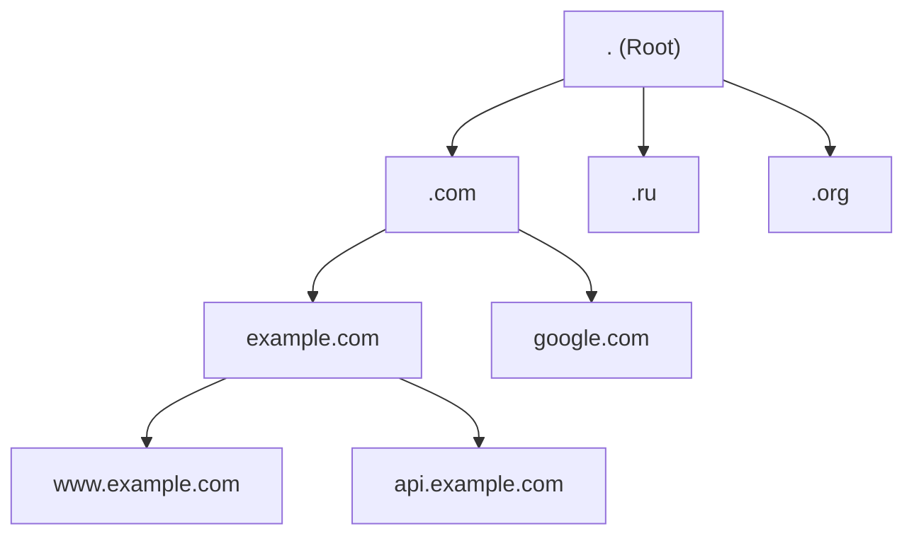
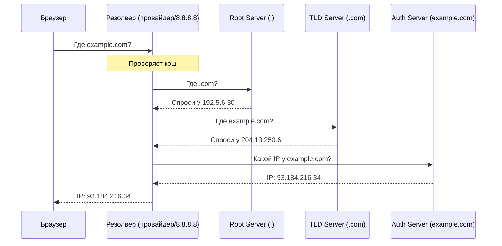

# Система доменных имён (DNS)

## Содержание
1. [Что такое DNS и зачем она нужна](#что-такое-dns-и-зачем-она-нужна)
2. [Иерархия DNS](#иерархия-dns)
3. [Процесс разрешения имён (Resolution)](#процесс-разрешения-имён)
4. [Типы записей и настройка](#настройка-dns)
5. [Безопасность (DNSSEC, DoH, DoT)](#безопасность-dnssec)

---

**DNS (Domain Name System)** — это "телефонная книга" интернета. Она превращает понятные человеку имена (например, `google.com`) в IP-адреса, которые понимают компьютеры.

---

## 1. Что такое DNS и зачем она нужна

- **Удобство**: Людям проще помнить слова, а не цифры.
- **Гибкость**: Вы можете сменить сервер (IP), сохранив имя сайта.
- **Распределенность**: Нет единого "главного" сервера, база данных размазана по всему миру.

> [!NOTE]
> DNS работает преимущественно по протоколу **UDP** на порту **53** для скорости. Если ответ слишком большой, используется **TCP 53**.

---

## 2. Иерархия DNS

DNS — это дерево, которое читается **справа налево**.

1. **Root (.)**: Корневые серверы. Знают, где искать TLD.
2. **TLD (Top-Level Domain)**: `.com`, `.ru`, `.net`.
3. **Second-Level Domain**: `example.com`.
4. **Subdomain**: `api.example.com`.

---

## 3. Процесс разрешения имён

Когда вы вводите адрес, происходит целая цепочка запросов:

### Кэширование и TTL
- **TTL (Time To Live)**: Время в секундах, на которое резолвер может запомнить ответ.
- **Зачем?** Чтобы не нагружать сеть при каждом клике.

> [!TIP]
> Если вы меняете IP сервера, ставьте маленькое TTL (напр. 300 сек) за день до переезда, чтобы пользователи быстрее узнали о новом адресе.

---

## 4. Настройка DNS: Типы записей

| Запись | Описание | Пример |
|:---|:---|:---|
| **A** | Имя -> IPv4 | `example.com -> 1.2.3.4` |
| **AAAA** | Имя -> IPv6 | `example.com -> 2a00:1450...` |
| **CNAME** | Имя -> Другое имя (псевдоним) | `www -> example.com` |
| **MX** | Куда отправлять почту | `mail.example.com` |
| **TXT** | Текстовые данные | Для верификации (SPF, DKIM) |
| **NS** | Ответственный за эту зону | `ns1.cloudflare.com` |

---

## 5. Безопасность

### DNSSEC
Добавляет цифровую подпись к ответам. Гарантирует, что IP-адрес не был подменен хакером по пути.

### Утечки и Приватность:
Обычный DNS-запрос идет открытым текстом. Кто угодно (провайдер, админ в кафе) видит, какие сайты вы посещаете.
1. **DoH (DNS over HTTPS)**: Запросы прячутся внутри обычного HTTPS-трафика.
2. **DoT (DNS over TLS)**: Выделенный защищенный канал для DNS.

> [!IMPORTANT]
> Для бэкенд-разработчика DNS — это не только сайт, но и связь между микросервисами (Service Discovery в Kubernetes работает на базе DNS).

---

## Ключевые выводы

- DNS превращает имена в IP.
- Иерархия: `Root -> TLD -> SLD -> Subdomain`.
- Рекурсивный резолвер делает всю грязную работу за нас.
- **TTL** влияет на то, как быстро мир увидит изменения на вашем сайте.
- **DNSSEC** защищает от подделки ответов.
