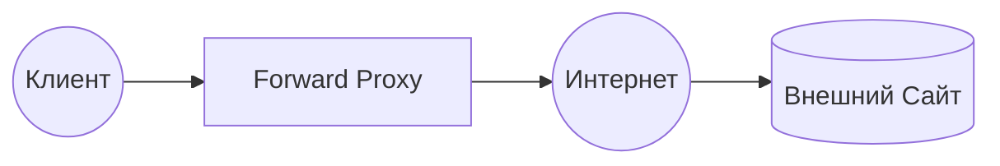
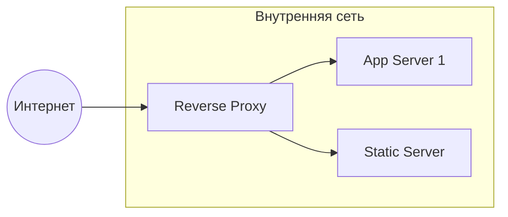
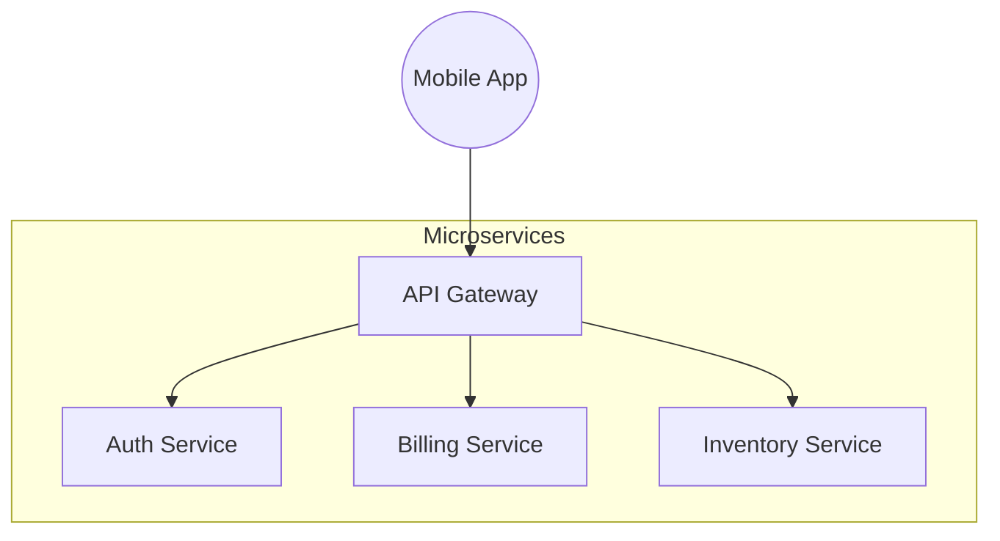
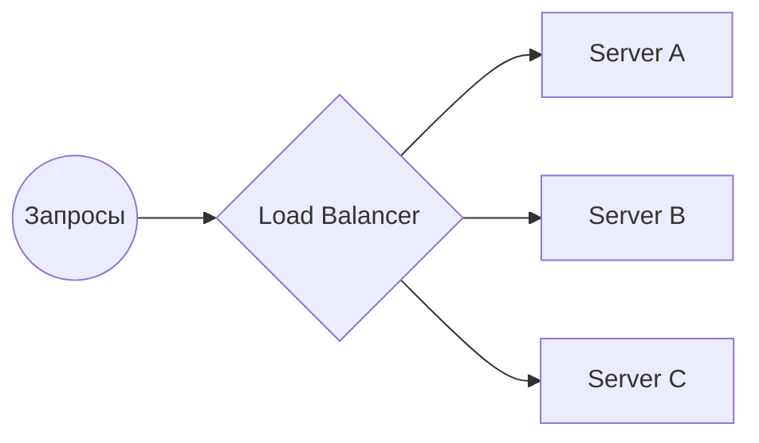

# Прокси, Шлюзы и Балансировщики

## Содержание
1. [Forward Proxy (Обычный прокси)](#forward-proxy-proxy)
2. [Reverse Proxy (Обратный прокси)](#reverse-proxy)
3. [API Gateway (Шлюз)](#api-gateway)
4. [Load Balancer (Балансировщик нагрузки)](#load-balancer)
5. [Сравнение и выбор](#сравнение-технологий)

---

В современной веб-разработке запросы редко попадают напрямую на сервер приложения. Они проходят через слои посредников, каждый из которых решает свою задачу.

---

## 1. Forward Proxy (Proxy)

Сервер, который стоит **перед клиентом**. Он защищает и представляет интересы клиента в интернете.



- **Скрытие IP**: Сайт видит адрес прокси, а не ваш.
- **Фильтрация**: Запрет доступа к соцсетям в офисе.
- **Кэширование**: Если 100 человек хотят скачать один файл, прокси скачает его один раз и раздаст всем.

> [!NOTE]
> Пример: VPN — это, по сути, продвинутый вариант Forward Proxy.

---

## 2. Reverse Proxy

Сервер, который стоит **перед вашими бэкендами**. Он защищает серверы от интернета.



### Зачем он нужен?
- **SSL-терминация**: Прокси берет на себя тяжелую математику HTTPS, а бэкенду отдает обычный HTTP.
- **Сжатие (Gzip)**: Уменьшает размер ответов.
- **Маршрутизация**: `/api` направляет на Go-сервер, а `/static` — на Nginx с картинками.

> [!TIP]
> **Nginx** — самый популярный Reverse Proxy в мире.

---

## 3. API Gateway

Это "продвинутый" Reverse Proxy, заточенный специально под управление API.



### Функции шлюза:
- **Аутентификация**: Проверяет JWT-токен до того, как запрос дойдет до сервиса.
- **Rate Limiting**: "Не больше 100 запросов в минуту от одного пользователя".
- **Агрегация**: Один запрос на шлюз может превратиться в три запроса к разным микросервисам, результаты которых шлюз соберет в один JSON.

---

## 4. Load Balancer (Балансировщик)

Распределяет нагрузку между несколькими одинаковыми серверами.



### Алгоритмы распределения:
- **Round Robin**: По очереди (1-2-3-1...).
- **Least Connections**: Тому, кто сейчас меньше всего занят.
- **IP Hash**: Привязывает клиента к конкретному серверу (чтобы сессия не разрывалась).

> [!IMPORTANT]
> **Health Check**: Балансировщик постоянно "пинкует" серверы. Если Server B "упал", балансировщик перестанет слать на него трафик.

---

## 5. Сравнение технологий

| Технология | На кого работает | Главная цель |
|:---|:---:|:---|
| **Forward Proxy** | На клиента | Анонимность, контроль доступа |
| **Reverse Proxy** | На сервер | Защита, SSL, статика |
| **API Gateway** | На систему | Безопасность API, логика входа |
| **Load Balancer** | На доступность | Масштабируемость, надежность |

### Пример на Go (Load Balancer Round-Robin):
```go
var current uint32
backends := []string{"http://s1.test", "http://s2.test"}

func getNextBackend() string {
    idx := atomic.AddUint32(&current, 1) % uint32(len(backends))
    return backends[idx]
}
```

---

## Ключевые выводы

- **Proxy** — это посредник.
- **Reverse Proxy** делает вашу инфраструктуру скрытой и безопасной.
- **API Gateway** — это "умный" вход для микросервисов.
- **Load Balancer** позволяет вашей системе выдерживать миллионы пользователей, просто добавляя новые серверы.
