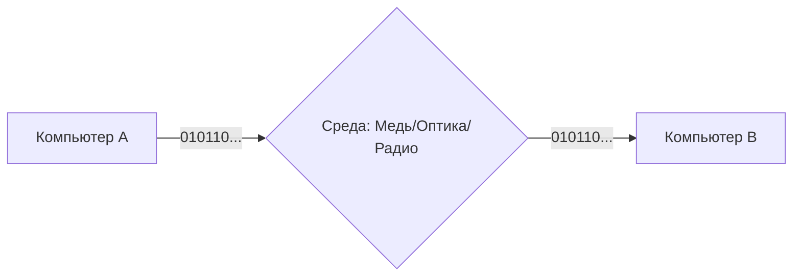

# OSI L1 & L2: Физический и Канальный уровни

## Содержание
1. [Физический уровень (L1): Биты и сигналы](#как-данные-передаются-физически)
2. [Канальный уровень (L2): Кадры и MAC-адреса](#адреса-управления-доступом-к-среде-mac-и-технология-ethernet)
3. [Коммутация (Switching)](#коммутаторы-коллизии-кадры)
4. [Ethernet-кадр](#кадры)

---

Эти уровни — "фундамент" сети. Они отвечают за то, чтобы электрический импульс или луч света превратился в понятную структуру данных.

---

## 1. L1: Физический уровень (Physical)

Здесь нет ни имен, ни адресов. Только вольты, герцы и биты.



- **Среды**:
  - **Медь**: Дешево, боится помех.
  - **Оптика**: Дорого, очень быстро, не боится помех.
  - **Радио (Wi-Fi)**: Удобно, но среда общая (все слышат всех).

---

## 2. L2: Канальный уровень (Data Link)

Здесь биты группируются в **Кадры (Frames)**. Главный герой тут — **MAC-адрес**.

> [!IMPORTANT]
> **MAC-адрес** — это "паспорт" устройства, зашитый в него на заводе. Он уникален в пределах вашей локальной сети.

```mermaid
graph LR
    Frame[Заголовок: MAC-адреса | Данные | Контрольная сумма]
```

---

## 3. Коммутатор (Switch) — Умное сердце сети

В отличие от старых хабов (которые спамили всем), коммутатор запоминает MAC-адреса на своих портах.

```mermaid
graph TD
    SW[Коммутатор]
    SW -- Порт 1 --> A[PC A: MAC 11..]
    SW -- Порт 2 --> B[PC B: MAC 22..]
    Note over SW: Таблица: Порт 1 = MAC 11, Порт 2 = MAC 22
```

- **CSMA/CD**: Механизм, который следит, чтобы два устройства не начали говорить одновременно (в сетях с общей средой).

---

## 4. Зачем это бэкенд-разработчику?

1. **VLAN**: Понимание, как один физический коммутатор делится на несколько логических сетей (важно для безопасности в облаках).
2. **MTU (Maximum Transmission Unit)**: Максимальный размер кадра (обычно 1500 байт). Если слать больше — данные будут дробиться, что замедлит сеть.
3. **ARP-таблицы**: Как IP-адрес превращается в MAC-адрес.

---

## Ключевые выводы

- **L1** — это кабели и сигналы.
- **L2** — это логика общения внутри одной комнаты (локальной сети).
- **MAC-адрес** — адрес для соседей; **IP-адрес** — адрес для всего мира.
