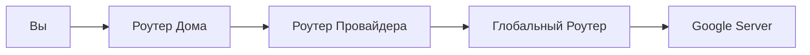

# OSI L3: Сетевой уровень (Network)

## Содержание
1. [Протокол IP (v4 и v6)](#версии-протокола-интернета-ipv4-и-ipv6)
2. [Маршрутизация пакетов](#маршрутизация-как-пакеты-находят-путь)
3. [NAT: Жизнь с нехваткой IP](#трансляция-сетевых-адресов-nat)
4. [Роутер vs Коммутатор](#роль-роутеров)

---

Сетевой уровень — это "почта" интернета. Его задача: доставить пакет из точки А (Москва) в точку Б (Лондон), даже если между ними сотни промежуточных сетей.

---

## 1. Протокол IP — Наш главный адрес

Если MAC-адрес — это имя человека, то IP-адрес — это его текущий почтовый адрес.

### IPv4 vs IPv6
- **IPv4**: Знакомый всем `192.168.1.1`. Места в мире почти не осталось (всего 4 млрд адресов).
- **IPv6**: Монстр вроде `2001:0db8:85a3...`. Адресов хватит даже для каждой пылинки на Земле.

> [!NOTE]
> **NAT (Network Address Translation)**: "Костыль", который позволяет целому офису выходить в интернет под одним публичным IP.

---

## 2. Как работает маршрутизация?

Пакет не знает всего пути. Он просто прыгает (hop) от одного роутера к другому.

- **TTL (Time To Live)**: Пакет не может вечно жить в сети. После каждого прыжка TTL уменьшается. Если он стал 0 — пакет удаляется. Это спасает интернет от бесконечных петель трафика.

---

## 3. Роутер (Маршрутизатор)

Это компьютер, который специализируется на чтении IP-адресов и пересылке пакетов в нужную сторону.

| Устройство | Уровень | Адрес | Область действия |
|:---|:---:|:---:|:---|
| **Коммутатор (Switch)** | L2 | MAC | Локальная сеть |
| **Роутер (Router)** | L3 | IP | Весь мир |

---

## 4. Практика для бэкенда

1. **Traceroute**: Показывает всю цепочку роутеров до вашего сервера. Если "лагает" — смотрим, на каком узле растет задержка.
2. **VPC & Subnets**: В облаках вы сами настраиваете таблицы маршрутов (Route Tables), решая, какие сервисы смотрят в интернет, а какие — нет.
3. **Public vs Private IP**: Никогда не выставляйте базу данных наружу с публичным IP.

---

## Ключевые выводы

- **L3** стирает границы между разными технологиями (Ethernet, Wi-Fi, 5G).
- **Маршрутизация** — это выбор следующего шага для пакета.
- **NAT** — способ спрятать локальную сеть за одним адресом.
