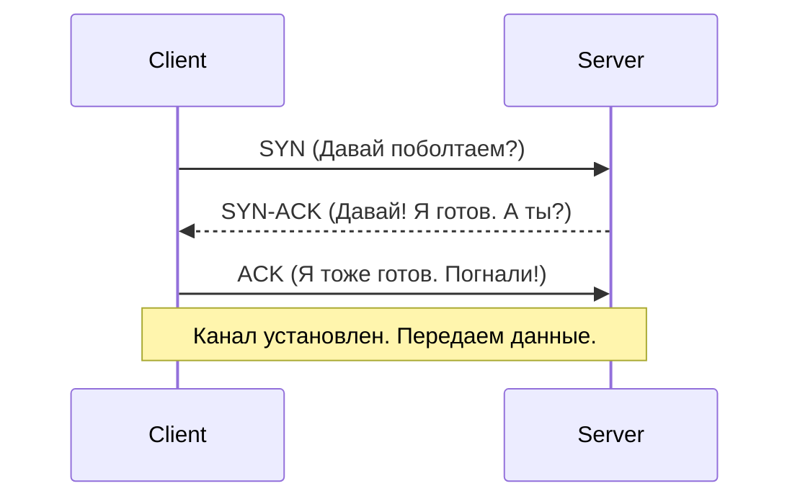

# OSI L4: Транспортный уровень (Transport)

## Содержание
1. [TCP: Порядок и надежность](#протокол-управления-передачей-tcp-надёжность)
2. [UDP: Скорость и риск](#протокол-пользовательских-датаграмм-udp-скорость-против-надёжности)
3. [Порты и Сокеты](#порты-и-сокеты-как-приложения-общаются-через-сеть)
4. [TCP Handshake (Рукопожатие)](#трехэтапное-рукопожатие-three-way-handshake)

---

Транспортный уровень связывает не компьютер с компьютером, а **приложение с приложением**.

---

## 1. TCP — "Протокол-перфекционист"

TCP гарантирует, что если вы отправили 1Гб данных, сервер получит именно этот 1Гб и в правильном порядке.

### Трехэтапное рукопожатие (3-way Handshake)
Перед передачей данных TCP должен убедиться, что "собеседник" готов слушать.

---

## 2. UDP — "Протокол-спринтер"

UDP не тратит время на рукопожатия и проверки. Он просто шлет пакеты. Если какой-то потерялся — ну и ладно.

> [!TIP]
> Идеально для **VoIP (Zoom/Skype)**. Вам важнее слышать живой голос сейчас, чем ждать 2 секунды, пока система переотправит потерянный слог.

---

## 3. Порты и Сокеты

IP-адрес доставляет данные до "дома" (сервера), а **Порт** — до конкретной "квартиры" (программы).

- **80 / 443**: Веб-сайты.
- **5432 / 3306**: Базы данных.

> [!IMPORTANT]
> **Socket** = [IP-адрес] + [Протокол] + [Порт]. Это уникальный "провод", связывающий клиент и сервер.

---

## 4. Сравнение

| Фича | TCP | UDP |
|:---:|:---:|:---:|
| **Надежность** | Высокая | Низкая |
| **Порядок** | Гарантирован | Случайный |
| **Скорость** | Ниже (оверхед) | Максимальная |
| **Пример** | HTTP, SQL, Email | Видео, Игры, DNS |

---

## Ключевые выводы

- **TCP** — для данных, где важна точность (деньги, текст).
- **UDP** — для данных, где важна реалтаймовость (голос, видео).
- **Порты** позволяют запускать сотни сетевых программ на одном IP.
