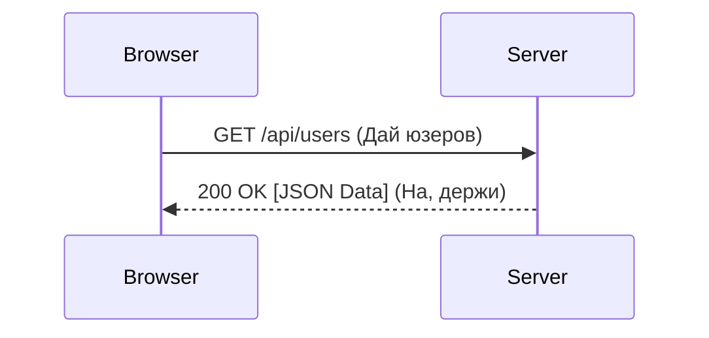

# OSI L5-L7: Прикладной уровень (Application)

## Содержание
1. [Верхушка айсберга: L7](#прикладной-уровень-модели-osi-и-прикладной-уровень-в-модели-tcpip-предоставляет-интерфейс-для-взаимодействия-приложений-с-сетью)
2. [HTTP и REST](#протокол-передачи-гипертекста-http-и-его-защищённая-версия-https)
3. [Электронная почта (SMTP/IMAP)](#протоколы-электронной-почты-smtp-imap-pop3)
4. [Современность: gRPC и GraphQL](#протокол-удалённого-вызова-процедур-grpc-и-другие-современные-протоколы)

---

Прикладной уровень (в TCP/IP он объединяет 5, 6 и 7 уровни OSI) — это то, с чем вы работаете как программист 90% времени.

---

## 1. HTTP/HTTPS — Король веба

Это протокол "запрос-ответ".

- **L5 (Сеансовый)**: Управляет "сессией" (логин/логаут).
- **L6 (Представления)**: Решает, в каком виде слать данные (JSON, XML) и как их шифровать (TLS).
- **L7 (Прикладной)**: Сама логика вашего API.

---

## 2. Электронная почта: Трио протоколов

1. **SMTP**: Используется для **отправки** письма.
2. **IMAP**: Для чтения. Письма остаются на сервере (синхронизация).
3. **POP3**: Для чтения. Письма скачиваются и удаляются с сервера (устарело).

---

## 3. Новые герои: gRPC и WebSocket

- **WebSocket**: Если HTTP — это "спросил-ответил", то WebSocket — это открытый телефонный разговор, где оба могут говорить одновременно.
- **gRPC**: Бинарный протокол от Google. В 5-10 раз быстрее обычного JSON-REST. Идеален для общения микросервисов внутри вашей сети.

---

## 4. Памятка для разработчика

> [!WARNING]
> **Stateless**: Классический HTTP не помнит, кто вы такой. Для "памяти" используются заголовки (Headers) с токенами (JWT) или Cookies.

- **DNS**: Тоже относится к прикладному уровню. Превращает `google.com` в IP-адрес.
- **TLS**: Работает на L6, делая из HTTP защищенный HTTPS.

---

## Ключевые выводы

- Прикладной уровень — это **смысл** передачи данных.
- **Stateless** природа HTTP требует авторизации каждого запроса.
- Будущее за бинарными протоколами (**gRPC, HTTP/3**) и real-time (**WebSockets**).
