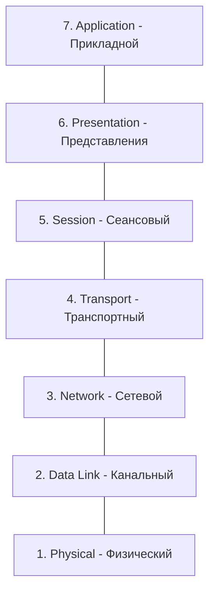
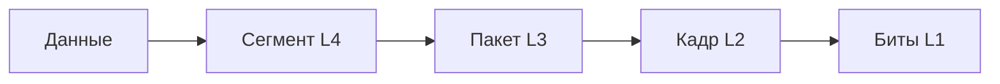

# Модель OSI (Open Systems Interconnection)

## Содержание
1. [Что такое OSI?](#обзор-7-уровней)
2. [Подробный разбор 7 уровней](#задачи-каждого-уровня-и-примеры-технологий)
3. [Как данные проходят через уровни](#задачи-каждого-уровня-и-примеры-технологий)
4. [OSI для разработчика](#зачем-бэкенд-разработчику-понимать-модель-osi)

---

Модель OSI — это теоретический эталон. Она объясняет, как данные превращаются из битов в кабеле в картинку в вашем браузере.

---

## 1. Семь уровней OSI

> [!TIP]
> Чтобы запомнить порядок, используйте мнемонику: **Please Do Not Throw Sausage Pizza Away** (Physical, Data Link, Network, Transport, Session, Presentation, Application).

---

## 2. Разбор уровней

| Уровень | За что отвечает | Примеры |
|:---|:---|:---|
| **7. Прикладной** | Интерфейс программ. | HTTP, FTP, SMTP, DNS |
| **6. Представления** | Кодирование, сжатие, шифрование. | JSON, XML, TLS, JPEG |
| **5. Сеансовый** | Управление диалогом, сессии. | RPC, NetBIOS |
| **4. Транспортный** | Доставка данных (надежно или нет). | TCP, UDP |
| **3. Сетевой** | Маршрутизация, IP-адреса. | IP, ICMP, Роутеры |
| **2. Канальный** | Соединение по MAC-адресам. | Ethernet, MAC, Свичи |
| **1. Физический** | Биты, вольты, кабели. | Оптоволокно, Wi-Fi |

---

## 3. Инкапсуляция и Декапсуляция

Когда вы отправляете данные, каждый уровень "заворачивает" их в свою обертку (добавляет заголовок).

---

## 4. Зачем это бэкенд-разработчику?

- **Отладка**: "Пинг идет (L3), но сайт не открывается (L7)". Модель помогает локализовать проблему.
- **Работа с облаками**: Группы безопасности (Security Groups) и балансировщики (ALB/NLB) работают на разных уровнях OSI.
- **Microservices**: Понимание gRPC vs REST — это вопрос выбора между L7 и оптимизациями на L4.

> [!IMPORTANT]
> На собеседованиях часто спрашивают: "На каком уровне работает балансировщик нагрузки (Nginx/HAProxy)?". Ответ: Обычно на L7 (прикладной), но может и на L4 (транспортный).

---

## Ключевые выводы

- OSI — это **чертеж**, а не реализация.
- Уровни 1-3 — про **железо и маршруты**.
- Уровни 4-7 — про **программную логику**.
- Инкапсуляция — это принцип "матрешки" для сетевых данных.
