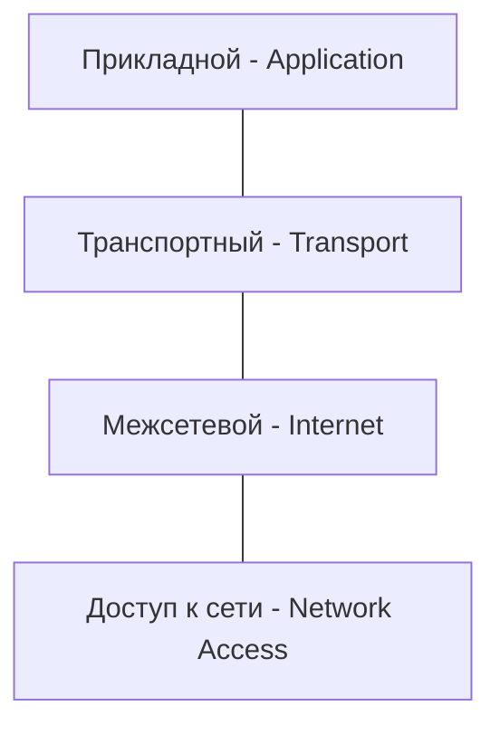
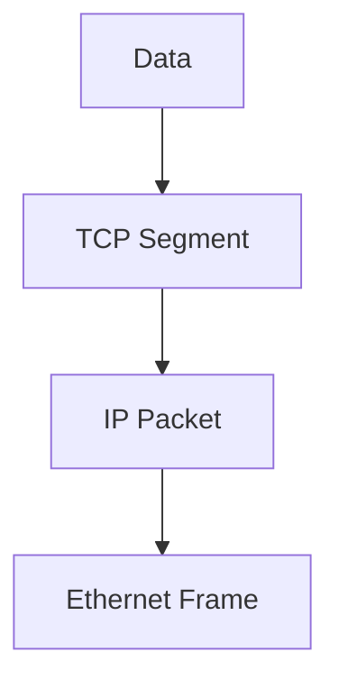

# Модель TCP/IP

## Содержание
1. [Почему TCP/IP?](#отличия-от-модели-osi-упрощённая-структура)
2. [Четыре уровня модели](#уровни-модели-tcpip)
3. [Сравнение с OSI](#как-уровни-tcpip-соотносятся-с-моделью-osi)
4. [Путь пакета в TCP/IP](#сценарий-загрузка-веб-страницы)

---

Если OSI — это теория, то **TCP/IP** — это практика. Весь современный интернет работает на этой модели.

---

## 1. Четыре уровня TCP/IP

Модель TCP/IP упрощена и объединяет уровни OSI для удобства реализации.

| Уровень | Аналог в OSI | Протоколы |
|:---|:---|:---|
| **Прикладной** | 7, 6, 5 | HTTP, DNS, gRPC, SSH |
| **Транспортный** | 4 | TCP, UDP, QUIC |
| **Межсетевой** | 3 | IP (v4/v6), ICMP |
| **Доступ к сети** | 2, 1 | Ethernet, Wi-Fi |

---

## 2. Ключевые принципы

### 1. Надежность (TCP) vs Скорость (UDP)
- **TCP**: Гарантирует, что данные дойдут без ошибок и в нужном порядке. Использует "рукопожатие" (Handshake).
- **UDP**: Шлет данные как есть. Быстро, но пакеты могут потеряться. Идеально для видео и игр.

### 2. IP-адресация
Каждое устройство в интернете имеет уникальный адрес (IP), по которому его находят пакеты.

> [!NOTE]
> **Межсетевой уровень** (Internet) — самый важный. Он делает интернет интернетом, связывая разные физические сети в одну.

---

## 3. Инкапсуляция в TCP/IP

- **Прикладной**: Ваши данные (JSON/HTML).
- **Транспортный**: Добавляет порт (например, 80 или 443).
- **Межсетевой**: Добавляет IP-адрес.
- **Доступ**: Добавляет MAC-адрес и отправляет биты в провод.

---

## 4. Почему победила TCP/IP?

1. **Простота**: 4 уровня легче реализовать в коде, чем 7.
2. **Гибкость**: Можно заменить Wi-Fi на 5G (нижний уровень), и ваш браузер (верхний уровень) этого даже не заметит.
3. **Открытость**: Протоколы не принадлежат ни одной компании.

---

## Ключевые выводы

- **TCP/IP** — это реальный язык интернета.
- Уровни **Application** и **Internet** — самые важные для программиста.
- Понимание портов и IP-адресов необходимо для настройки любого бэкенда.
