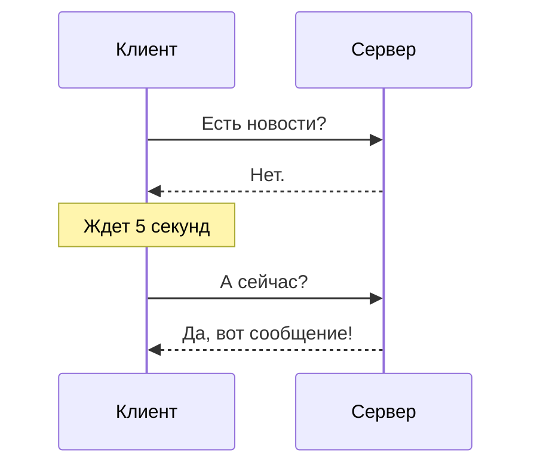
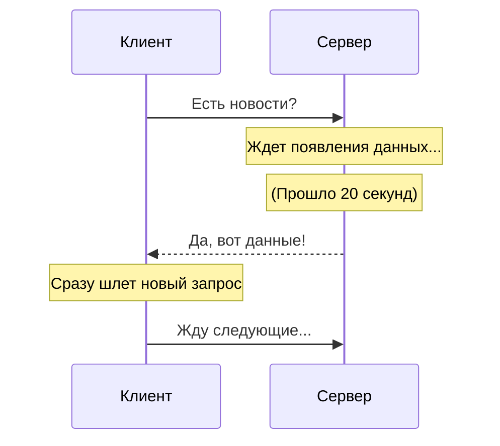
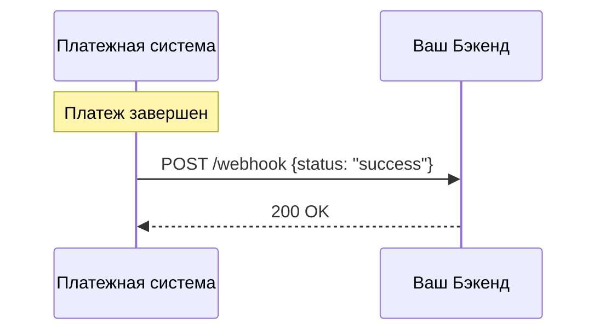
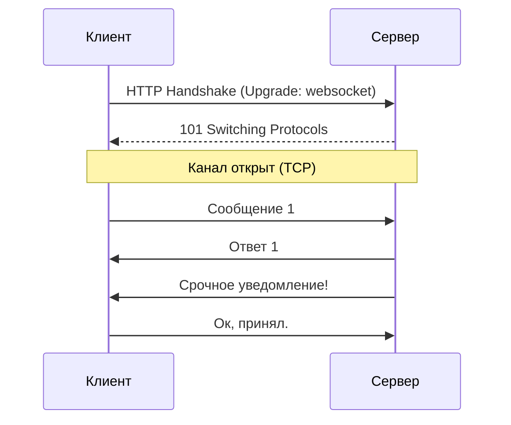

# Обмен данными: Polling, Webhooks, WebSockets

## Содержание
1. [Short Polling](#short-polling)
2. [Long Polling](#long-polling)
3. [Webhooks (Вебхуки)](#webhooks)
4. [WebSockets](#websockets)
5. [Server-Sent Events (SSE)](#sse---server-sent-events)
6. [Сравнение технологий](#сравнение-технологий)

---

Как серверу сообщить клиенту, что произошло что-то новое? В обычном HTTP сервер молчит, пока его не спросят. Для решения этой проблемы придумали несколько подходов.

---

## 1. Short Polling

Самый простой и "наивный" способ. Клиент просто спамит сервер вопросами: "Есть что-то новое?".

> [!WARNING]
> **Минус**: Огромная лишняя нагрузка на сервер и сеть. 99% запросов будут возвращать "пустоту", но тратить ресурсы на установку HTTP-соединения.

---

## 2. Long Polling

Улучшенная версия. Клиент спрашивает, а сервер **замирает** и не отвечает, пока данные не появятся (или не выйдет таймаут).

> [!TIP]
> Это хороший компромисс, если вам не нужно сверхбыстрое real-time соединение, но хочется экономить ресурсы.

---

## 3. Webhooks

Это "перевернутый" HTTP. Не клиент идет к серверу, а **сервер идет к клиенту**.

> [!IMPORTANT]
> **Проблема доступности**: Ваш бэкенд должен иметь публичный IP/URL, чтобы внешний сервис мог до него достучаться. Часто используется для интеграции со Stripe, GitHub, Telegram.

---

## 4. WebSockets

Полнодуплексное, двустороннее соединение. После "рукопожатия" (handshake) клиент и сервер становятся равными собеседниками.

- **Плюсы**: Минимальные задержки, низкий оверхед на заголовки.
- **Минусы**: Сложно масштабировать (каждый клиент держит открытое соединение, забивая память сервера).

---

## 5. SSE - Server-Sent Events

Односторонний "стриминг" от сервера к клиенту поверх обычного HTTP.

> [!NOTE]
> Идеально подходит для лент новостей или курсов акций, где клиенту не нужно ничего слать обратно серверу, только слушать.

---

## 6. Сравнение технологий

| Технология | Направление | Задержка | Сложность |
|:---|:---|:---:|:---|
| **Short Polling** | Клиент -> Сервер | Высокая | Низкая |
| **Long Polling** | Клиент -> Сервер | Средняя | Средняя |
| **Webhooks** | Сервер -> Клиент | Низкая | Средняя |
| **WebSockets** | Двустороннее | Минимальная | Высокая |

---

## Ключевые выводы

- **Short Polling** — для MVP и простых задач.
- **Long Polling** — когда WebSockets невозможны.
- **Webhooks** — для межсерверных уведомлений.
- **WebSockets** — для чатов, игр и финансовых графиков.
