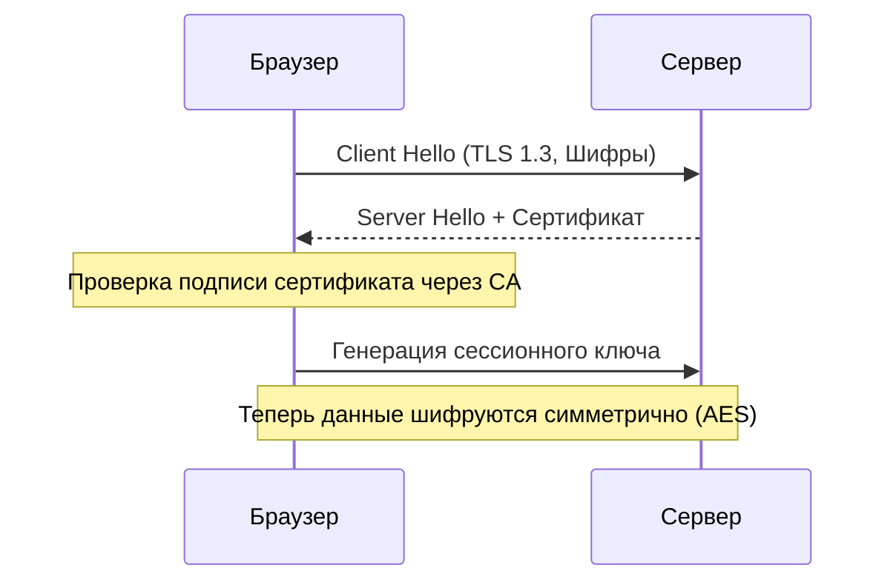
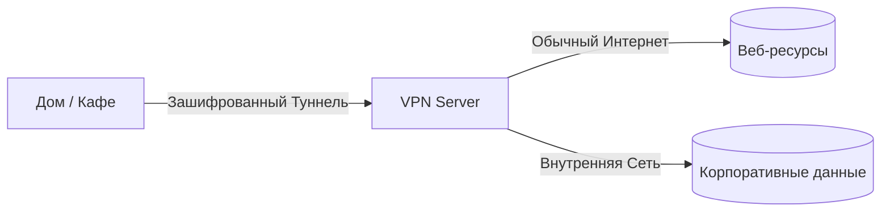
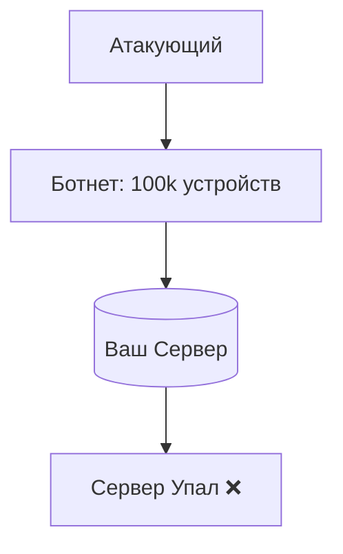

# Безопасность в сетях

## Содержание
1. [Шифрование: SSL и TLS](#шифрование-tls-и-ssl)
2. [VPN и Туннелирование](#виртуальная-частная-сеть-vpn)
3. [Типовые атаки (DDoS, MITM)](#атаки-на-сети)
4. [Чек-лист защиты для бэкенда](#как-бэкенд-разработчику-защитить-приложение)

---

Безопасность — это не конечная цель, а процесс. В сетях мы боремся за три вещи (Триада CIA):
1. **Confidentiality** (Конфиденциальность) — никто посторонний не прочитал.
2. **Integrity** (Целостность) — никто не изменил данные по пути.
3. **Availability** (Доступность) — сервис работает, несмотря на атаки.

---

## 1. Шифрование: TLS/SSL

**TLS (Transport Layer Security)** — протокол, который делает интернет безопасным. HTTPS — это просто HTTP внутри "трубы" TLS.

### TLS Handshake (Рукопожатие):

> [!IMPORTANT]
> **SSL мертв**. Используйте только **TLS 1.2** или **1.3**. Старые версии (SSL 2.0/3.0) уязвимы и давно взломаны.

---

## 2. VPN (Virtual Private Network)

Создает зашифрованный туннель через "грязный" публичный интернет.

- **WireGuard**: Самый современный и быстрый протокол.
- **OpenVPN**: Классика, надежный, но тяжеловесный.

---

## 3. Типовые атаки

### MITM (Man-In-The-Middle)
Злоумышленник вклинивается между вами и сервером.
> [!TIP]
> **Защита**: Всегда используйте HTTPS и проверяйте валидность сертификатов. HSTS (заголовок сервера) принудительно заставляет браузер использовать только защищенное соединение.

### DDoS (Отказ в обслуживании)
Нападение толпы: миллионы запросов заваливают сервер.
- **L3/L4 DDoS**: Забивают канал (флуд пакетами).
- **L7 DDoS**: Имитируют поведение людей, запрашивая тяжелые страницы сайта.

---

## 4. Чек-лист защиты для бэкенда

- [ ] **HTTPS везде**: Даже для внутренних API.
- [ ] **Rate Limiting**: Ограничьте количество запросов с одного IP (защита от брутфорса и мелких DDoS).
- [ ] **WAF (Web Application Firewall)**: Фильтр перед сервером (Cloudflare, AWS WAF).
- [ ] **Скрытие версии**: Не пишите в заголовках `Server: nginx/1.14.1`. Это подсказка хакеру, какие уязвимости искать.
- [ ] **Безопасные сокеты**: Используйте TLS-библиотеки последних версий.

---

## Ключевые выводы

- **TLS** шифрует трафик и подтверждает личность сервера.
- **Сертификаты** — это основа доверия в вебе.
- **Безопасность** должна быть многослойной: от фаервола до кода приложения.
- Никогда не доверяйте внешним сетям — шифруйте всё.
