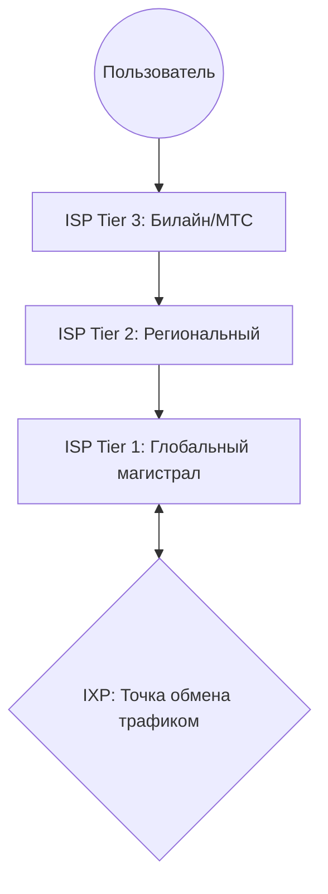
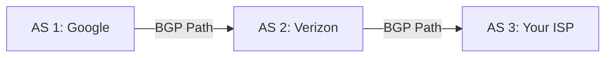
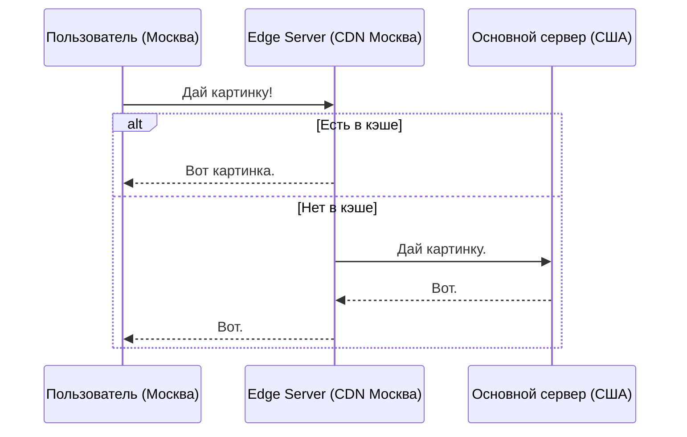

# Интернет и его инфраструктура

## Содержание
1. [Архитектура "Сеть сетей"](#как-устроен-интернет)
2. [Иерархия провайдеров (Tier)](#интернет-провайдеры-и-точки-обмена-трафиком)
3. [BGP — Клей интернета](#протокол-пограничного-шлюза-bgp)
4. [CDN (Content Delivery Network)](#сети-доставки-контента-cdn)

---

Интернет — это не одна компания, а миллионы сетей, которые договорились работать вместе.

---

## 1. Иерархия провайдеров

- **Tier 1**: Короли интернета (AT&T, Level 3). Они владеют гигантскими кабелями через океаны.
- **Tier 2**: Платят Tier 1 за доступ, но имеют свои крупные сети.
- **Tier 3**: Те, кому вы платите за домашний интернет.

> [!NOTE]
> **IXP (Internet Exchange Point)**: Здания, набитые роутерами, где провайдеры соединяются друг с другом напрямую, чтобы трафик шел быстрее.

---

## 2. BGP — Border Gateway Protocol

BGP — это навигатор для интернета. Он решает, через какие страны и сети полетит ваш пакет.

> [!WARNING]
> **BGP Hijacking**: Если кто-то "соврет" в BGP, что лучший путь к Google лежит через его серверы, он может перехватить трафик целой страны.

---

## 3. Облачные сети (VPC)

Внутри облака (AWS/GCP) вы строите свою виртуальную сеть.

- **VPC (Virtual Private Cloud)**: Ваша изолированная песочница.
- **Subnet (Подсеть)**: Деление VPC. Например, "Публичная" (для сайта) и "Приватная" (для базы данных).

---

## 4. CDN — Сети доставки контента

Зачем качать картинку из США, если её можно взять с сервера в соседнем квартале?

### Популярные CDN:
1. **Cloudflare**: Защита + Скорость.
2. **Akamai**: Старейший и крупнейший.
3. **CloudFront**: Интеграция с AWS.

---

## Ключевые выводы

- Интернет держится на **BGP**.
- **Tier 1** провайдеры — это фундамент.
- **CDN** — это способ сделать сайт быстрым по всему миру.
- **VPC** — основа облачной безопасности.
