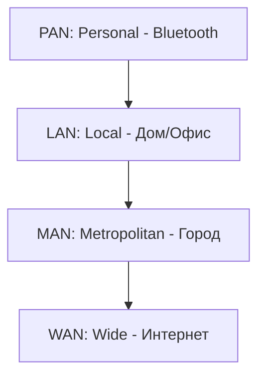
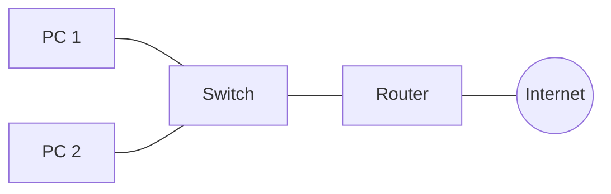

# Основы компьютерных сетей

## Содержание
1. [Что такое сеть?](#что-такое-сеть-и-зачем-она-нужна)
2. [Классификация сетей (LAN, WAN, MAN)](#типы-сетей)
3. [Сетевые устройства](#устройства)
4. [Каналы связи](#каналы-связи)
5. [Протоколы](#понятие-протоколов-и-их-роль)

---

**Компьютерная сеть** — это система, позволяющая устройствам "общаться" друг с другом, обмениваться файлами и ресурсами.

---

## 1. Типы сетей по масштабу

- **LAN (Local Area Network)**: Ваша домашняя сеть или Wi-Fi в офисе. Высокая скорость, низкая задержка.
- **WAN (Wide Area Network)**: Глобальная сеть, объединяющая города и страны (ИНТЕРНЕТ).

---

## 2. Основные устройства

| Устройство | Роль | Уровень (OSI) |
|:---|:---|:---:|
| **Роутер (Маршрутизатор)** | Соединяет разные сети, ищет путь для пакета. | L3 (Network) |
| **Коммутатор (Switch)** | Соединяет устройства внутри одной сети (LAN). | L2 (Data Link) |
| **Точка доступа (AP)** | Раздает Wi-Fi. | L1/L2 |

---

## 3. Каналы связи

### Проводные:
- **Витая пара (Ethernet)**: Обычный медный кабель. Дешево и сердито.
- **Оптоволокно**: Свет внутри стекла. Огромные скорости на огромные расстояния. Не боится помех.

### Беспроводные:
- **Wi-Fi**: Удобно, но скорость падает с расстоянием и стенами.
- **4G/5G**: Мобильный интернет.

---

## 4. Протоколы — Язык общения

Протоколы — это правила. Если один говорит по-китайски, а другой по-испански, общения не выйдет.

> [!NOTE]
> Основной стек протоколов в современном мире — это **TCP/IP**.

- **IP**: Решает, КУДА отправить (адресация).
- **TCP**: Решает, КАК отправить (надежно, с подтверждением).
- **HTTP**: Решает, ЧТО отправить (контент сайта).

---

## Ключевые выводы

- Сети строятся из **устройств** (роутеры, свичи) и **каналов** (кабели, волны).
- **LAN** — это ваша внутренняя "крепость", **WAN** — это внешний мир.
- **Протоколы** гарантируют, что устройства поймут друг друга.
