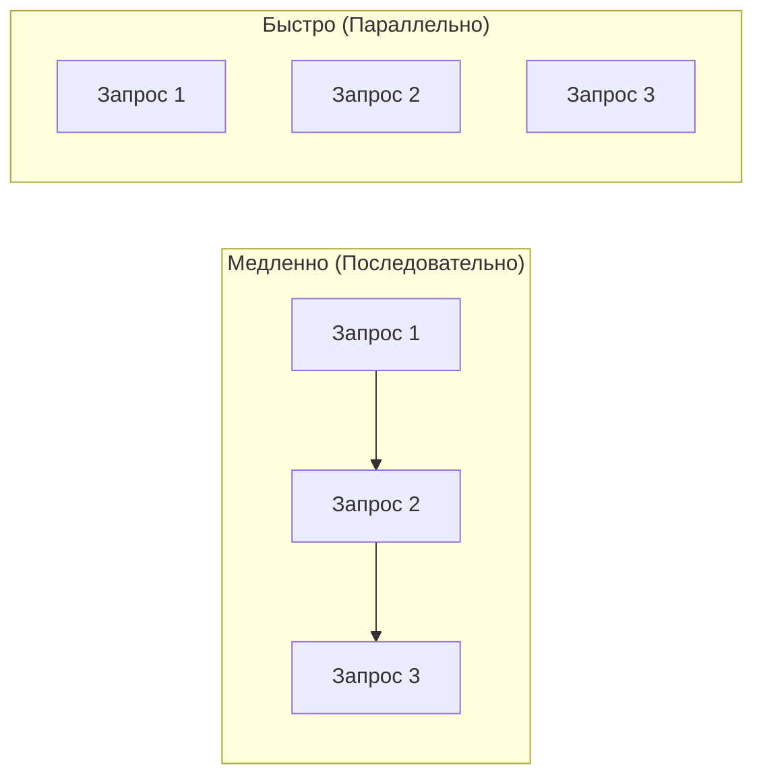
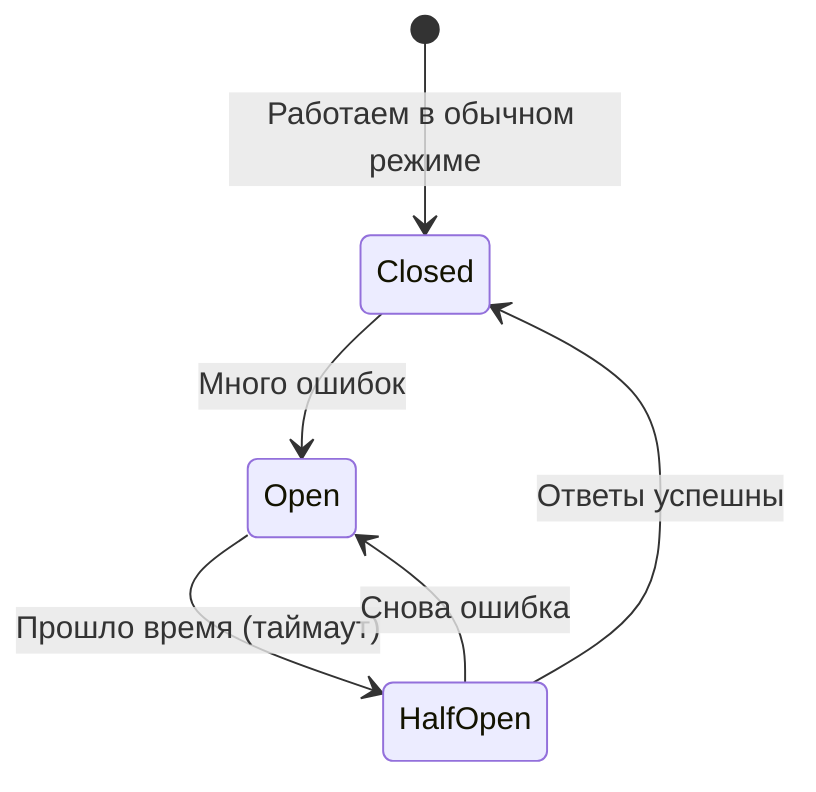

# Сети: Практика для бэкенд-разработчика

## Содержание
1. [Как сети влияют на код](#как-сети-влияют-на-архитектуру-приложений)
2. [Микросервисы и Service Discovery](#микросервисы)
3. [Паттерны надежности (Circuit Breaker, Retries)](#сетевые-аспекты)
4. [Оптимизация (Сжатие, HTTP/2, gRPC)](#оптимизация-сетевых-запросов)

---

Бэкенд-разработчик живет в мире распределенных систем. Даже запрос к базе данных или Redis — это сетевой вызов.

---

## 1. Сетевые ограничения

В идеальном мире сеть мгновенна и надежна. В реальности:
- **Задержка (Latency)**: Убивает производительность. 100 последовательных запросов по 10мс = 1 секунда ожидания для пользователя.
- **Потери (Packet Loss)**: Приводят к таймаутам и медленным ретрансмиссиям TCP.

### Что делать?
- **Batching**: Вместо 10 запросов по одному ID, сделайте один запрос на 10 ID.
- **Параллелизм**: Выполняйте независимые сетевые вызовы одновременно.

---

## 2. Микросервисы и коммуникация

Микросервисы превращают вызовы функций в сетевые вызовы.

| Тип | Протокол | Плюсы |
|:---|:---:|:---|
| **REST** | HTTP/1.1 / JSON | Просто, понятно всем. |
| **gRPC** | HTTP/2 / Protobuf | Очень быстро, типизация, бинарный формат. |
| **Messaging** | Kafka / RabbitMQ | Асинхронно, надежно (отложенная обработка). |

---

## 3. Паттерны надежности

Сеть **обязательно** упадет. Вопрос в том, готов ли ваш код.

### Retries (Повторы)
Если запрос упал, попробуйте еще раз.
> [!CAUTION]
> **Exponential Backoff**: Обязательно увеличивайте паузу между попытками (1с, 2с, 4с...), иначе вы добьете упавший сервер лавиной лишних запросов.

### Circuit Breaker (Предохранитель)
Если сервис Б не отвечает 5 раз подряд, перестаньте слать на него запросы на 1 минуту, чтобы дать ему "прийти в себя".

---

## 4. Оптимизация на уровне сети

- **Keep-Alive**: Не закрывайте TCP-соединение после каждого запроса. Установка нового TLS-соединения — это ОЧЕНЬ дорого.
- **Сжатие**: Используйте Gzip или Brotli для JSON.
- **HTTP/2**: Мультиплексирование позволяет слать много запросов по одной "трубе" одновременно.

---

## Ключевые выводы

- Сетевой вызов в 1000 раз медленнее вызова функции в памяти.
- Используйте **Retries** с умом (Backoff + Jitter).
- **gRPC** — стандарт для внутреннего общения сервисов.
- **Keep-Alive** — ваш лучший друг в экономии ресурсов.
