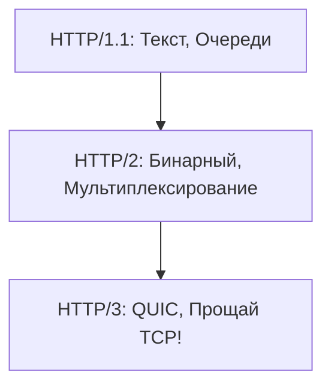
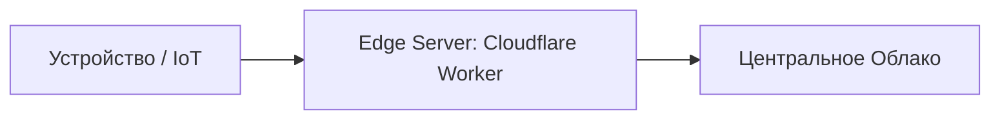

# 🌟 Современные тренды в сетях

## 📑 Содержание
1. [Эволюция HTTP (1.1 -> 2 -> 3)](#http1-http11-http2-и-http3)
2. [Протокол QUIC](#http3)
3. [Edge Computing (Граничные вычисления)](#граничные-вычисления-edge-computing)
4. [Zero Trust (Нулевое доверие)](#архитектура-нулевого-доверия-zero-trust-architecture)
5. [5G и IoT](#сети-пятого-поколения-5g)

---

Сети становятся быстрее, но сложнее. Главный тренд — борьба с задержками и повышение безопасности.

---

## 1. 📈 Эволюция HTTP

- **HTTP/1.1**: Главная проблема — **Head-of-Line Blocking**. Если первая картинка грузится медленно, остальные ждут.
- **HTTP/2**: Научился слать всё одновременно по одному TCP-соединению. Но если потеряется ОДИН пакет, TCP остановит ВСЕ запросы.
- **HTTP/3 (QUIC)**: Переехал на **UDP**. Теперь потеря пакета в одной картинке не мешает грузиться другим.

---

## 2. 🚀 QUIC (Quick UDP Internet Connections)

Это новый фундамент интернета от Google.

### Почему UDP?
TCP — старый и неповоротливый. Чтобы договориться о шифровании (TLS) в TCP, нужно 3-4 "рукопожатия". QUIC делает это за 1-2.

> [!TIP]
> QUIC позволяет переключаться с Wi-Fi на 4G (например, когда вы выходите из дома) без разрыва соединения с сервером.

---

## 3. 🏔️ Edge Computing

Зачем тащить данные в облако в США, если их можно обработать "на краю" (Edge)?

- **Cloudflare Workers / AWS Lambda@Edge**: Ваш код запускается в ближайшем к пользователю дата-центре.
- **Результат**: Задержка 5-10мс вместо 200мс.

---

## 4. 🔐 Zero Trust Architecture

"Никому не верь". Даже если устройство находится внутри офисной сети.

- **Основные правила**:
  - Каждый запрос должен быть авторизован.
  - Устройство всегда считается потенциально зараженным.
  - Доступ дается только к тому, что нужно для работы (принцип наименьших привилегий).

---

## 🎯 Ключевые выводы

- **HTTP/3** — будущее, которое уже наступило (Google, Facebook уже там).
- **QUIC** исправляет фундаментальные ошибки TCP.
- **Edge Computing** переносит логику из центра на периферию для скорости.
- **Zero Trust** заменяет старые VPN и корпоративные "периметры" на тотальную проверку.
