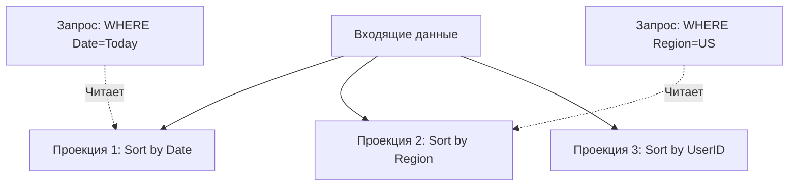

# 🦅 Vertica

## 📑 Содержание
1. [Что это? (Enterprise OLAP)](#что-это-enterprise-olap)
2. [Проекции (Projections)](#проекции-projections)
3. [Vertica vs ClickHouse](#vertica-vs-clickhouse)

---

## 1. 🤔 Что это? (Enterprise OLAP)

**Vertica** — это мощная, коммерческая (Enterprise) колоночная база данных для аналитики (OLAP).
Она появилась задолго до ClickHouse и была пионером MPP (Massively Parallel Processing) архитектуры на стандартном железе.

*   **Кластеризация**: Изначально создана для работы на сотнях серверов.
*   **SQL Стандарт**: Поддерживает почти полный стандарт SQL (в отличие от ClickHouse, где свой диалект).
*   **Умная**: Имеет сложный оптимизатор запросов.

---

## 2. 📽️ Проекции (Projections)

Это киллер-фича Вертики.
В обычных БД есть Таблицы и Индексы. В Вертике есть **Проекции**.

> [!TIP]
> **Проекция** — это физическая копия данных таблицы, но отсортированная специальным образом.

Например, для таблицы `Sales` можно создать две проекции:
1.  **По дате**: Чтобы быстро считать продажи за день.
2.  **По региону**: Чтобы быстро считать продажи по городам.

При вставке данные летят сразу во все проекции. При чтении Оптимизатор сам выбирает, из какой проекции быстрее прочитать ответ.

---

## 3. ⚔️ Vertica vs ClickHouse

| Фича | 🦅 Vertica | 📊 ClickHouse |
| :--- | :--- | :--- |
| **Лицензия** | Платная (дорого) / Free Community (ограничения) | Open Source (бесплатно) |
| **SQL** | Full ANSI SQL (JOINs работают идеально) | SQL-like (JOINs ограничены, специфичный синтаксис) |
| **Update/Delete** | Поддерживает (хоть и медленно) | Очень сложно (Mutations), лучше не использовать |
| **Скорость** | Очень быстро | Невероятно быстро (часто быстрее Вертики на простых запросах) |
| **Администрирование** | Сложно, требует DBA | Просто начать, сложно тюнить |

---

## 💡 Итог
*   **Vertica**: Если вы банк/корпорация, у вас есть деньги, вам нужен полноценный SQL и сложные JOIN-ы.
*   **ClickHouse**: Если вы стартап/технологическая компания, вам нужна скорость света, вы готовы мириться с особенностями SQL и у вас много логов.