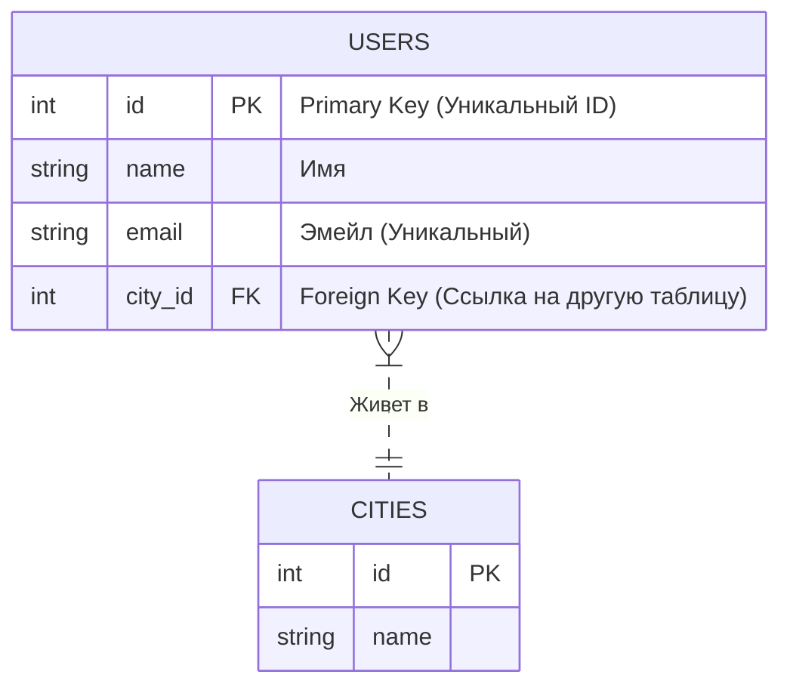

# 🗄️ 0. Введение в Базы Данных (DB & DBMS)

## 📑 Содержание
1. [Что такое БД и СУБД?](#что-такое-бд-и-субд)
2. [Краткая история](#краткая-история)
3. [Основные понятия RDBMS](#основные-понятия-rdbms)
4. [SQL — язык общения](#sql--язык-общения)

---

## 1. 🤔 Что такое БД и СУБД?

Часто эти понятия путают, но разница есть:

- **БД (База Данных / Database)**: Это само *хранилище* данных. Упорядоченный набор информации (файлы на диске).
- **СУБД (Система Управления Базами Данных / DBMS)**: Это *программа*, которая позволяет создавать БД, читать из них, обновлять и удалять данные. Это "интерфейс" между вами и файлами данных.

> [!NOTE]
> **Аналогия**: 
> *   **БД** — это архив с документами в подвале.
> *   **СУБД** — это библиотекарь, который знает, где что лежит, и приносит вам нужную папку по запросу.
> *   **SQL** — это язык, на котором вы просите библиотекаря (например, "Дай мне все книги Пушкина за 1830 год").

**Примеры популярных СУБД**:
- **PostgreSQL** (Open Source, мощная, надежная) 🐘
- **MySQL / MariaDB** (Популярная для веба) 🐬
- **SQLite** (Встраиваемая, всё в одном файле) 🪶
- **Oracle / MS SQL Server** (Коммерческие энтерпрайз решения) 🏢

---

## 2. 📜 Краткая история

1.  **Файловые системы**: Просто хранили данные в txt/csv.
    *   *Проблема*: Тяжело искать, нет связей, дублирование данных.
2.  **Иерархические и Сетевые модели**: Данные как дерево или граф.
    *   *Проблема*: Сложно менять структуру, зависимость от физического хранения.
3.  **Реляционные (RDBMS)**: (1970-е, Е.Ф. Кодд). Данные в виде таблиц.
    *   *Победа*: Стандарт де-факто на 40+ лет. Строгая структура, связи, SQL.
4.  **NoSQL**: (2000-е). Ответ на Big Data и необходимость гибкости.
    *   *Суть*: Отказ от жесткой схемы ради скорости и масштабируемости.
5.  **NewSQL**: Попытка объединить ACID гарантии RDBMS и скорость NoSQL (CockroachDB, TiDB).

---

## 3. 🏗️ Основные понятия RDBMS

**RDBMS (Relational Database Management System)** — Реляционная СУБД. Данные хранятся в **Таблицах** (Отношениях/Relations).

### Структура

1.  **Таблица (Table)**: Набор данных одной тематики (например, `Users`, `Orders`).
2.  **Строка (Row / Record / Tuple)**: Одна конкретная запись (Один пользователь: `id:1, name:Ivan`).
3.  **Столбец (Column / Field / Attribute)**: Характеристика записи (Имя, Возраст, Email). Имеет строгий тип данных (Число, Строка, Дата).
4.  **Схема (Schema)**: Описание структуры базы данных (какие есть таблицы, какие в них поля и типы).

### Ключи (Keys)

-   **Primary Key (PK, Первичный ключ)**: Уникальный идентификатор строки. Не может быть `NULL`. Обычно это `id`. По нему мы быстро находим конкретную запись.
-   **Foreign Key (FK, Внешний ключ)**: Поле, которое ссылается на `Primary Key` *другой* таблицы. Так создаются **связи** между таблицами.

---

## 4. 🗣️ SQL — язык общения

**SQL (Structured Query Language)** — декларативный язык. Мы говорим *ЧТО* мы хотим получить, а СУБД сама решает *КАК* это сделать.

Основные группы команд:

1.  **DDL (Data Definition Language)**: Определение структуры (Создать таблицу, Удалить колонку).
    *   `CREATE`, `ALTER`, `DROP`
2.  **DML (Data Manipulation Language)**: Работа с данными (Вставить, Обновить, Удалить, Найти).
    *   `INSERT`, `UPDATE`, `DELETE`, `SELECT`
3.  **DCL (Data Control Language)**: Права доступа.
    *   `GRANT`, `REVOKE`
4.  **TCL (Transaction Control Language)**: Управление транзакциями.
    *   `COMMIT`, `ROLLBACK`

---

> [!TIP]
> **Почему RDBMS до сих пор топ-1?**
> Потому что в бизнесе (банки, магазины, учет) важна **целостность** и **структура**. Если вы переводите деньги, вы хотите быть уверены, что они списались у вас и появились у получателя (ACID), а не "где-то потерялись" ради скорости.
