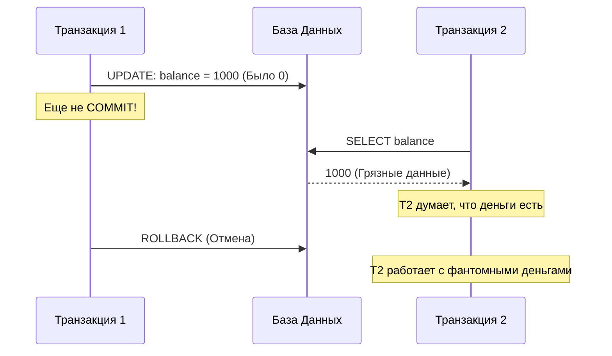
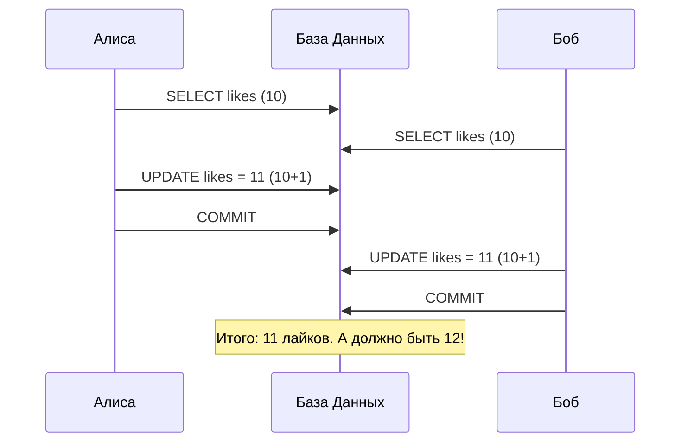
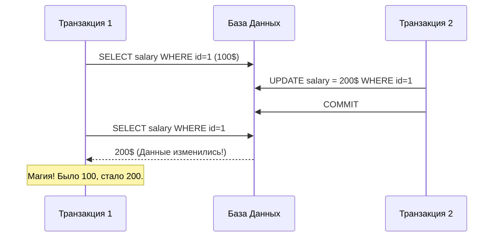
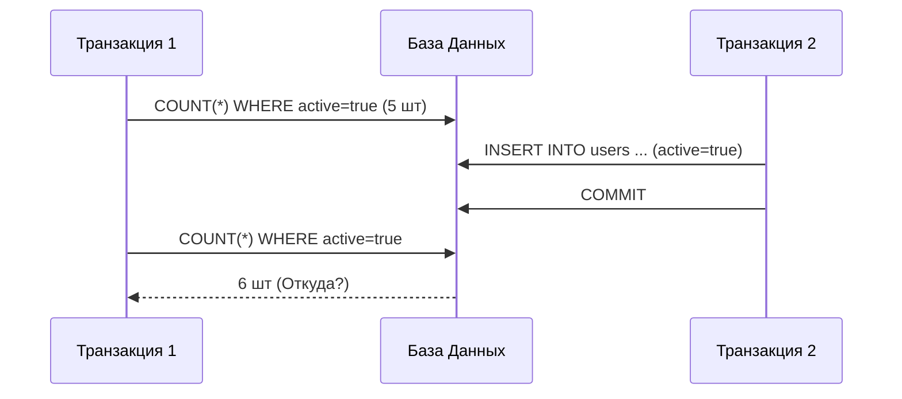

# 🧪 1. ACID: Гарантии надежности

## 📑 Содержание
1. [Что такое ACID?](#что-такое-acid)
    - [Atomicity (Атомарность)](#1-atomicity-атомарность)
    - [Consistency (Согласованность)](#2-consistency-согласованность)
    - [Isolation (Изоляция)](#3-isolation-изоляция)
    - [Durability (Долговечность)](#4-durability-долговечность)
2. [Аномалии (Problemas)](#3-аномалии-транзакций)
3. [Пример транзакции в PostgreSQL](#пример-транзакции-в-postgresql)

---

## 🤔 Что такое ACID?

ACID — это набор из 4-х требований к транзакционной системе, обеспечивающих сохранность данных.
**Транзакция** — это группа последовательных операций с базой данных, которая представляет собой логическую единицу работы с данными.

### 1. Atomicity (Атомарность)
**"Всё или ничего"**.
Транзакция не может быть выполнена частично. Либо выполняются **все** операции внутри неё, либо **ни одной**.

> [!EXAMPLE]
> **Пример**: Перевод денег.
> 1. Списать 100р у Алисы.
> 2. Зачислить 100р Бобу.
> 
> Если на шаге 2 произошла ошибка (свет выключили), то шаг 1 должен **отмениться** (Rollback). Деньги не должны исчезнуть.

### 2. Consistency (Согласованность)
**"Законы не нарушаются"**.
Транзакция переводит базу данных из одного согласованного состояния в другое.
Это значит, что после транзакции все данные должны соответствовать правилам (Constraints):
-   Типы данных (нельзя записать текст в числовое поле).
-   Foreign Keys (нельзя сослаться на несуществующего юзера).
-   Unique (нельзя создать второй аккаунт с тем же email).
-   Check (баланс не может быть отрицательным, если есть такое ограничение).

### 3. Isolation (Изоляция)
**"Я в домике"**.
Параллельные транзакции не должны мешать друг другу. Результат их выполнения должен быть таким же, как если бы они выполнялись последовательно (одна за другой).

Есть 4 уровня изоляции (стандарт ANSI SQL), от слабого к сильному:
1.  **Read Uncommitted**: Можно читать незакоммиченные (грязные) данные. *Опасно!*
2.  **Read Committed** (Default в Postgres): Видны только зафиксированные изменения.
3.  **Repeatable Read**: Если мы прочитали строку в начале транзакции, она не изменится до конца транзакции (даже если кто-то другой ее изменил и закоммитил).
4.  **Serializable**: Полная имитация последовательного выполнения. Самый надежный, но самый медленный (много блокировок).

### 4. Durability (Долговечность)
**"Рукописи не горят"**.
Если транзакция подтверждена (Commit), то изменения **сохраняются навсегда**, даже если через миллисекунду сервер обесточат.
Это достигается с помощью **WAL (Write-Ahead Log)** — журнала предзаписи. Сначала пишем в журнал "мы хотим изменить X на Y", сбрасываем это на диск, и только потом реально меняем данные.

---

## 🐘 Пример транзакции в PostgreSQL

```sql
-- Начало транзакции
BEGIN;

-- Операция 1: Списываем деньги у Алисы (id=1)
UPDATE accounts 
SET balance = balance - 100.00
WHERE id = 1;

-- Операция 2: Зачисляем деньги Бобу (id=2)
UPDATE accounts 
SET balance = balance + 100.00
WHERE id = 2;

-- Если всё ок — фиксируем изменения
COMMIT;

-- Если где-то ошибка — всё отменяем
-- ROLLBACK;
```

---

## 3. 🐛 Аномалии транзакций

В зависимости от уровня изоляции (Isolation), мы можем встретить разные "глюки" (аномалии).

### 1. Dirty Read (Грязное чтение)
Транзакция читает данные, которые другая транзакция **еще не закоммитила**. Если вторая откатится (Rollback), то первая прочитала то, чего никогда не существовало.



### 2. Lost Update (Потерянное обновление)
Две транзакции одновременно меняют одну и ту же запись, и одна "затирает" результат другой.
**Пример**: Два админа одновременно редактируют одну статью. Сохранится версия того, кто нажал "Save" последним.



### 3. Non-Repeatable Read (Неповторяющееся чтение)
В рамках одной транзакции мы делаем один и тот же запрос дважды, но получаем **разные данные**, потому что кто-то успел изменить (UPDATE) строку между нашими запросами.



### 4. Phantom Read (Фантомное чтение)
Похоже на предыдущее, но проблема не в изменении (UPDATE) старых строк, а в **появлении новых (INSERT)** или удалении (DELETE).
Мы читаем список (WHERE price > 100), получаем 5 товаров. Делаем запрос снова — товаров уже 6. "Фантом" появился из ниоткуда.



---

## 4. 🛡️ Уровни изоляции и что они лечат

| Уровень (Level) | Dirty Read | Non-Repeatable Read | Phantom Read |
| :--- | :---: | :---: | :---: |
| **Read Uncommitted** | ❌ (Возможно) | ❌ | ❌ |
| **Read Committed** (PG Default) | ✅ (Защищено) | ❌ | ❌ |
| **Repeatable Read** | ✅ | ✅ | ❌ (В Postgres защищено!) |
| **Serializable** | ✅ | ✅ | ✅ |

> [!NOTE]
> В **PostgreSQL** уровень `Repeatable Read` на самом деле круче стандарта SQL и защищает даже от Фантомов (Phantom Read).


> [!IMPORTANT]
> Без `BEGIN` и `COMMIT` (в автокоммите) каждая команда — сама себе транзакция. Если первая пройдет, а вторая упадет — деньги спишутся, но не зачислятся. В одной транзакции это **невозможно**.
