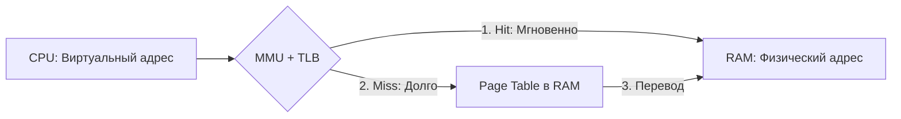
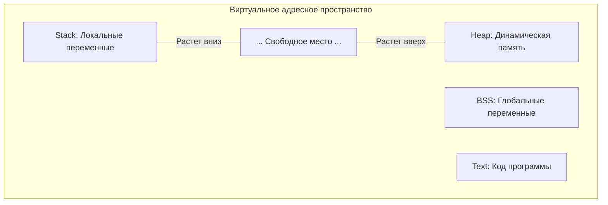
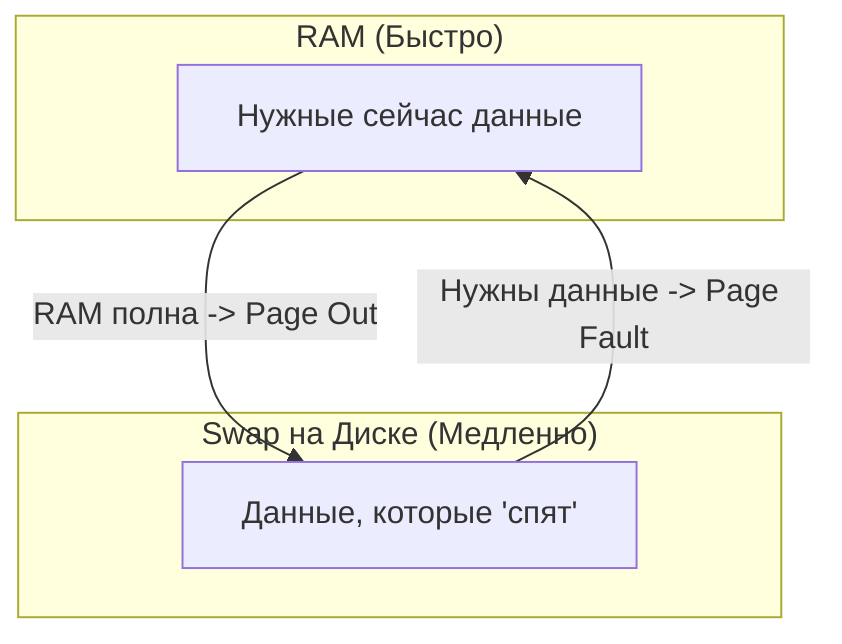

# Память в операционных системах

## Виртуальная память, физическая память, MMU, page fault, swapping

---

## 0. Зачем вообще нужна сложная система памяти

Если бы программы работали напрямую с физической памятью:

- один процесс мог бы читать и портить память другого
- падение программы могло бы повалить всю систему
- нельзя было бы эффективно использовать RAM
- невозможно было бы запускать много программ одновременно

Решение — **виртуальная память**.

---

## 1. Физическая память (RAM)

**Физическая память** (Physical Memory) — это реальные микросхемы RAM в компьютере.

- Ограниченный объём (например, 16 GB).
- Очень высокая скорость доступа.
- Адресуется прямолинейно через физические адреса.

> [!CAUTION]
> **Прямой доступ — это опасно**: Если дать процессу прямой доступ к RAM, он сможет прочитать пароли из памяти браузера или случайно перезаписать код ядра системы. Поэтому процесс **никогда не видит** реальные физические адреса. Он живет в своей «песочнице».

---

## 2. Виртуальная память и механизм трансляции

**Виртуальная память** — это абстракция, создающая для процесса иллюзию непрерывного и изолированного адресного пространства.

### 2.1 Главная схема: От адреса к данным

Чтобы процессор мог прочитать данные, виртуальный адрес должен превратиться в физический. В этом участвуют три ключевых игрока:

### 2.2 MMU (Memory Management Unit)
**MMU** — это аппаратный блок внутри CPU. Это «сердце» управления памятью.
- **Что делает**: Переводит виртуальные адреса в физические на лету.
- **Когда работает**: На **каждом** доступе к памяти (чтение инструкции, запись переменной).
- **Кто управляет**: Настраивается исключительно ядром ОС.

### 2.3 Page Table (Таблица страниц)
Это «словарь» переводов, который хранится в оперативной памяти (RAM).
- Поскольку MMU физически не может вместить переводы для терабайтов памяти, он хранит их в RAM.
- **Флаги доступа**: В таблице записано не только "куда идти", но и "что можно":
    - **Present**: Есть ли страница в RAM?
    - **Read/Write**: Можно ли менять данные?
    - **NX (No Execute)**: Можно ли запускать код (защита от вирусов).

### 2.4 TLB (Translation Lookaside Buffer)
Обращение к RAM за таблицей страниц — это медленно (сотни циклов CPU). Чтобы не тормозить, используется **TLB**.
- **Что это**: Сверхбыстрый кэш внутри CPU, хранящий последние 64-512 переводов.
- **Эффект**: В 99% случаев перевод берется из TLB за доли наносекунды. Если адреса в TLB нет (TLB Miss), MMU идет в медленную RAM за таблицей страниц.

---

## 3. Страницы памяти (Pages)

Управлять памятью по байтам невозможно (слишком много записей в таблицах). Поэтому её делят на **страницы**.

- **Стандартный размер**: 4 KB (4096 байт).
- **Виртуальная страница**: Кусок виртуального пространства.
- **Физический фрейм**: Реальный кусок RAM.
- **Связь**: ОС связывает виртуальную страницу с физическим фреймом через Page Table.

---

## 4. Анатомия процесса в памяти (Сегменты)

Виртуальная память процесса разделена на логические сегменты:

- **Text Segment (Code)**: Скомпилированный код. Обычно Read-Only.
- **Data / BSS**: Глобальные и статические переменные.
- **Heap (Куча)**: Динамические данные (`new`, `make`). Растет «вверх».
- **Stack (Стек)**: Локальные переменные функций. Растет «вниз».

---

## 5. Page Fault (Отказ страницы)

Многие думают, что "fault" — это ошибка, но это **штатный механизм**.

> [!IMPORTANT]
> **Page Fault** — это ситуация, когда MMU видит в таблице страниц флаг `Present = 0`. Это значит, что данные по этому адресу закреплены за процессом, но физически их сейчас нет в RAM.

### 5.1 Как это работает:
1. MMU бросает исключение (сигнал).
2. CPU останавливает программу и зовет **Ядро ОС**.
3. ОС смотрит: "Почему страницы нет?".
    - Если она в **Swap** (на диске) — загружает её в RAM.
    - Если это **Demand Paging** (первое обращение) — выделяет чистую память.
4. ОС обновляет Page Table и говорит программе: "Попробуй еще раз".

---

## 6. Swap и вытеснение памяти

**Swap** — это когда часть данных процесса временно "выселяется" на диск, чтобы освободить место в дорогой RAM.

- **Major Page Fault**: Когда за данными приходится идти на медленный диск. Это причина, почему компьютер начинает "тормозить", когда открыто слишком много вкладок.
- **LRU (Least Recently Used)**: Алгоритм, по которому ОС выбирает, кого выселить. Выселяют тех, кто давно не использовался.

---

## 7. Продвинутые оптимизации

### 7.1 Copy-On-Write (COW)
При создании копии процесса (`fork`) память не копируется физически.
- Оба процесса смотрят на одни и те же страницы (Read-Only).
- Как только отец или сын хочет **записать** что-то, ОС делает копию страницы только для него. Это экономит гигабайты памяти.

### 7.2 Memory-mapped files (mmap)
Позволяет "привязать" файл к виртуальной памяти. Чтение из файла превращается в простое чтение из памяти. Это гораздо быстрее обычных `read/write`.

---

## 8. Итог: Кто за что отвечает

| Компонент | Роль |
| :--- | :--- |
| **MMU** | Железный аппаратный переводчик (Hardware). |
| **TLB** | Его личный "кэш-блокнот" для скорости. |
| **Page Table** | Карта в RAM, которую пишет ОС для MMU. |
| **ОС (Kernel)** | Дирижер: настраивает MMU, грузит страницы с диска. |
| **Swap** | Резервный склад на диске. |

---

## Главная мысль

Процесс никогда не видит реальную память. Он живет в иллюзии, созданной **ОС** при поддержке **MMU**. Это позволяет нам запускать сотни приложений одновременно, изолировать их друг от друга и использовать больше памяти, чем у нас есть на самом деле.
