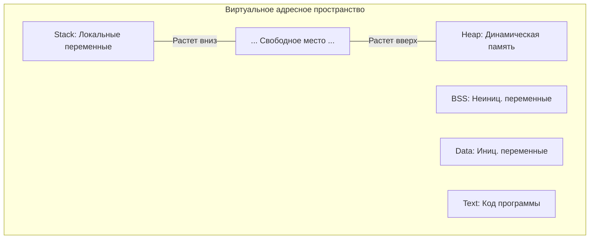
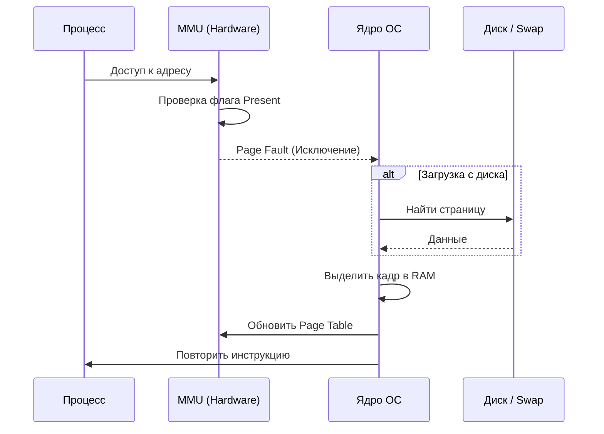
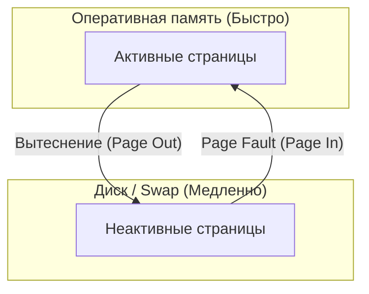

# Память в операционных системах

## Виртуальная память, физическая память, MMU, page fault, swapping

---

## 0. Зачем вообще нужна сложная система памяти

Если бы программы работали напрямую с физической памятью:

- один процесс мог бы читать и портить память другого
- падение программы могло бы повалить всю систему
- нельзя было бы эффективно использовать RAM
- невозможно было бы запускать много программ одновременно

Решение — **виртуальная память**.

---

## 1. Физическая память (RAM)

### 1.1 Что такое физическая память

**Физическая память** (Physical Memory) — это реальные микросхемы RAM в компьютере.

**Характеристики:**

- Ограниченный объём (например, 16 GB).
- Очень высокая скорость доступа.
- Адресуется прямолинейно через физические адреса ОС.

---

### 1.2 Почему процессы не работают с RAM напрямую?

> [!CAUTION]
> **Прямой доступ — это опасно**: Если дать процессу прямой доступ к RAM, он сможет прочитать пароли из памяти браузера или случайно перезаписать код ядра системы.

Поэтому процесс **никогда не видит** реальные физические адреса. Он живет в своей «песочнице».

---

## 2. Виртуальная память

**Виртуальная память** — это абстракция, создающая для процесса иллюзию, что:

- У него есть собственное, непрерывное и огромное адресное пространство.
- Он никак не пересекается с другими процессами.
- Памяти может быть даже больше, чем реально установлено планок RAM (за счет диска).

### 2.1 Главная идея

**Виртуальный адрес** → (**MMU**) → **Физический адрес**

**Схема трансляции:**

---

## 3. Анатомия процесса в памяти (Сегменты)

Виртуальная память процесса не просто «кусок» адресов. Она разделена на логические сегменты, каждый из которых имеет своё назначение.

### 3.1 Основные сегменты:

- **Text Segment (Code)**: Здесь лежит скомпилированный машинный код вашей программы. Он обычно **Read-Only**, чтобы программа случайно не изменила себя в процессе работы.
- **Data Segment**: Здесь хранятся глобальные и статические переменные, которые были проинициализированы при запуске.
- **BSS (Block Started by Symbol)**: Специфический раздел для глобальных переменных, которые объявлены, но не имеют начального значения (обнулены по умолчанию).
- **Heap (Куча)**: Память для динамических данных (объекты, созданные через `new` или `make`). Она растет «вверх» (в сторону увеличения адресов).
- **Stack (Стек)**: Память для локальных переменных функций и адресов возврата. Стек растет «вниз» (в сторону уменьшения адресов), навстречу куче.

**Схема устройства процесса:**

> [!TIP]
> **Stack vs Heap**: Стек очень быстрый, потому что за ним следит CPU (LIFO), но его размер ограничен. Куча — огромная, но управление ей (выделение и очистка GC) стоит ресурсов.

---

## 4. Страницы памяти (Pages)

### 4.1 Зачем память делят на страницы

Управлять памятью по байтам слишком дорого.

Поэтому:

- память делят на фиксированные блоки
- минимальная единица управления — **страница**

---

### 4.2 Размер страницы

Обычно:

- 4 KB (4096 байт)

Иногда:

- 2 MB (huge pages)
- 1 GB (редко)

В этом конспекте:
1 page = 4 KB

---

### 4.3 Виртуальные и физические страницы

- виртуальная память состоит из виртуальных страниц
- физическая RAM состоит из физических страниц

ОС сопоставляет их между собой.

---

## 5. MMU (Memory Management Unit)

### 5.1 Что такое MMU

MMU — это аппаратный блок внутри CPU, который:

- переводит виртуальные адреса в физические
- проверяет права доступа
- вызывает page fault

MMU работает **на каждом доступе к памяти**.

---

### 5.2 Кто управляет MMU

MMU ничего не решает сам.

Его настраивает:

- операционная система
- через таблицы страниц

---

## 6. Page Tables (Таблицы страниц)

Таблица страниц — это «карта», по которой **MMU** ориентируется, где в реальности лежат данные.

### 6.1 Флаги страниц

Каждая запись в таблице содержит флаги доступа:

- **Present**: Загружена ли страница в RAM?
- **Read/Write**: Можно ли менять данные?
- **User/Kernel**: Доступна ли страница обычному процессу?
- **NX (No Execute)**: Можно ли исполнять код на этой странице? (Защита от эксплойтов).

---

## 7. TLB (Translation Lookaside Buffer)

Чтобы не заглядывать в таблицу страниц (которая лежит в RAM) при каждом обращении, CPU использует **TLB**.

> [!TIP]
> **TLB** — это сверхбыстрый кэш переводов адресов внутри процессора. Его размер невелик, но он покрывает 99% всех запросов памяти.

---

## 8. Page Fault (Отказ страницы)

Многие думают, что "fault" — это ошибка, но в контексте памяти это **ключевой механизм**.

> [!IMPORTANT]
> **Page Fault** — это сигнал процессора операционной системе: «Процесс хочет данные по адресу X, но их сейчас нет в оперативной памяти! Разберись».

**Схема обработки Page Fault:**

---

### 8.1 Что происходит при page fault

1. MMU обнаруживает проблему
2. CPU вызывает исключение
3. Управление передаётся ОС
4. ОС:
   - выделяет страницу RAM
   - или загружает её с диска
   - обновляет page table
5. Инструкция выполняется заново

---

### 8.2 Minor и Major page fault

- Minor:
  - страница есть
  - но не в TLB

- Major:
  - страницы нет в RAM
  - нужна загрузка с диска

---

## 9. Demand Paging (Ленивая загрузка)

### 9.1 Суть demand paging

Страницы загружаются:

- не заранее
- а только при первом доступе

Процесс может зарезервировать много памяти,
но реально использовать мало.

---

## 10. Swap (Подкачка)

**Swap** — это расширение оперативной памяти за счет диска.

**Зачем он нужен?**

- Диск в тысячи раз медленнее RAM, но его много.
- Если RAM закончится, без Swap система начнет убивать процессы (**OOM Killer**).
- Со Swap система просто начнет «подтормаживать», но продолжит работу.

**Схема Swap:**

---

## 11. Page Replacement (Вытеснение страниц)

### 11.1 Почему нужно вытеснение

Если RAM заполнена:

- чтобы загрузить новую страницу
- нужно вытеснить старую

---

### 11.2 Как выбирают страницу для вытеснения

Используются эвристики:

- LRU (приближённо)
- Clock
- другие алгоритмы

---

### 11.3 Dirty и Clean страницы

- Clean:
  - совпадает с диском
  - можно просто выбросить

- Dirty:
  - изменена
  - нужно сохранить в swap

---

## 12. Memory-mapped files (mmap)

### 12.1 Что такое mmap

mmap — это механизм, при котором:

- файл отображается в память
- работа с файлом выглядит как работа с RAM

---

### 12.2 mmap и page fault

- данные читаются лениво
- page fault подгружает нужную часть файла

---

## 13. Copy-On-Write (COW)

**COW** — это гениальная оптимизация при создании процессов (`fork`).

> [!NOTE]
> При создании копии процесса ОС не копирует всю его память сразу. Она просто дает обоим процессам ссылки на одни и те же физические страницы, помечая их как **Read-Only**.

Как только один из процессов пытается что-то **записать**, происходит **Page Fault**, ОС копирует конкретную страницу и дает процессу его собственную копию.

---

## 14. OOM Killer (Ангел смерти)

Когда закончилась и RAM, и Swap, ядро Linux вызывает **OOM Killer**.
Он анализирует процессы и выбирает «жертву» (обычно ту, что ест больше всех памяти и меньше всех приносит пользы), принудительно завершая её, чтобы вся система не «встала колом».

---

## 15. Итог: Главные мысли

| Концепция              | Коротко о главном                                             |
| :--------------------- | :------------------------------------------------------------ |
| **Процесс**            | Разбит на сегменты (**Text**, **Data**, **Stack**, **Heap**). |
| **Виртуальная память** | Изоляция процесса и иллюзия безграничной RAM.                 |
| **MMU & TLB**          | Аппаратные ускорители перевода адресов.                       |
| **Page Table**         | Карта соответствия виртуальных страниц физическим.            |
| **Page Fault**         | Метод ленивой подгрузки данных с диска в RAM.                 |
| **Swap**               | Диск как бесконечный (но медленный) резерв памяти.            |
| **COW**                | Оптимистичное копирование памяти только при записи.           |

---

## 16. Основная идея

Процесс никогда не видит реальную «железную» память. Он живет в мире виртуальных адресов, которыми виртуозно управляет операционная система, жонглируя страницами между RAM и диском, изолируя процессы и оптимизируя ресурсы.
