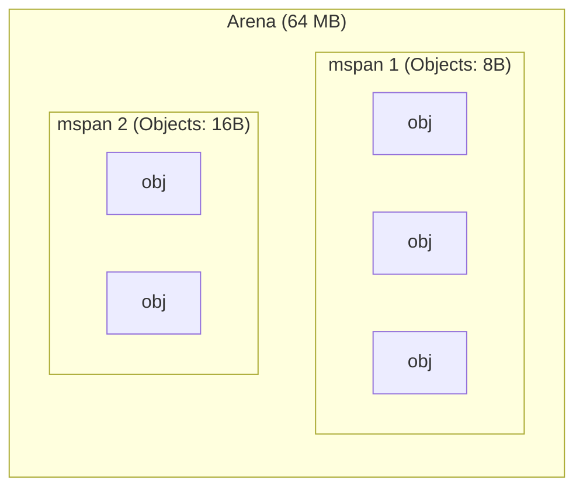
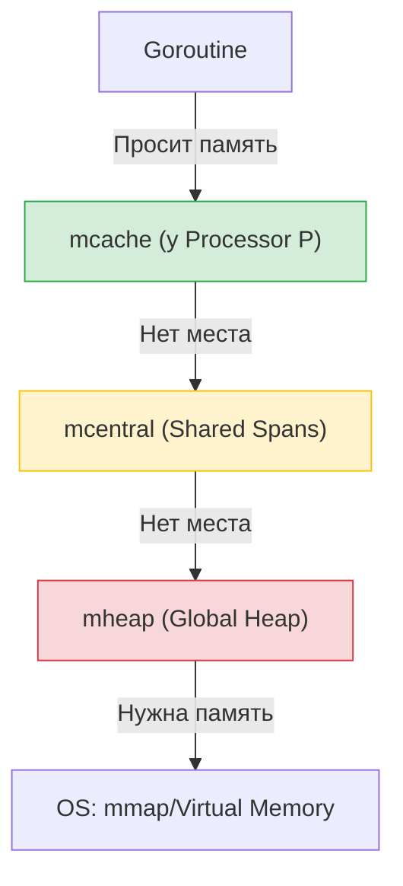

# Аллокатор памяти в Go  
## Как Go управляет кучей: Схемы, структуры и оптимизации

---

## 0. Введение

Чтобы понять, как Go выделяет память, нужно помнить базу из [OS Memory Base](./Base.md): операционная система дает процессу **виртуальную память**, разбитую на страницы.

Go не просит у ОС память под каждую переменную (это было бы слишком медленно из-за системных вызовов). Вместо этого Go забирает у ОС огромные куски памяти (**Arenas**) и сам нарезает их на маленькие части.

> [!IMPORTANT]
> Дизайн аллокатора Go основан на **TCMalloc** (Thread-Caching Allocator). Главная идея: минимизировать блокировки (locks), давая каждому потоку (в Go — каждому процессору P) свой локальный запас памяти.

---

## 1. Физическая структура: Матрешка из памяти

Аллокатор Go видит память как иерархию структур.

### 1.1 Page (Страница)
Как и в ОС, минимальная единица здесь — страница. В Go одна страница обычно равна **8 KB**.

### 1.2 mspan (Спан)
Это базовый кирпичик аллокатора. 
**mspan** — это непрерывный набор из одной или нескольких страниц (например, один спан может содержать 3 страницы по 8 KB = 24 KB).

Спаны нарезаются на объекты одинакового размера. Например:
- Спан А: нарезан на объекты по 8 байт.
- Спан Б: нарезан на объекты по 16 байт.

### 1.3 Arena (Арена)
Это огромные куски виртуальной памяти (по 64 MB в 64-битном Linux), которые Go запрашивает у ОС. Весь Heap (куча) в Go состоит из набора таких арен.

---

## 2. Size Classes: Борьба с фрагментацией

Если мы будем выделять ровно столько байт, сколько просит пользователь (например, 13 байт, потом 7, потом 21), в памяти образуются "дырки" — **фрагментация**.

Чтобы этого избежать, Go использует **Size Classes** (классы размеров).
Всего их около 67. Если вы просите 13 байт, Go выделит вам объект из класса "16 байт". Да, 3 байта пропадут зря (**внутренняя фрагментация**), но зато память останется чистой и структурированной.

> [!TIP]
> Классы размеров позволяют аллокатору быстро находить свободное место: он просто ищет ближайший подходящий спан нужного класса.

---

## 3. Логическая иерархия: Три уровня кэширования

Чтобы работать быстро под нагрузкой, Go использует трехуровневую систему.

### 3.1 mcache (Локальный кэш)
У каждого процессора **P** (из GMP модели) есть свой `mcache`.
- **Зачем**: Чтобы выделять память **без блокировок**. Горутина на P просто берет память из своего `mcache`.
- **Что внутри**: Набор спанов разных классов размеров.

### 3.2 mcentral (Общий склад спанов)
Если в `mcache` закончились свободные объекты нужного класса, он идет в `mcentral`.
- **Зачем**: Общий склад для всех P.
- **Особенность**: Здесь есть блокировка (`mutex`), но она **гранулярная** — только на конкретный класс размера.

### 3.3 mheap (Глобальная куча)
Если и в `mcentral` пусто, управление переходит к `mheap`.
- **Зачем**: Хранит все арены и управляет большими объектами.
- **Особенность**: Самая "тяжелая" блокировка на весь аллокатор.

**Схема иерархии:**

---

## 4. Как выделяется память: Три пути

Go делит объекты на три категории в зависимости от их размера:

### 4.1 Tiny Objects (< 16 байт)
Это очень маленькие объекты (например, маленькие строки или числа).
- **Путь**: `mcache` -> **Tiny Allocator**.
- **Оптимизация**: Чтобы не тратить по целому блоку на каждый "чих", Go упаковывает несколько крошечных объектов в один блок размером 16 байт.

### 4.2 Small Objects (от 16 байт до 32 KB)
Самый частый случай.
- **Путь**: `mcache` -> `mcentral` -> `mheap`.
- **Алгоритм**: Ищется свободный слот в `mcache` нужного Size Class. Если нет — запрашивается новый спан у `mcentral`.

### 4.3 Large Objects (> 32 KB)
Очень большие структуры или слайсы.
- **Путь**: **Напрямую в `mheap`**.
- **Особенность**: Такие объекты слишком велики для локальных кэшей. Они выделяются сразу в глобальной куче, обходя `mcache` и `mcentral`.

---

## 5. Куда попадут данные: Stack или Heap?

Начинающие часто спрашивают: "А эта переменная будет в стеке или в куче?". В Go этим занимается компилятор с помощью **Escape Analysis** (анализ утечек).

### 5.1 Stack (Стек)
- **Что там**: Локальные переменные, которые "не покидают" функцию.
- **Плюсы**: Невероятно быстро. Память освобождается автоматически при выходе из функции (просто сдвигается указатель стека).
- **Минус**: Размер фиксирован (в Go стек горутины начинается с 2 KB и может расти, но всё равно ограничен).

### 5.2 Heap (Куча)
- **Что там**: Данные, на которые есть ссылки из других частей программы, или слишком большие объекты.
- **Плюсы**: Живут долго, размер не ограничен.
- **Минусы**: Медленнее выделяется память, а главное — её должен чистить **Garbage Collector (GC)**, что потребляет CPU.

> [!TIP]
> **Золотое правило**: Чем больше данных остается на стеке, тем меньше работы у Garbage Collector и тем быстрее ваша программа.

---

## 6. Итог: Как всё это работает вместе

Представьте процесс как покупку кофе:
1.  **mcache**: Это ваш карман. Если там есть монетки (свободные слоты), вы платите мгновенно.
2.  **mcentral**: Это банкомат в торговом центре. Если в кармане пусто, вы идете туда (нужна небольшая очередь-блокировка).
3.  **mheap**: Это отделение банка. Если банкомат сломан или вам нужна огромная сумма (Large Object), вы идете в банк (самая долгая процедура).

### Сводная таблица

| Уровень | Кто владеет | Скорость | Блокировки | Назначение |
| :--- | :--- | :--- | :--- | :--- |
| **mcache** | Процессор P | Молния | Нет (Lock-free) | Мелкие и частые аллокации |
| **mcentral** | Глобально (на класс) | Быстро | Mutex (только на один Size Class) | Подпитка mcache спанами |
| **mheap** | Глобально | Медленно | Глобальный Mutex | Управление аренами и большими объектами |

> [!NOTE]
> Такая архитектура делает Go одним из самых быстрых языков в плане работы с памятью среди языков с Garbage Collector.
