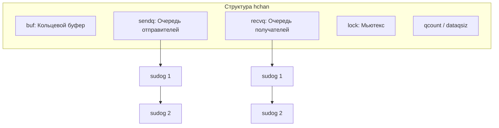
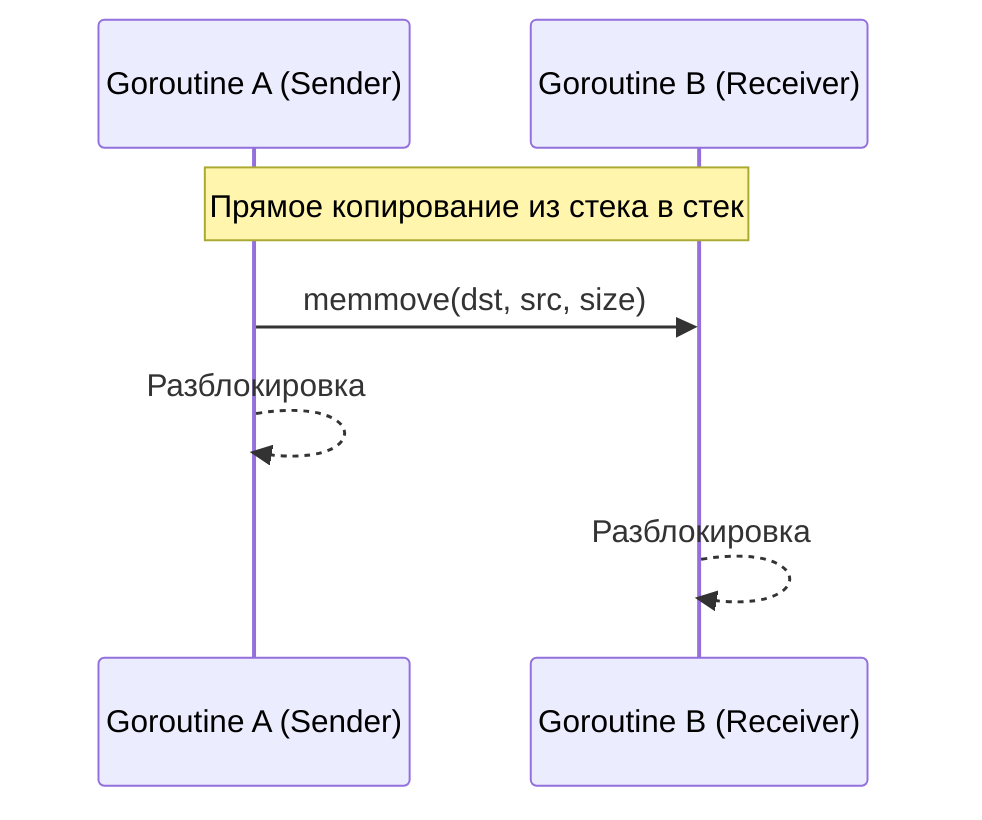
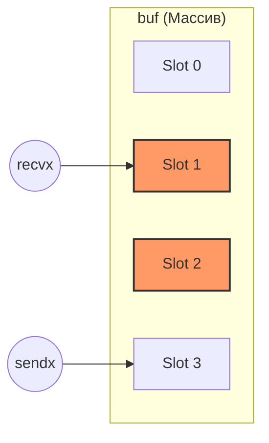
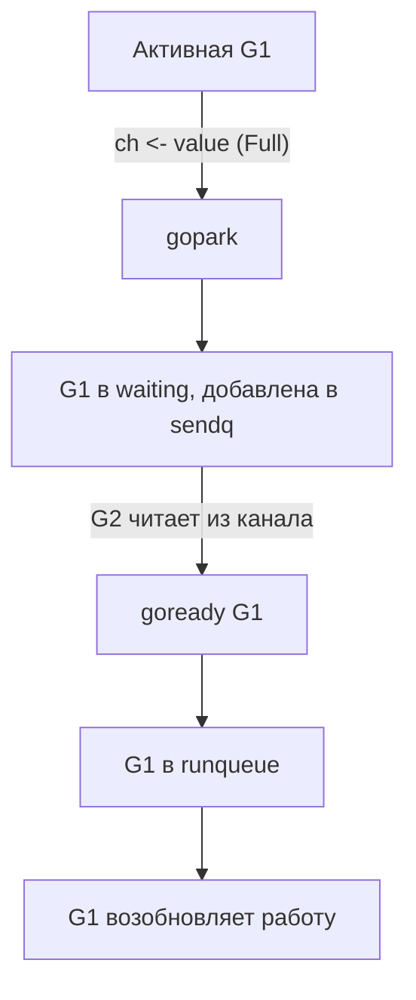

### Что такое каналы в Go?

Каналы (channels) — это один из ключевых механизмов в Go для синхронизации и обмена данными между горутинами (goroutines). Они реализуют концепцию CSP (Communicating Sequential Processes), где горутины общаются напрямую через каналы, а не через общую память. Основной принцип: "Не общайтесь через общую память, делитесь памятью через общение".

Каналы создаются с помощью встроенной функции make и имеют тип chan T, где T — это тип данных, который будет передаваться через канал.

Пример создания канала:

```Go
ch := make(chan int) // канал для передачи целых чисел
```

---

### Как каналы работают под капотом?

Внутренне канал в Go представлен структурой **hchan** (в исходниках `runtime/chan.go`). Она управляет очередями горутин и хранением данных.

```go
type hchan struct {
    qcount   uint           // Количество элементов в буфере
    dataqsiz uint           // Размер кольцевого буфера
    buf      unsafe.Pointer // Указатель на буфер (массив)
    elemsize uint16         // Размер одного элемента
    closed   uint32         // Флаг закрытия канала
    elemtype *_type         // Тип данных в канале
    sendx    uint           // Индекс для записи (для буфера)
    recvx    uint           // Индекс для чтения (для буфера)
    recvq    waitq          // Список ожидающих получателей
    sendq    waitq          // Список ожидающих отправителей
    lock     mutex          // Мьютекс для защиты всех полей hchan
}
```

**Схема структуры hchan:**


> [!IMPORTANT]
> Канал — это всегда указатель (`*hchan`). Когда вы передаёте канал в функцию, вы копируете адрес структуры, поэтому обе функции работают с одними и теми же очередями и буфером.

#### Что такое `lock`?
Любая операция с каналом (запись, чтение, закрытие) начинается с захвата **lock**. Это гарантирует, что только одна горутина может изменять состояние канала в данный момент. Именно поэтому каналы потокобезопасны.

---

### Типы каналов

Теперь разберём три основных типа каналов: небуферизированные, буферизированные и nil-каналы.

#### 1. Небуферизированные каналы

- **Создание**: ch := make(chan int) (без указания размера буфера).

- **Особенность**: Размер буфера равен 0 (dataqsiz = 0), то есть в канале нет места для хранения данных.

- **Как работает**:
  - Операция записи (ch <- value) блокирует горутину-отправителя, пока другая горутина не выполнит операцию чтения (<-ch).
  - Операция чтения (<-ch) блокирует горутину-получателя, пока другая горутина не выполнит запись.
  - Передача данных происходит напрямую между горутинами (без промежуточного хранения), это называется **синхронное поведение**.

- **Под капотом**:
  - Если отправитель пытается записать в канал (`ch <- value`), а получателя нет, он добавляется в очередь **sendq** и «засыпает».
  - Если получатель пытается прочитать (`<-ch`), а отправителя нет, он добавляется в очередь **recvq** и тоже засыпает.
  - **Direct Copy**: Когда получатель находит отправителя (или наоборот), данные копируются **напрямую из стека в стек** горутины, минуя промежуточный буфер. Это одна из главных оптимизаций Go.

**Схема Direct Copy (Синхронная передача):**


Пример:

```Go
func main() {
    ch := make(chan int)
    go func() {
        ch <- 42 // запись блокирует, пока не будет чтения
    }()
    fmt.Println(<-ch) // чтение разблокирует отправителя
}
```

- **Зачем использовать**: Небуферизированные каналы идеальны для синхронизации, когда нужно гарантировать, что одна горутина закончила работу, прежде чем другая начнёт.

---

#### 2. Буферизированные каналы

- **Создание**: ch := make(chan int, 3) (с указанием размера буфера, здесь 3).

- **Особенность**: Канал имеет буфер фиксированного размера (dataqsiz > 0), который хранит данные в порядке FIFO (first-in, first-out).

- **Как работает**:
  - Операция записи (ch <- value) неблокирующая, если в буфере есть место. Если буфер заполнен, отправитель блокируется, пока не освободится место.
  - Операция чтения (<-ch) неблокирующая, если в буфере есть данные. Если буфер пуст, получатель блокируется, пока не появятся данные.
  - Это **асинхронное поведение**, пока буфер не заполнен или не опустошён.

- **Под капотом**:
  - Буфер реализован как **кольцевой массив** (**buf**), где **sendx** указывает на позицию для записи, а **recvx** — для чтения.
  - При записи данные копируются в буфер, **sendx** увеличивается. Если буфер заполнен, отправитель добавляется в **sendq** и блокируется.
  - При чтении данные извлекаются из буфера, **recvx** увеличивается. Если буфер пуст, получатель добавляется в **recvq** и блокируется.
  - Мьютекс (**lock**) защищает доступ к буферу от гонок данных.

**Схема кольцевого буфера:**


Пример:

```Go
func main() {
    ch := make(chan int, 2)
    ch <- 1 // буфер: [1]
    ch <- 2 // буфер: [1, 2]// ch <- 3 // здесь заблокируется, т.к. буфер полон (размер 2)
    fmt.Println(<-ch) // буфер: [2]
    fmt.Println(<-ch) // буфер: пуст
}
```

- **Зачем использовать**: Буферизированные каналы полезны, когда нужно временно хранить данные или избежать блокировки для повышения производительности.

---

#### 3. Nil-каналы

- **Создание**: var ch chan int (по умолчанию канал равен nil, если не инициализирован через make).

- **Особенность**: Это просто нулевое значение типа chan T. Нельзя записывать или читать из nil-канала.

- **Как работает**:
  - Операция записи (ch <- value) блокируется навсегда.
  - Операция чтения (<-ch) блокируется навсегда.
  - Использование в select:
    - Если в select есть ветка с nil-каналом, она никогда не будет выбрана (игнорируется).

- **Под капотом**:
  - Nil-канал — это просто указатель nil вместо структуры hchan. Runtime проверяет это и сразу переводит горутину в состояние ожидания без дополнительных действий.

Пример:

```Go
func main() {
    var ch chan int // ch == nil
    go func() {
        ch <- 42 // блокируется навсегда
    }()
    fmt.Println(<-ch) // блокируется навсегда
}
```

- **Зачем использовать**: Nil-каналы часто применяются в паттернах с select для динамического включения/выключения каналов. Например:

```Go
func main() {
    ch1 := make(chan int)
    var ch2 chan int // nil
    select {
    case <-ch1:
        fmt.Println("ch1")
    case <-ch2: // эта ветка игнорируется, т.к. ch2 == nil
        fmt.Println("ch2")
    }
}
```

---

#### Закрытие каналов

- Каналы можно закрыть с помощью close(ch).

- **Особенности**:
  - После закрытия запись в канал вызывает панику.
  - Чтение из закрытого канала возвращает нулевое значение типа данных (например, 0 для int) и ok == false в случае value, ok := <-ch.
  - Закрытие nil-канала вызывает панику.

- **Под капотом**: При вызове close runtime устанавливает флаг в структуре hchan и будит все горутины из recvq и sendq, сообщая им о закрытии.

Пример:

```Go
func main() {
    ch := make(chan int, 1)
    ch <- 42
    close(ch)
    v, ok := <-ch
    fmt.Println(v, ok) // 42 true
    v, ok = <-ch
    fmt.Println(v, ok) // 0 false
}
```

---

## Парковка горутин (Gopark и Goready)

Когда горутина не может продолжить работу (например, пишет в полный канал), она должна «запаковаться» (освободить тред). Этот процесс называется **parking**.

### Очереди ожидания (sendq и recvq)
Это двусвязные списки, элементами которых являются структуры **sudog**.
- **sudog** — это обёртка над горутиной (**G**), которая содержит информацию о том, какой элемент она хочет передать или получить.

### Алгоритм блокировки (gopark):
1. Горутина создает структуру **sudog**.
2. Помещает её в **sendq** (для отправителя) или **recvq** (для получателя) канала.
3. Вызывает функцию `gopark`.
4. Планировщик Go снимает горутину с выполнения (тред **M** освобождается и может взять другую горутину).
5. Состояние горутины меняется на `waiting`.

### Алгоритм пробуждения (goready):
1. Другая горутина выполняет операцию, которая разблокирует первую (например, чистит буфер).
2. Она находит **sudog** в очереди канала.
3. Извлекает **G** из **sudog**.
4. Вызывает функцию `goready`.
5. Планировщик переводит горутину в состояние `runnable`, и она попадает в очередь на выполнение (LRQ/GRQ).

> [!TIP]
> **Важно**: Горутины не «просыпаются» сами. Их всегда будет кто-то другой (та горутина, которая сделала чтение или запись, разблокировавшую очередь).

**Схема парковки и пробуждения:**


---

### Итог

1. **Небуферизированные каналы**: Синхронные, работают через прямую копию между стеками.
2. **Буферизированные каналы**: Асинхронные до заполнения буфера, используют кольцевой буфер и копирование в/из него.
3. **Nil-каналы**: Всегда блокируют горутину навсегда (вызывают `gopark` без шанса на `goready`).
4. **Закрытие**: Устанавливает флаг `closed` и будит всех ждущих (они получают нулевые значения).
5. **Sudog**: Ключевое связующее звено между планировщиком и каналами.
