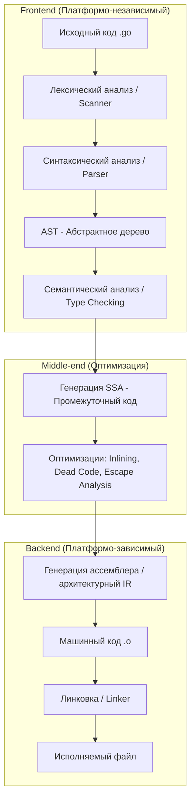
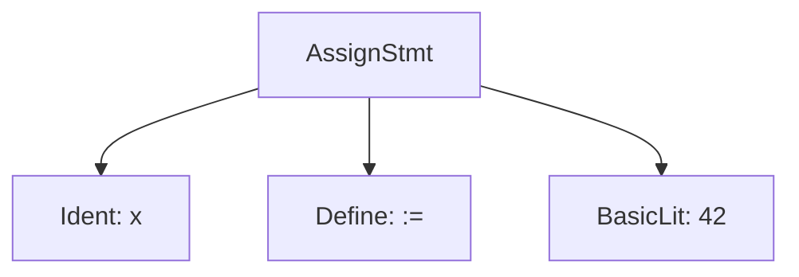

## 🏗️ Стадии компиляции

Процесс компиляции в Go можно разделить на три больших этапа: **Frontend**, **Middle-end** и **Backend**.



---

## ⚙️ Подробный разбор стадий

### 1. 🔍 Лексический анализ (токенизация)

- **Что происходит**: Исходный код разбивается на **токены** — минимальные синтаксические единицы (ключевые слова, идентификаторы, операторы, числа).
- **Пример**: Код x := 42 разбивается на токены: x, :=, 42.
- **В Go**: Лексический анализатор (scanner) в пакете go/scanner преобразует код в поток токенов, игнорируя пробелы и комментарии.

**Пример кода (Go)**:

```go
package main

func main() {
	x := 42
}
```

**Токены**:

```
package, main, func, main, (, ), {, x, :=, 42, }
```

### 2. 🌲 Синтаксический анализ (построение AST)

- **Что происходит**: Токены анализируются для проверки синтаксиса и построения **AST** (**Abstract Syntax Tree**). Это дерево отражает структуру программы.
- **В Go**: Парсер (`go/parser`) строит AST, проверяя синтаксическую корректность.

**Визуализация AST для `x := 42`**:


### 3. 🧪 Семантический анализ

- **Что происходит**: Проверяется семантическая корректность:
  - Типы переменных (например, x совместим с int).
  - Объявления (функции, переменные).
  - Доступ к переменным/функциям.
- **Пример**: Проверяется, что x := 42 корректно (тип int для 42, x не переопределяется).
- **В Go**: Компилятор проверяет типы, области видимости и зависимости.

**Пример ошибки**:

```go
x := "string"
x = 42 // Ошибка: несовместимые типы
```

### 4. 🧬 Генерация промежуточного кода (SSA)

- **Что происходит**: AST преобразуется в **SSA** (**Static Single Assignment**) — промежуточное представление, где каждой переменной значение присваивается ровно один раз.
- **В Go**: Go использует **SSA** для глубоких оптимизаций. Это позволяет компилятору легко отслеживать использование переменных.

> [!NOTE]
> **SSA** делает код платформо-независимым. На этом этапе компилятор еще не «знает», какой будет процессор (x86 или ARM).

### 5. ⚡ Оптимизация

- **Что происходит**: Промежуточный код оптимизируется:
  - **Inlining**: Подстановка тела мелких функций вместо их вызова.
  - **Escape Analysis**: Решение, где выделить память — на **стеке** (быстро) или в **куче** (медленно, нужен GC).
  - **Dead Code Elimination**: Удаление кода, который никогда не выполнится.

### 6. 💻 Генерация машинного кода

- **Что происходит**: IR преобразуется в **машинный код** (инструкции для процессора, например, x86, ARM).
- **Пример**: Для x := 42 генерируются инструкции для выделения памяти и записи значения.
- **В Go**: Компилятор (gc) генерирует ассемблерный код, специфичный для целевой архитектуры.

**Пример ассемблера (x86, упрощенно)**:

```
MOVQ $42, AX
MOVQ AX, [SP-8]
```

### 7. 🔗 Линковка

- **Что происходит**: **Линковщик** объединяет объектные файлы (сгенерированный машинный код) и библиотеки в единый исполняемый файл. Решает ссылки на внешние функции/переменные.
- **Пример**: Если программа вызывает fmt.Println, линковщик подключает библиотеку fmt.
- **В Go**: Линковщик (go tool link) создает бинарный файл (например, a.out или myprogram).

**Пример команды**:

```bash
go build main.go
```

- Создает исполняемый файл, включающий код и зависимости.

---

## 🔄 Роль транспилятора (Frontend в Backend)

В Go компилятор (`gc`) часто называют транспилятором в широком смысле, потому что он превращает Go-код сначала в архитектурно-независимый **SSA**, а затем в платформо-зависимый **ассемблер**.

> [!TIP]
> **Зачем промежуточный ассемблер?**
> Это позволяет Go быть очень переносимым. Чтобы поддержка новой архитектуры (например, нового чипа Apple M1/M2) была проще, разработчикам Go достаточно реализовать только «хвост» компилятора, который превращает **SSA** в конкретные машинные команды.

---

## 🔗 Роль линковщика

### Что делает линковщик?

- **Объединяет объектные файлы**: Собирает скомпилированные модули (.o) в исполняемый файл.
- **Решает ссылки**: Связывает вызовы функций/переменных с их реализациями (например, подключает fmt).
- **Управляет памятью**: Распределяет адреса для кода, данных и стека.
- **Добавляет метаданные**: Включает информацию для ОС (например, формат ELF для Linux).

### Как работает в Go?

- Линковщик (go tool link) берет объектные файлы, созданные компилятором, и:
  - Связывает их с стандартной библиотекой Go (runtime, fmt, и т.д.).
  - Создает исполняемый файл в формате, подходящем для ОС (ELF, PE, Mach-O).
  - Определяет точки входа (например, main).
- Пример: Для программы с fmt.Println линковщик подключает код из fmt.

**Пример команды**:

```bash
go tool link -o myprogram main.o
```

### Пример работы линковщика

Программа:

```go
package main

import "fmt"

func main() {
	fmt.Println("Hello, World!")
}
```

- **Объектный файл** (main.o): Содержит машинный код для main, но ссылается на fmt.Println.
- **Линковщик**:
  - Находит реализацию fmt.Println в библиотеке fmt.
  - Создает исполняемый файл (myprogram), готовый для запуска.

---

## 🖥️ Машинный код

### Что такое машинный код?

- **Машинный код** — низкоуровневые инструкции, которые процессор выполняет напрямую (в двоичном формате, например, 0xB8 0x2A 0x00).
- В Go машинный код генерируется для целевой архитектуры (x86, ARM, и т.д.) и ОС (Linux, Windows).

### Пример машинного кода

Для x := 42 на x86:

```
B8 2A 00 00 00  ; MOV AX, 42
89 44 24 F8     ; MOV [SP-8], AX
```

- **MOV**: Перемещает значение в регистр или память.
- **AX**: Регистр процессора.
- **SP-8**: Адрес в стеке для переменной x.

### Как Go генерирует машинный код?

- Компилятор преобразует IR в ассемблер.
- Ассемблер переводит его в машинный код.
- Линковщик упаковывает в исполняемый файл.

---

## 📋 Порядок стадий компиляции в Go

1. **Токенизация**:
   - Исходный код → токены (x, :=, 42).

2. **Синтаксический анализ**:
   - Токены → AST (дерево с узлами для переменных, функций).

3. **Семантический анализ**:
   - Проверка типов, областей видимости.

4. **Генерация IR**:
   - AST → SSA (промежуточный код).

5. **Оптимизация**:
   - Инлайнинг, удаление мертвого кода.

6. **Генерация ассемблера**:
   - IR → ассемблерный код (транспиляция).

7. **Ассемблирование**:
   - Ассемблер → машинный код (.o).

8. **Линковка**:
   - Объектные файлы + библиотеки → исполняемый файл.

---

## 🚀 Пример полного процесса

**Исходный код**:

```go
package main

import "fmt"

func main() {
	x := 42
	fmt.Println(x)
}
```

### 1. Токенизация

Токены: package, main, import, "fmt", func, main, (, ), {, x, :=, 42, fmt, ., Println, (, x, ), }.

### 2. Синтаксический анализ

AST (упрощенно):

```
Program
  └─ PackageDecl: "main"
  └─ ImportDecl: "fmt"
  └─ FuncDecl: "main"
       └─ BlockStmt
            ├─ AssignStmt
            │    ├─ Var: "x"
            │    ├─ Operator: ":="
            │    └─ Literal: 42
            └─ CallStmt
                 ├─ Func: "fmt.Println"
                 └─ Arg: "x"
```

### 3. Семантический анализ

- Проверено: x — int, fmt.Println существует, x доступен.

### 4. Генерация IR

SSA (упрощенно):

```
v1 = const 42 : int
x = v1
call fmt.Println(x)
```

### 5. Оптимизация

- Например, инлайнинг fmt.Println (если возможно).

### 6. Генерация ассемблера

Ассемблер (x86, упрощенно):

```
TEXT main.main(SB), NOSPLIT, $16-0
    MOVQ $42, AX
    MOVQ AX, main.x-8(SP)
    LEAQ main.x-8(SP), AX
    CALL fmt.Println(SB)
    RET
```

### 7. Ассемблирование

- Ассемблер → объектный файл (main.o).

### 8. Линковка

- main.o + библиотека fmt → a.out.

**Результат**:

```bash
go build main.go
./main
# Вывод: 42
```

---

## 🛠️ Как быстро понять процесс? (Инструменты и советы)

### Ключевые этапы

- **Токены → AST**: Код разбирается на части и структурируется.
- **Семантика**: Проверяется логика (типы, области видимости).
- **IR → Ассемблер**: Код преобразуется в низкоуровневый формат.
- **Машинный код → Линковка**: Создается исполняемый файл.

### Инструменты Go

- **Просмотр токенов**:
  ```bash
  go vet main.go
  ```
- **Просмотр AST**:
  ```go
  import "go/parser"
  // Парсинг кода
  ```
- **Просмотр ассемблера**:
  ```bash
  go tool compile -S main.go
  ```
- **Просмотр объектного файла**:
  ```bash
  go tool objdump main.o
  ```

### Советы

- **Изучайте ассемблер**: Помогает понять машинный код.
- **Используйте** go build -gcflags=-S: Показывает ассемблерный вывод.
- **Экспериментируйте**: Компилируйте простые программы и анализируйте этапы.

---

## Рекомендации

### Когда углубляться?

- **Лексический/синтаксический анализ**: Если пишете парсер или компилятор.
- **AST**: Для инструментов анализа кода (линтеры, рефакторинг).
- **IR/оптимизация**: Для оптимизации производительности.
- **Линковка/машинный код**: Для низкоуровневого программирования или отладки.

### Типичные сценарии

- **Разработка**: Простой go build для компиляции.
- **Отладка**: Используйте go tool compile -S для анализа ассемблера.
- **Оптимизация**: Изучайте escape analysis (-gcflags=-m).

### Полезные команды

- **Компиляция**:
  ```bash
  go build main.go
  ```
- **Ассемблер**:
  ```bash
  go tool compile -S main.go
  ```
- **Объектный файл**:
  ```bash
  go tool objdump main.o
  ```
- **Линковка**:
  ```bash
  go tool link -o myprogram main.o
  ```

---

## Примечания

- **Код**: Пример показывает простой процесс компиляции. Для сложных программ добавляются зависимости и оптимизации.
- **Go**: Компилятор Go упрощает процесс, но следует стандартным стадиям.
- **Машинный код**: Зависит от архитектуры (x86, ARM), но концепции универсальны.
