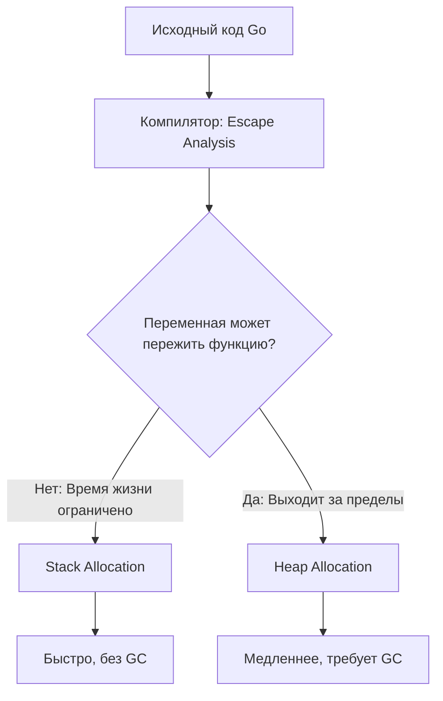
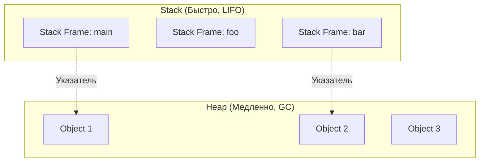
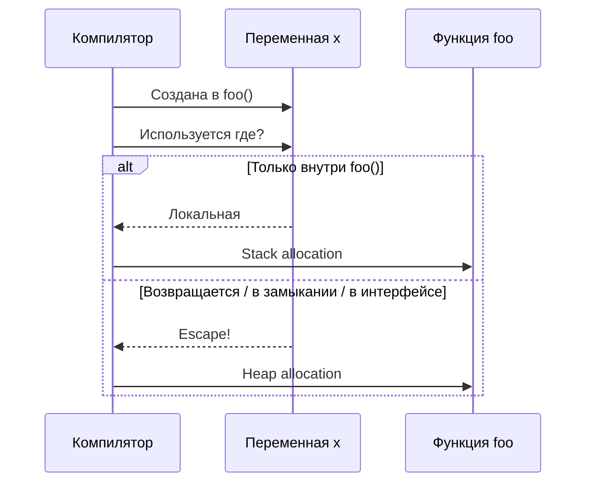
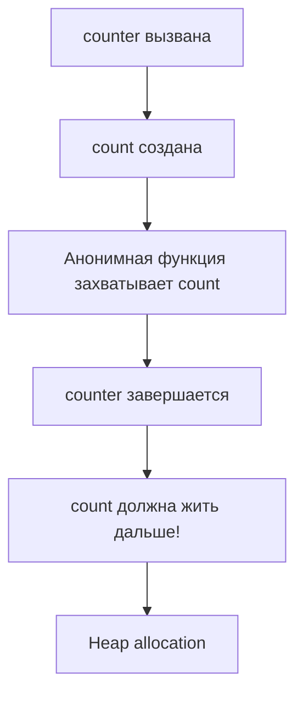

# Escape Analysis в Go

## Содержание
1. [Что такое Escape Analysis](#что-такое-escape-analysis)
2. [Stack vs Heap: Фундаментальные понятия](#stack-vs-heap-фундаментальные-понятия)
3. [Зачем нужен Escape Analysis](#зачем-нужен-escape-analysis)
4. [Как работает Escape Analysis](#как-работает-escape-analysis)
5. [Когда переменная "убегает" на heap](#когда-переменная-убегает-на-heap)
6. [Когда переменная остается на stack](#когда-переменная-остается-на-stack)
7. [Массивы и слайсы: Роль размера](#массивы-и-слайсы-роль-размера)
8. [Инструменты диагностики](#инструменты-диагностики)
9. [Подводные камни](#подводные-камни)
10. [Best Practices](#best-practices)

---

## Что такое Escape Analysis

**Escape Analysis** — это процесс анализа, который выполняет компилятор Go на этапе компиляции. Его главная задача — определить, где безопаснее и эффективнее выделить память для переменной: на **стеке** (stack) или в **куче** (heap).

> [!NOTE]
> **Escape Analysis** — это не runtime-механизм. Решение о размещении переменной принимается **до выполнения программы**, во время компиляции.

**Схема работы:**


---

## Stack vs Heap: Фундаментальные понятия

### Stack (Стек)

**Stack** — это область памяти, которая работает по принципу LIFO (Last In, First Out). Каждая функция получает свой **stack frame** (кадр стека), где хранятся:
- Локальные переменные
- Параметры функции
- Адрес возврата

**Характеристики:**
- ✅ **Очень быстрое** выделение и освобождение (просто сдвиг указателя)
- ✅ **Автоматическое** управление памятью (выход из функции = очистка)
- ✅ **Не требует GC** (Garbage Collector)
- ❌ **Ограниченный размер** (обычно 1-8 MB на горутину)
- ❌ **Время жизни** ограничено временем выполнения функции

### Heap (Куча)

**Heap** — это глобальная область памяти, совместно используемая всеми горутинами.

**Характеристики:**
- ✅ **Неограниченный размер** (в пределах доступной системной памяти)
- ✅ **Долгоживущие** данные могут существовать после завершения функции
- ❌ **Медленнее** выделение (allocator должен найти свободный блок)
- ❌ **Требует GC** для освобождения памяти
- ❌ **Фрагментация** памяти

**Визуализация:**


> [!IMPORTANT]
> **Главное правило**: Stack — для кратковременных локальных данных. Heap — для данных, которые должны пережить функцию.

---

## Зачем нужен Escape Analysis

### 1. Оптимизация производительности

- **Stack allocation** в **100-1000 раз быстрее**, чем heap allocation
- Нет overhead от работы GC (которая может "замораживать" программу на STW паузы)

### 2. Снижение нагрузки на GC

- Чем меньше объектов в heap, тем меньше работы у Garbage Collector
- GC "видит" только heap. Stack очищается автоматически при выходе из функции

### 3. Улучшение cache locality

- Данные на stack располагаются последовательно
- CPU cache эффективнее работает с такими данными

**Пример производительности:**
```go
// Stack allocation (быстро)
func sumStack() int {
    x := 42  // x на stack
    y := 58  // y на stack
    return x + y
}

// Heap allocation (медленно)
func sumHeap() *int {
    x := 42
    result := x + 58
    return &result  // result "убегает" на heap!
}
```

```
Benchmark_StackAlloc-8    1000000000    0.25 ns/op    0 B/op    0 allocs/op
Benchmark_HeapAlloc-8      50000000    35.2 ns/op    8 B/op    1 allocs/op
```

> [!TIP]
> Разница в **140 раз**! Вот почему Escape Analysis так важен.

---

## Как работает Escape Analysis

Компилятор Go проходит через AST (абстрактное синтаксическое дерево) вашего кода и отслеживает **время жизни** каждой переменной.

### Алгоритм (упрощенно):

1. **Построение графа потока данных**: Компилятор смотрит, куда "течет" каждая переменная
2. **Анализ времени жизни**: Может ли переменная пережить функцию?
3. **Принятие решения**:
   - Если переменная не выходит за пределы функции → **Stack**
   - Если переменная возвращается, сохраняется в замыкании, или передается через интерфейс → **Heap**

**Схема анализа:**


---

## Когда переменная "убегает" на heap

### 1. Возврат указателя

```go
func createUser() *User {
    u := User{Name: "Alice"}  // u escapes to heap
    return &u
}
```

**Почему?** Вызывающая функция будет использовать `u` после завершения `createUser()`.

---

### 2. Сохранение в глобальной переменной

```go
var globalUsers []*User

func addUser() {
    u := User{Name: "Bob"}  // u escapes to heap
    globalUsers = append(globalUsers, &u)
}
```

**Почему?** `u` должна жить дольше, чем функция `addUser()`.

---

### 3. Замыкания (Closures)

```go
func counter() func() int {
    count := 0  // count escapes to heap!
    return func() int {
        count++
        return count
    }
}
```

**Почему?** Возвращаемая функция "захватывает" `count`, и он должен существовать между вызовами.

**Схема:**


---

### 4. Интерфейсы

```go
func printValue() {
    x := 42  // x escapes to heap!
    var i interface{} = x
    fmt.Println(i)
}
```

**Почему?** Интерфейсы в Go хранят указатель на данные. Компилятор не может гарантировать, что `x` не используется где-то еще.

---

### 5. Слишком большие структуры

```go
func createLargeArray() {
    arr := [100000]int{}  // Слишком большой для stack!
    // arr escapes to heap
    process(arr)
}
```

**Почему?** Stack ограничен (обычно 1-8 MB на горутину). Большие объекты принудительно размещаются на heap.

---

### 6. Передача указателя через канал

```go
func sendData(ch chan *Data) {
    d := Data{Value: 10}  // d escapes to heap
    ch <- &d
}
```

**Почему?** Получатель из другой горутины будет использовать `d` после завершения функции.

---

### 7. Слайсы с динамическим размером

```go
func makeSlice(n int) []int {
    s := make([]int, n)  // s escapes to heap
    return s
}
```

**Почему?** Размер `n` неизвестен на этапе компиляции, поэтому компилятор не может выделить место на stack.

---

### 8. Методы на указателях

```go
type Counter struct {
    value int
}

func (c *Counter) Increment() {
    c.value++
}

func newCounter() *Counter {
    c := Counter{}  // c escapes to heap
    return &c
}
```

---

### 9. Defer с захватом переменных

```go
func processFile() error {
    f, _ := os.Open("file.txt")
    defer f.Close()  // f может escape, если Close() сохранит ссылку
    // ...
}
```

---

### 10. Неопределенная длина среза/строки

```go
func concat(a, b string) string {
    return a + b  // результат может escape, если слишком большой
}
```

---

## Когда переменная остается на stack

### 1. Простые локальные переменные

```go
func calculate() int {
    x := 10  // Stack
    y := 20  // Stack
    return x + y
}
```

---

### 2. Массивы фиксированного размера (небольшие)

```go
func sumArray() int {
    arr := [10]int{1, 2, 3, 4, 5, 6, 7, 8, 9, 10}  // Stack
    sum := 0
    for _, v := range arr {
        sum += v
    }
    return sum
}
```

---

### 3. Структуры, не покидающие функцию

```go
func processLocal() {
    u := User{Name: "Charlie"}  // Stack
    fmt.Println(u.Name)  // Используется только здесь
}
```

---

### 4. Параметры функции (value types)

```go
func add(a, b int) int {  // a, b на Stack
    return a + b
}
```

---

### 5. Слайсы с константным размером (inlined)

```go
func smallSlice() {
    s := make([]int, 3)  // Может остаться на stack (компилятор умный!)
    s[0] = 1
    s[1] = 2
    s[2] = 3
    fmt.Println(s)
}
```

> [!NOTE]
> Современные версии Go (1.17+) улучшили Escape Analysis, и небольшие слайсы с известным размером могут оставаться на stack.

---

## Массивы и слайсы: Роль размера

Это один из самых интересных и тонких моментов Escape Analysis.

### Массивы: `[N]T`

Массивы — это **value type** (тип-значение). Их размер известен на этапе компиляции.

#### Случай 1: Маленький массив

```go
func smallArray() {
    arr := [10]int{}  // Stack (40 байт для int32 или 80 для int64)
    arr[0] = 42
}
```

**Результат:** Stack allocation ✅

---

#### Случай 2: Большой массив

```go
func largeArray() {
    arr := [1000000]int{}  // Heap! (4-8 MB)
    arr[0] = 42
}

// go build -gcflags='-m' main.go
// ./main.go: arr escapes to heap
```

**Результат:** Heap allocation ⚠️

**Почему?** Stack ограничен. Если массив больше, чем **~64KB**, компилятор отправит его на heap.

---

#### Случай 3: Возврат массива

```go
func returnArray() [10]int {
    arr := [10]int{1, 2, 3}
    return arr  // Копируется! Stack
}
```

**Результат:** Stack allocation (массив **копируется** при возврате)

---

#### Случай 4: Возврат указателя на массив

```go
func returnArrayPtr() *[10]int {
    arr := [10]int{1, 2, 3}
    return &arr  // arr escapes to heap!
}
```

**Результат:** Heap allocation

---

### Слайсы: `[]T`

Слайс — это **ссылочный тип**. Внутри он содержит:
- Указатель на массив данных
- Длину (`len`)
- Вместимость (`cap`)

#### Случай 1: Константный размер при создании

```go
func fixedSlice() {
    s := make([]int, 10)  // Stack (если не escape)
    s[0] = 42
    fmt.Println(s)
}

// Компилятор видит: размер = 10 (const), локальное использование
// Результат: Stack (в новых версиях Go)
```

---

#### Случай 2: Динамический размер

```go
func dynamicSlice(n int) {
    s := make([]int, n)  // Heap! (n неизвестен на compile-time)
    s[0] = 42
}
```

**Результат:** Heap allocation

**Почему?** Компилятор не знает, сколько памяти нужно до выполнения программы.

---

#### Случай 3: Возврат слайса

```go
func returnSlice() []int {
    s := make([]int, 10)
    return s  // s escapes to heap!
}
```

**Результат:** Heap allocation

**Почему?** Вызывающая функция получает ссылку на данные, которые должны жить дольше.

---

#### Случай 4: Append с неизвестным ростом

```go
func appendData() {
    s := []int{1, 2, 3}  // Stack (пока)
    s = append(s, 4)     // Может escape, если рост требует realloc
}
```

---

### Схема: Массивы vs Слайсы

```mermaid
graph TD
    A[Массив vs Слайс] --> B{Массив [N]T}
    A --> C{Слайс []T}
    
    B --> B1{Размер N?}
    B1 -->|Маленький < 64KB| B2[Stack]
    B1 -->|Большой > 64KB| B3[Heap]
    
    C --> C1{Размер известен?}
    C1 -->|Const: make n, 10| C2{Escapes?}
    C1 -->|Dynamic: make n, n| C3[Heap]
    
    C2 -->|Нет| C4[Stack возможен]
    C2 -->|Да: return/closure| C5[Heap]
```

---

### Таблица: Массивы vs Слайсы

| Сценарий | Массив `[N]T` | Слайс `[]T` |
|:---|:---:|:---:|
| Локальная переменная, маленький размер | Stack ✅ | Stack* ✅ |
| Локальная переменная, большой размер (>64KB) | Heap ⚠️ | Heap ⚠️ |
| Возврат значения | Stack (копия) | Heap ⚠️ |
| Возврат указателя `&arr` | Heap ⚠️ | Heap ⚠️ |
| Размер известен на compile-time | Stack ✅ | Stack* ✅ |
| Размер известен только на runtime | N/A | Heap ⚠️ |

*Зависит от версии Go и контекста использования

---

## Инструменты диагностики

### 1. Флаг компилятора `-m`

Самый важный инструмент для анализа Escape Analysis:

```bash
go build -gcflags='-m' main.go
```

**Пример вывода:**
```
./main.go:5:2: moved to heap: x
./main.go:10:13: ... argument does not escape
./main.go:10:13: s escapes to heap
```

---

### 2. Уровни детализации

```bash
# Базовый уровень
go build -gcflags='-m'

# Больше деталей
go build -gcflags='-m -m'

# Максимум информации
go build -gcflags='-m -m -m'
```

---

### 3. Пример анализа

**Код:**
```go
package main

import "fmt"

func createUser() *User {
    u := User{Name: "Alice"}
    return &u
}

type User struct {
    Name string
}

func main() {
    user := createUser()
    fmt.Println(user.Name)
}
```

**Команда:**
```bash
go build -gcflags='-m' main.go
```

**Вывод:**
```
./main.go:5:2: moved to heap: u
./main.go:6:9: &u escapes to heap
./main.go:15:13: ... argument does not escape
./main.go:15:25: user.Name escapes to heap
```

**Расшифровка:**
- `moved to heap: u` — переменная `u` размещена на heap
- `&u escapes to heap` — причина: возврат указателя
- `user.Name escapes to heap` — `fmt.Println` использует interface{}, вызывая escape

---

### 4. Benchmarking

Используйте бенчмарки для измерения allocations:

```go
func BenchmarkStackAlloc(b *testing.B) {
    for i := 0; i < b.N; i++ {
        sumStack()
    }
}

func BenchmarkHeapAlloc(b *testing.B) {
    for i := 0; i < b.N; i++ {
        sumHeap()
    }
}
```

**Запуск:**
```bash
go test -bench=. -benchmem
```

**Важные метрики:**
- `allocs/op` — количество heap allocations на операцию
- `B/op` — байт выделено на операцию

---

## Подводные камни

### 1. Интерфейсы всегда вызывают escape

```go
func printInt(x int) {
    fmt.Println(x)  // x escapes! (fmt.Println принимает interface{})
}
```

**Решение:** Если критична производительность, избегайте `fmt.Println` в hot path.

---

### 2. Defer может вызвать escape

```go
func process() {
    x := 42
    defer fmt.Println(x)  // x может escape
}
```

**Почему?** `defer` захватывает переменные, продлевая их время жизни.

---

### 3. Небольшие слайсы могут оставаться на stack

```go
func optimized() {
    s := make([]int, 3)  // Stack в Go 1.17+
    s[0] = 1
    // Не возвращается, не сохраняется
}
```

Но это **не гарантируется**! Зависит от версии компилятора и контекста.

---

### 4. Append может вызвать неожиданный escape

```go
func grow() []int {
    s := []int{1, 2, 3}  // Может think: Stack
    s = append(s, 4, 5, 6, 7)  // Realloc → Heap!
    return s
}
```

---

### 5. Циклы и escape analysis

```go
func loop() {
    for i := 0; i < 10; i++ {
        x := i  // x на stack (каждая итерация - новый фрейм)
        fmt.Println(&x)  // Но адрес разный каждый раз!
    }
}
```

---

### 6. Variadic функции (...)

```go
func sum(nums ...int) {  // nums — это слайс → может escape
    // ...
}

sum(1, 2, 3)  // Компилятор создает временный слайс
```

---

## Best Practices

### 1. Используйте value receivers, где возможно

```go
// Плохо (escape)
func (u *User) GetName() string {
    return u.Name
}

// Хорошо (stack)
func (u User) GetName() string {
    return u.Name
}
```

---

### 2. Избегайте возврата указателей без необходимости

```go
// Плохо
func createConfig() *Config {
    return &Config{Timeout: 30}
}

// Хорошо
func createConfig() Config {
    return Config{Timeout: 30}
}
```

---

### 3. Используйте пулы для переиспользования (sync.Pool)

```go
var bufferPool = sync.Pool{
    New: func() interface{} {
        return new(bytes.Buffer)
    },
}

func process() {
    buf := bufferPool.Get().(*bytes.Buffer)
    defer bufferPool.Put(buf)
    // Используйте buf
}
```

---

### 4. Предпочитайте массивы слайсам (если размер известен)

```go
// Хорошо (Stack)
func processFixed() {
    arr := [100]int{}
    // ...
}

// Может escape
func processDynamic() {
    s := make([]int, 100)
    // ...
}
```

---

### 5. Профилируйте перед оптимизацией

```bash
# CPU профиль
go test -cpuprofile=cpu.prof -bench=.

# Heap профиль
go test -memprofile=mem.prof -bench=.

# Анализ
go tool pprof cpu.prof
```

---

### 6. Не микро-оптимизируйте без измерений

> [!WARNING]
> "Premature optimization is the root of all evil" — Donald Knuth

Сначала бенчмарк, потом оптимизация!

---

## Итоги

### Ключевые моменты

| Концепция | Краткое описание |
|:---|:---|
| **Escape Analysis** | Компилятор решает: Stack или Heap |
| **Stack** | Быстро, автоматически, ограничен |
| **Heap** | Медленно, GC, неограничен |
| **Escape триггеры** | Возврат указателя, интерфейсы, замыкания, каналы |
| **Массивы [N]T** | Stack (если <64KB), Heap (если >64KB или &arr) |
| **Слайсы []T** | Heap (если dynamic size или escape) |
| **Инструменты** | `-gcflags='-m'`, benchmarks, pprof |

---

### Главное правило

**Пишите читаемый код, затем профилируйте, затем оптимизируйте.**

Escape Analysis — мощный инструмент оптимизации, но не стоит жертвовать ясностью кода ради микрооптимизаций. Большинство программ на Go работают отлично без ручной оптимизации allocations.

---

### Полезные ссылки

- [Go Official Blog: Escape Analysis](https://go.dev/blog/ismmkeynote)
- [Go Compiler Internals](https://github.com/golang/go/blob/master/src/cmd/compile/internal/gc/escape.go)
- [Effective Go](https://go.dev/doc/effective_go)
