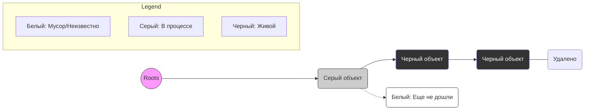

# Garbage Collector в Go
## Принципы работы, конкурентность и управление ресурсами

---

## 0. Введение

В Go управление памятью в куче (Heap) автоматизировано. **Garbage Collector (GC)** берет на себя задачу поиска и освобождения объектов, которые больше не используются программой. Это защищает от утечек памяти и ошибок ручного управления (как в C++).

Главная цель GC в Go — **низкая задержка (low latency)**. Go жертвует абсолютной скоростью сборки ради того, чтобы паузы в работе программы (**Stop-The-World** или **STW**) были практически незаметны.

---

## 1. Трехцветный алгоритм (Tri-color Mark & Sweep)

Для того чтобы понимать, какие объекты "живы", а какие — "мусор", Go использует систему трех цветов.

### 1.1 Цвета объектов
- **Белый (White)**: Кандидат на удаление. GC еще не проверял этот объект.
- **Серый (Grey)**: Объект "живой", но мы еще не проверили объекты, на которые он ссылается (его детей).
- **Черный (Black)**: Объект точно "живой", и все его ссылки уже проверены.

### 1.2 Процесс раскраски
1. В начале все объекты **белые**.
2. GC берет "корни" (**Roots**: стеки, глобальные переменные) и помечает объекты, на которые они указывают, **серыми**.
> [!NOTE]
> **Roots (Корни)** — это точка отсчета для сборщика мусора. Сюда входят глобальные переменные и все переменные на стеках активных горутин. Если объект нельзя "достичь", пройдя по ссылкам от корней, значит он — мусор.
3. GC берет серый объект, переводит его в **черный**, а все его ссылки делает **серыми**.
4. Повторяем, пока серых объектов не останется.
5. Все, кто остался **белым** — мусор.

---

## 2. Конкурентность и правило 25% CPU

Go использует **Concurrent GC**. Это значит, что сборка мусора идет параллельно с выполнением вашего кода.

### 2.1 Использование процессора
Чтобы GC не "съел" все ресурсы системы, в Go действует жесткое правило:
**На Garbage Collector выделяется ровно 25% ресурсов процессора (1/4 от GOMAXPROCS).**

Как это работает:
- Если у вас 4 логических процессора (`GOMAXPROCS=4`), Go выделит **ровно один** поток (P) чисто под нужды фонового GC-воркера.
- Остальные 75% времени процессоры заняты вашей программой.

### 2.2 Вспомогательная аллокация (Assist)
Если программа выделяет память быстрее, чем GC успевает ее чистить (25% ресурсов не хватает), Go заставляет горутины-"нарушители" помогать сборщику. Это называется **Mark Assist**. Программа немного замедляется, но память не раздувается бесконтрольно.

---

## 3. Фазы работы GC (Жизненный цикл)

Сборка мусора проходит через несколько стадий:

1.  **Sweep Termination (STW)**: Очень короткая остановка всех горутин. Подготовка к новому циклу.
2.  **Marking Phase (Concurrent)**: Основная работа. GC красит объекты, используя те самые 25% CPU. Программа продолжает работать.
3.  **Mark Termination (STW)**: Вторая короткая остановка. Завершаем покраску, выключаем Write Barrier.
4.  **Off/Sweeping (Concurrent)**: Освобождаем память (белые объекты) и возвращаем ее в аллокатор.

> [!NOTE]
> Суммарное время пауз STW (Stop-The-World) в современных версиях Go обычно составляет менее **100 микросекунд**. Это в тысячи раз быстрее, чем моргнуть глазом.

---

## 4. Write Barrier (Барьер записи)

Так как GC работает параллельно с программой, может возникнуть проблема:
1. GC пометил объект А черным.
2. Программа внезапно перенесла ссылку на белый объект Б внутрь объекта А.
3. Так как А уже черный, GC его не перепроверяет -> объект Б будет удален как мусор!

Чтобы этого не случилось, во время работы GC включается **Write Barrier**. Это небольшая проверка при каждой записи указателя: если мы записываем ссылку на белый объект, он тут же становится серым.

---

## 5. Управление GC: GOGC и GOMEMLIMIT

### 5.1 GOGC (Коэффициент роста)
По умолчанию `GOGC=100`. Это значит: запустить GC, когда размер новой кучи достигнет 100% от размера живых данных после прошлой сборки.
- `GOGC=50`: сборка в 2 раза чаще, меньше памяти.
- `GOGC=off`: сборка только по лимиту памяти.

### 5.2 GOMEMLIMIT (Лимит памяти)
Добавлен в Go 1.19. Позволяет задать жесткий порог (например, 2GB). Если память подходит к пределу, GC начнет работать агрессивнее, игнорируя настройки GOGC, чтобы избежать падения по OOM (Out Of Memory).

---

## 6. Итог

| Характеристика | Описание |
| :--- | :--- |
| **Алгоритм** | Трехцветный Mark & Sweep (маркировка и очистка). |
| **Режим** | Конкурентный (работает параллельно с программой). |
| **CPU Limit** | 25% от доступных процессоров (1/4 GOMAXPROCS). |
| **Паузы (STW)** | Минимальные, обычно < 100 µs. |
| **Защита** | Write Barrier предотвращает потерю живых данных во время мутации. |

---

## Главная мысль

Garbage Collector в Go — это баланс между экономией памяти и отзывчивостью системы. Он не самый эффективный в плане использования ресурсов, но он гарантирует, что ваше приложение будет работать плавно, без длинных "замираний", типичных для старых версий Java или Python.