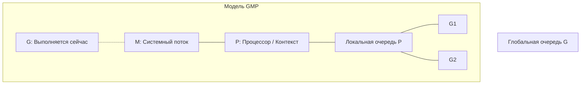
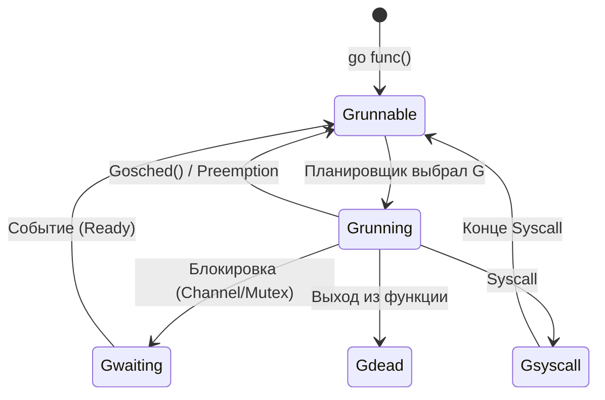
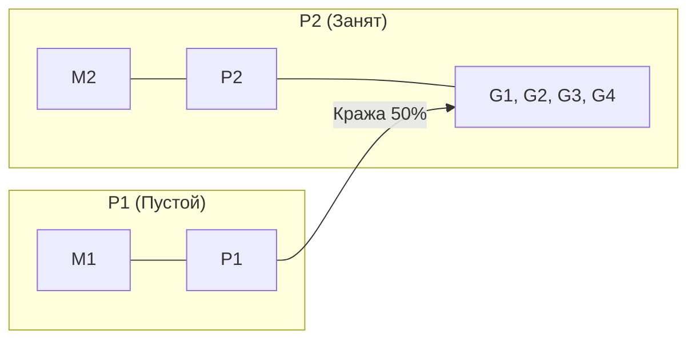
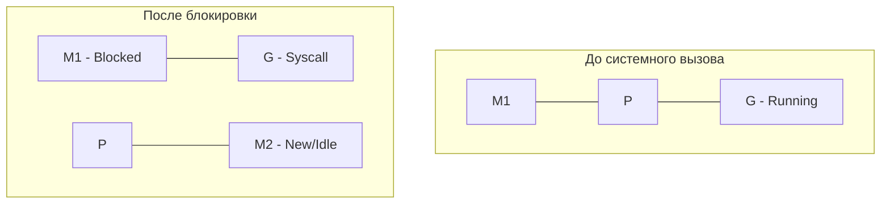

Горутины — это ключевая фича языка программирования Go, обеспечивающая лёгкость и эффективность конкурентного выполнения задач. В этом руководстве мы разберём, что такое горутины, как они работают на уровне runtime, как устроен планировщик, что происходит с системными вызовами, и как дополнительные механизмы вроде netpoller и sysmon поддерживают систему.

---

### Часть 1: Что такое горутины?

### Определение

Горутина (**goroutine**) — это функция или метод, запущенный конкурентно с помощью ключевого слова `go`.

```go
go func() {
    fmt.Println("Hello from goroutine")
}()
```

> [!IMPORTANT]
> **M:N Модель**: Горутины — это не потоки ОС. Это лёгкие абстракции (User-space threads). Пакет runtime Go отображает **M** горутин на **N** системных потоков (также называемых **LWP** — Light Weight Process). Это позволяет эффективно управлять тысячами задач на малом количестве ресурсов.

### Основные характеристики

1. **Лёгкость**: Начальный размер стека — **2 КБ**, тогда как у потоков ОС — 1–8 МБ. Стек динамический и может расти.
2. **Управление runtime**: Горутины работают под контролем **планировщика Go**, а не ядра ОС. Это исключает дорогостоящие переключения контекста на уровне ядра.
3. **Конкурентность**: Позволяют выполнять задачи конкурентно. Будет ли это параллелизм, зависит от числа ядер и переменной **GOMAXPROCS**.

### Создание

- Вызов go func() добавляет новую горутину в очередь планировщика.

- Создание занимает всего ~100-200 наносекунд, что делает их дешевле потоков ОС (создание которых занимает микросекунды или миллисекунды).

---

### Часть 2: Как работают горутины под капотом?

### Модель M:N (GMP)

Go использует модель **GMP**, где три сущности работают сообща:

- **G (Goroutine)**: Сама горутина.
- **M (Machine)**: Поток ОС (системный тред).
- **P (Processor)**: Логический контекст планирования. Число **P** равно **GOMAXPROCS**.

**Схема GMP:**


### Структура G

- stack: Указатели на начало и конец стека.

- pc: Program counter — текущая инструкция.

- sched: Контекст для возобновления (регистры).

- goid: Уникальный идентификатор.

- status: Состояние (\_Grunnable, \_Grunning, \_Gwaiting, \_Gdead, \_Gsyscall).

### Создание горутины (подробно)

1. Вызов go func() → runtime.newproc.

2. Создаётся структура G, в неё записывается указатель на функцию и контекст.

3. G добавляется:
   - В локальную очередь текущего P (если есть место, до 256 горутин).
   - Или в глобальную очередь (runtime.sched.runq), если локальная заполнена.

4. Начальный стек — 2 КБ.

### Управление стеком

- **Рост**: При переполнении (например, глубокая рекурсия) вызывается runtime.morestack. Новый стек (вдвое больше текущего) выделяется, данные копируются.

- **Максимум**: До 1 ГБ.

- **Переиспользование**: После завершения стек освобождается или используется для новых горутин.

---

### Часть 3: Планировщик Go

Планировщик — это часть runtime, которая управляет выполнением горутин. Он кооперативный, то есть переключение происходит в определённых точках.

### Состояния горутины

1. **_Grunnable**: Готова к работе, ждёт в очереди (**LRQ** или **GRQ**).
2. **_Grunning**: Выполняется на **M** через контекст **P**.
3. **_Gwaiting**: Заблокирована (канал, мьютекс, таймер).
4. **_Gsyscall**: Выполняет системный вызов.
5. **_Gdead**: Завершена, ожидает переиспользования.

**Жизненный цикл (Lifecycle):**


### Цикл жизни горутины

1. **Создание**: go → runtime.newproc → G в очередь.

2. **Ожидание**: \_Grunnable в локальной или глобальной очереди.

3. **Выполнение**: P выбирает G → \_Grunning.

4. **Блокировка**: Переход в \_Gwaiting или \_Gsyscall.

5. **Завершение**: Функция завершает работу → \_Gdead, стек освобождается.

### Точки переключения

Планировщик переключает горутины, когда:

- Горутина завершает выполнение.

- Вызывается системный вызов.

- Используется runtime.Gosched() (явная передача управления).

- Компилятор вставляет проверки (например, в циклах).

### Очереди планировщика

1. **Локальная очередь P**:
   - Кольцевой буфер на 256 G.
   - Быстрый доступ, без мьютексов.

2. **Глобальная очередь**:
   - Общая для всех P (runtime.sched.runq).
   - Защищена мьютексом, медленнее.

### Work-Stealing (Кража работы)

Если локальная очередь **P** пуста, он не засыпает, а пытается «украсть» работу:
1. Проверяет глобальную очередь (**GRQ**).
2. Если там пусто, крадёт 50% горутин у случайного другого **P**.

**Схема Work-Stealing:**


---

### Часть 4: Цикл runtime.schedule (подробно)

Функция runtime.schedule — это основной цикл планировщика, который P выполняет, чтобы найти следующую G. Шаги:

1. **Глобальная очередь (1/61)**:
   - С вероятностью ~1.6% P смотрит в runtime.sched.runq.
   - Если G найдена → берёт её и выполняет.
   - Почему редко: Глобальная очередь требует мьютекс, что дорого.

2. **Локальная очередь**:
   - P проверяет p.runq.
   - Если G есть → берёт и выполняет.
   - Быстрее, так как локально.

3. **Work-Stealing**:
   - Если локальная очередь пуста, P выбирает случайный другой P.
   - Забирает половину его очереди (если есть).

4. **Глобальная очередь (повторно)**:
   - Если кража не удалась, снова проверяется глобальная очередь.
   - Берётся G, если есть.

5. **Netpoller**:
   - Если очередей нет, P обращается к netpoller.
   - Netpoller возвращает горутины, готовые после сетевых операций (например, чтение сокета).
   - G добавляются в локальную или глобальную очередь.

6. **Спящий режим**:
   - Если работы нет, P переходит в \_Pidle.
   - M возвращается в пул потоков.
   - P ждёт новых G (например, от netpoller или новой горутины).

---

### Часть 5: Пул потоков

- **Что это**: Набор M (потоков ОС), которые runtime создаёт и переиспользует.

- **Создание**: Новый M создаётся через pthread_create (Unix) или аналог, если все текущие M заняты.

- **Переиспользование**: После завершения работы M паркуется в пуле, а не уничтожается.

- **Цель**: Минимизировать накладные расходы на создание потоков ОС.

---

### Часть 6: Netpoller

- **Что это**: Механизм для асинхронной обработки сетевых операций (реализован через epoll/kqueue/IOCP).

- **Как работает**:
  - Горутины, заблокированные на сетевых операциях (например, net.Conn.Read), передаются netpoller’у.
  - Netpoller ждёт готовности (например, данные в сокете) и возвращает G в очередь.

- **Зачем**: Освобождает M от блокировки на сетевых вызовах, позволяя P выполнять другие G.

---

### Часть 7: Системные вызовы

Что происходит, когда G выполняет системный вызов?

### Шаг за шагом

1. **P запускает G**:
   - P берёт G из очереди → привязывает к M → G в \_Grunning.

2. **Системный вызов**:
   - G вызывает, например, os.ReadFile или time.Sleep.
   - M блокируется ядром ОС на этом вызове.

3. **Hand-off**:
   - Runtime замечает блокировку (через проверки перед системными вызовами).
   - P отцепляется от M.
   - G переходит в \_Gsyscall, остаётся на заблокированном M.
   - P берёт новый M из пула (или создаёт).

4. **Что с G и M?**
   - **G**: Ждёт завершения вызова в \_Gsyscall. Выполняется "на фоне" (в терминах ядра ОС).
   - **M**: Заблокирован ОС, ждёт конца вызова.
   - **После завершения**: G возвращается в очередь (локальную или глобальную), M — в пул.

### Что с P?

Когда **M** блокируется на системном вызове, среда выполнения Go делает **Hand-off**:
1. Освобождает **P** от заблокированного **M**.
2. Ищет (или создает) новый **M** для этого **P**, чтобы остальные горутины в очереди не ждали.

**Схема Syscall Hand-off:**


### Пример

```Go
go func() {
    time.Sleep(1 * time.Second) // Блокировка на 1 секунду
    fmt.Println("Done")
}()
```

- G → \_Gsyscall, M блокируется.

- P берёт новый M, работает дальше.

- Через 1 секунду G возвращается в очередь.

---

### Часть 8: Sysmon

- **Что это**: Фоновая горутина (runtime.sysmon), запущенная при старте программы на отдельном M.

- **Задачи**:
  1. **Мониторинг системных вызовов**:
     - Проверяет G в \_Gsyscall каждые 20 мкс – 10 мс.
     - Если вызов длится >10 мс, отмечает M как проблемный и помогает P получить новый M.

  2. **Разблокировка P**:
     - Убеждается, что P не "зависли" из-за долгих вызовов.
  3. **Балансировка**:
     - Перераспределяет G из глобальной очереди в локальные.
     - Убирает мёртвые горутины.

- **Роль**: Не "забирает" G, а следит за системой и предотвращает зависания.

---

### Часть 9: Практические аспекты

### Утечки горутин

- Если G остаётся в \_Gwaiting без завершения (например, ждёт события, которого нет), она занимает память.

- Решение: Явное завершение или тайм-ауты.

### "Захват" потока

- Бесконечный цикл без точек переключения (например, for {}) может монополизировать M.

- Компилятор добавляет проверки, но не всегда спасает.

### Отладка

- runtime.NumGoroutine(): Число активных горутин.

- runtime.Stack(): Дамп стеков всех G.

### Ограничение горутин

- Используйте семафоры или worker pool для контроля числа G.

---

### Часть 10: Заключение

Горутины — это лёгкие, управляемые runtime единицы конкурентности в Go:

- Модель M:N позволяет масштабировать тысячи G на несколько M.

- Планировщик (runtime.schedule) ищет работу в локальных и глобальных очередях, крадёт G, использует netpoller.

- Пул потоков и netpoller оптимизируют ресурсы и сеть.

- Системные вызовы обрабатываются через hand-off, освобождая P.

- Sysmon следит за системой, предотвращая зависания.

Всё это делает горутины мощным и эффективным инструментом, идеально подходящим для современных приложений.
