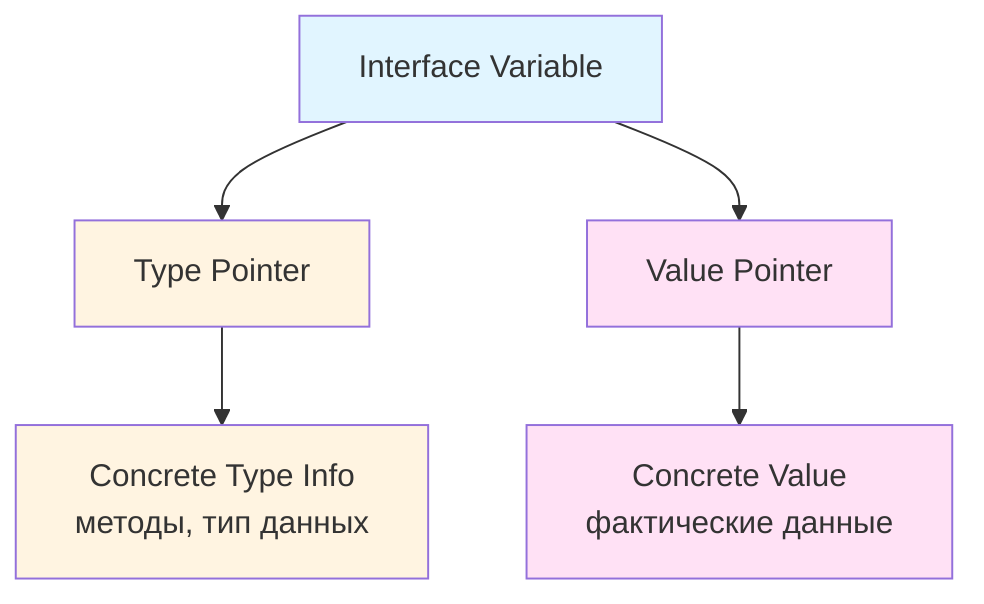
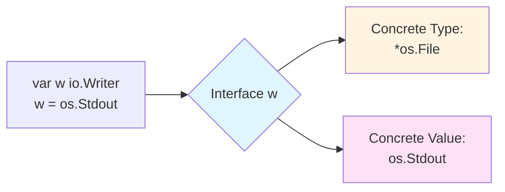
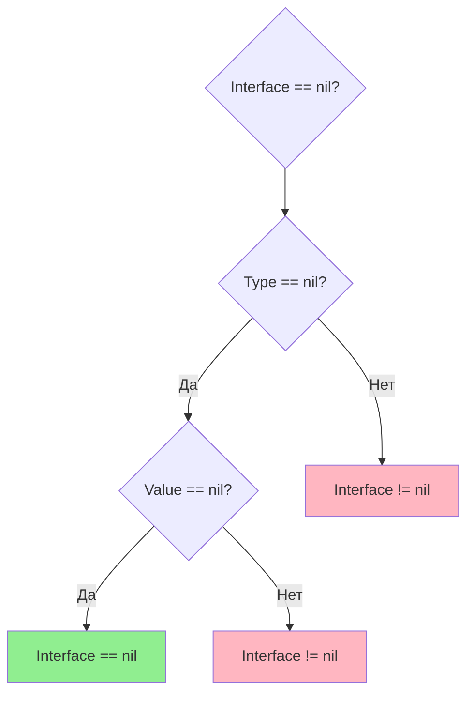

# Interface в Go

## Содержание
1. [Что такое Interface](#что-такое-interface)
2. [Зачем нужны Interfaces](#зачем-нужны-interfaces)
3. [Внутренняя структура Interface](#внутренняя-структура-interface)
4. [Пустой Interface (interface{} / any)](#пустой-interface-interface--any)
5. [Concrete Type и Concrete Value](#concrete-type-и-concrete-value)
6. [Когда Interface равен nil](#когда-interface-равен-nil)
7. [Примеры использования](#примеры-использования)

---

## Что такое Interface

**Interface** (интерфейс) в Go — это **тип**, который определяет набор методов (сигнатуры методов), но **не реализует их**. Интерфейс описывает **поведение** (behavior), а не структуру данных.

> [!IMPORTANT]
> Ключевое отличие Go от других языков: **неявная реализация интерфейсов**. Тип реализует интерфейс автоматически, если у него есть все методы, определенные в интерфейсе. Не нужны ключевые слова `implements` или `extends`.

### Простой пример

```go
// Определение интерфейса
type Writer interface {
    Write(data []byte) (n int, err error)
}

// Любой тип с методом Write([]byte) (int, error) автоматически реализует Writer
type FileWriter struct {
    filename string
}

func (f *FileWriter) Write(data []byte) (int, error) {
    // реализация записи в файл
    return len(data), nil
}

// *FileWriter неявно реализует интерфейс Writer
```

---

## Зачем нужны Interfaces

### 1. **Полиморфизм**
Интерфейсы позволяют писать код, который работает с разными типами через общий контракт:

```go
type Animal interface {
    Speak() string
}

type Dog struct{}
func (d Dog) Speak() string { return "Гав!" }

type Cat struct{}
func (c Cat) Speak() string { return "Мяу!" }

// Функция работает с любым Animal
func MakeSound(a Animal) {
    fmt.Println(a.Speak())
}

func main() {
    MakeSound(Dog{}) // Гав!
    MakeSound(Cat{}) // Мяу!
}
```

### 2. **Разделение зависимостей (Dependency Inversion)**
Интерфейсы позволяют зависеть от абстракций, а не от конкретных реализаций:

```go
// Плохо: зависимость от конкретного типа
type UserService struct {
    db *PostgreSQL // жесткая привязка к PostgreSQL
}

// Хорошо: зависимость от интерфейса
type Database interface {
    Save(data interface{}) error
    Load(id int) (interface{}, error)
}

type UserService struct {
    db Database // можем использовать любую реализацию Database
}
```

### 3. **Тестирование**
Интерфейсы упрощают создание моков (mock) для тестирования:

```go
type EmailSender interface {
    Send(to, subject, body string) error
}

// В тестах можем использовать мок
type MockEmailSender struct {
    sentEmails []string
}

func (m *MockEmailSender) Send(to, subject, body string) error {
    m.sentEmails = append(m.sentEmails, to)
    return nil
}
```

### 4. **Композиция интерфейсов**
Интерфейсы можно комбинировать:

```go
type Reader interface {
    Read(p []byte) (n int, err error)
}

type Writer interface {
    Write(p []byte) (n int, err error)
}

// Композиция интерфейсов
type ReadWriter interface {
    Reader
    Writer
}
```

---

## Внутренняя структура Interface

Интерфейс в Go хранится как пара значений: **тип** и **значение**.



### Внутреннее представление (runtime)

В runtime интерфейс представлен двумя основными структурами:

#### 1. **eface** (empty interface)
Используется для `interface{}` (пустого интерфейса):

```go
type eface struct {
    _type *_type      // информация о типе
    data  unsafe.Pointer // указатель на данные
}
```

#### 2. **iface** (interface with methods)
Используется для интерфейсов с методами:

```go
type iface struct {
    tab  *itab        // таблица методов + информация о типе
    data unsafe.Pointer // указатель на данные
}

type itab struct {
    inter *interfacetype // тип интерфейса
    _type *_type         // конкретный тип
    hash  uint32         // копия _type.hash для быстрого сравнения
    _     [4]byte        // выравнивание
    fun   [1]uintptr     // массив указателей на методы
}
```

### Поля интерфейса

> [!NOTE]
> **Интерфейс содержит два поля:**
> 1. **Type (тип)**: информация о конкретном типе, который хранится в интерфейсе
> 2. **Value (значение)**: указатель на фактические данные

Это можно визуализировать так:

```go
var w io.Writer
w = os.Stdout

// Внутреннее представление:
// Type:  *os.File
// Value: адрес os.Stdout
```

---

## Пустой Interface (interface{} / any)

**Пустой интерфейс** — это интерфейс без методов. Может хранить значение **любого типа**.

```go
// Старая запись
var x interface{}

// Новая запись (с Go 1.18+)
var y any
```

> [!TIP]
> `any` — это просто алиас для `interface{}`. Они полностью эквивалентны.

### Использование пустого интерфейса

```go
func PrintAnything(val any) {
    fmt.Println(val)
}

func main() {
    PrintAnything(42)           // int
    PrintAnything("Hello")      // string
    PrintAnything([]int{1, 2})  // slice
    PrintAnything(struct{}{})   // struct
}
```

### Type Assertion (проверка типа)

Чтобы извлечь конкретное значение из `any`, используем **type assertion**:

```go
var i any = "hello"

// Type assertion с проверкой
s, ok := i.(string)
if ok {
    fmt.Println("Строка:", s)
}

// Type assertion без проверки (может вызвать panic!)
s := i.(string) // panic, если i не string
```

### Type Switch

Для проверки нескольких типов используем **type switch**:

```go
func Describe(i any) {
    switch v := i.(type) {
    case int:
        fmt.Printf("Целое число: %d\n", v)
    case string:
        fmt.Printf("Строка: %s\n", v)
    case bool:
        fmt.Printf("Булево: %t\n", v)
    default:
        fmt.Printf("Неизвестный тип: %T\n", v)
    }
}
```

### Когда использовать `any`

> [!WARNING]
> **Избегайте чрезмерного использования `any`!**
> 
> Используйте `any` только когда:
> - Работаете с библиотекой encoding/json, database/sql
> - Пишете универсальные контейнеры (хотя с Go 1.18+ лучше использовать дженерики)
> - Действительно нужна максимальная гибкость
> 
> В остальных случаях предпочитайте **конкретные типы** или **интерфейсы с методами**.

---

## Concrete Type и Concrete Value

### Concrete Type (конкретный тип)

**Concrete type** — это фактический тип данных, который хранится в интерфейсе.

```go
var w io.Writer
w = os.Stdout

// Concrete type: *os.File
```

Вы можете получить concrete type с помощью рефлексии:

```go
import "reflect"

func main() {
    var w io.Writer = os.Stdout
    
    t := reflect.TypeOf(w)
    fmt.Println(t) // *os.File
}
```

### Concrete Value (конкретное значение)

**Concrete value** — это фактические данные, хранящиеся в интерфейсе.

```go
var i interface{} = 42

// Concrete type: int
// Concrete value: 42

v := reflect.ValueOf(i)
fmt.Println(v) // 42
```

### Визуализация



### Пример с разными типами

```go
type Shape interface {
    Area() float64
}

type Circle struct {
    Radius float64
}

func (c Circle) Area() float64 {
    return 3.14 * c.Radius * c.Radius
}

type Rectangle struct {
    Width, Height float64
}

func (r Rectangle) Area() float64 {
    return r.Width * r.Height
}

func main() {
    var s Shape
    
    // Первое присваивание
    s = Circle{Radius: 5}
    // Concrete type: Circle
    // Concrete value: Circle{Radius: 5}
    
    // Второе присваивание
    s = Rectangle{Width: 10, Height: 5}
    // Concrete type: Rectangle
    // Concrete value: Rectangle{Width: 10, Height: 5}
    
    fmt.Printf("Type: %T, Value: %+v\n", s, s)
    // Type: main.Rectangle, Value: {Width:10 Height:5}
}
```

---

## Когда Interface равен nil

Это одна из самых **запутанных** тем в Go! Interface равен `nil`, только когда **оба поля** (type и value) равны `nil`.

### Правило nil для интерфейсов



> [!CAUTION]
> **Интерфейс равен nil тогда и только тогда, когда:**
> - **Type** == nil
> - **Value** == nil
> 
> Если хотя бы одно поле не nil, интерфейс **не равен nil**!

### Случай 1: Полностью nil интерфейс

```go
var w io.Writer
// Type:  nil
// Value: nil

fmt.Println(w == nil) // true ✅
```

### Случай 2: Nil concrete value, но не nil type

```go
var buf *bytes.Buffer = nil
var w io.Writer = buf

// Type:  *bytes.Buffer (не nil!)
// Value: nil

fmt.Println(w == nil)  // false ❌ (неожиданно!)
fmt.Println(buf == nil) // true
```

> [!WARNING]
> **Это частая ошибка!** 
> 
> Интерфейс `w` не равен `nil`, хотя его concrete value (`buf`) равно `nil`. Это происходит потому, что **type field** содержит информацию о `*bytes.Buffer`.

### Случай 3: Проверка на nil работает неожиданно

```go
func DoSomething() error {
    var err *MyError = nil
    return err // Возвращаем nil указатель
}

func main() {
    err := DoSomething()
    if err != nil {
        fmt.Println("Ошибка!") // Выведется! ❌
    }
}
```

**Почему выводится "Ошибка!"?**

```go
// После return err интерфейс error содержит:
// Type:  *MyError
// Value: nil

// Интерфейс не nil, потому что type != nil!
```

### Правильный подход

```go
func DoSomething() error {
    var err *MyError = nil
    if err != nil {
        return err
    }
    return nil // Возвращаем явно nil интерфейс
}

// Или лучше:
func DoSomething() error {
    // Если ошибки нет, возвращаем nil
    return nil // Type и Value оба nil
}
```

### Как правильно проверять nil

#### Вариант 1: Проверка через рефлексию

```go
import "reflect"

func IsNil(i interface{}) bool {
    if i == nil {
        return true
    }
    return reflect.ValueOf(i).IsNil()
}

func main() {
    var buf *bytes.Buffer = nil
    var w io.Writer = buf
    
    fmt.Println(w == nil)      // false
    fmt.Println(IsNil(w))      // true ✅
}
```

#### Вариант 2: Type assertion

```go
func CheckNil(w io.Writer) {
    if w == nil {
        fmt.Println("Полностью nil")
        return
    }
    
    // Проверяем конкретный тип
    if buf, ok := w.(*bytes.Buffer); ok && buf == nil {
        fmt.Println("Concrete value nil")
    }
}
```

#### Вариант 3: Избегать проблемы

```go
// Плохо
func GetWriter() io.Writer {
    var buf *bytes.Buffer = nil
    return buf // Type != nil!
}

// Хорошо
func GetWriter() io.Writer {
    var buf *bytes.Buffer = nil
    if buf == nil {
        return nil // Type и Value оба nil
    }
    return buf
}
```

### Таблица сравнения

| Type     | Value    | Interface == nil | Примечание                        |
|----------|----------|------------------|-----------------------------------|
| `nil`    | `nil`    | ✅ `true`        | Полностью nil интерфейс           |
| `*T`     | `nil`    | ❌ `false`       | Type задан, но value nil          |
| `*T`     | `&value` | ❌ `false`       | Оба поля заданы                   |
| `nil`    | `&value` | ❌ невозможно    | Невозможная ситуация в Go runtime |

---

## Примеры использования

### Пример 1: Базовое использование интерфейсов

```go
package main

import "fmt"

type Greeter interface {
    Greet() string
}

type EnglishGreeter struct {
    name string
}

func (e EnglishGreeter) Greet() string {
    return "Hello, " + e.name
}

type RussianGreeter struct {
    name string
}

func (r RussianGreeter) Greet() string {
    return "Привет, " + r.name
}

func SayHello(g Greeter) {
    fmt.Println(g.Greet())
}

func main() {
    en := EnglishGreeter{name: "Alice"}
    ru := RussianGreeter{name: "Алиса"}
    
    SayHello(en) // Hello, Alice
    SayHello(ru) // Привет, Алиса
}
```

### Пример 2: Интерфейс для работы с разными источниками данных

```go
package main

import (
    "fmt"
    "io"
    "os"
    "strings"
)

type DataSource interface {
    Read() (string, error)
}

type FileSource struct {
    filename string
}

func (f *FileSource) Read() (string, error) {
    data, err := os.ReadFile(f.filename)
    if err != nil {
        return "", err
    }
    return string(data), nil
}

type StringSource struct {
    data string
}

func (s *StringSource) Read() (string, error) {
    return s.data, nil
}

type URLSource struct {
    url string
}

func (u *URLSource) Read() (string, error) {
    // Упрощенная реализация
    return "Data from " + u.url, nil
}

func ProcessData(source DataSource) {
    data, err := source.Read()
    if err != nil {
        fmt.Println("Ошибка:", err)
        return
    }
    fmt.Println("Данные:", data)
}

func main() {
    sources := []DataSource{
        &FileSource{filename: "test.txt"},
        &StringSource{data: "Hello from string"},
        &URLSource{url: "https://example.com"},
    }
    
    for _, src := range sources {
        ProcessData(src)
    }
}
```

### Пример 3: Nil интерфейс - подводные камни

```go
package main

import "fmt"

type MyError struct {
    msg string
}

func (e *MyError) Error() string {
    return e.msg
}

// ❌ ПЛОХО: возвращает non-nil интерфейс с nil value
func BadFunction() error {
    var err *MyError = nil
    // логика...
    return err // Type: *MyError, Value: nil
}

// ✅ ХОРОШО: правильная проверка
func GoodFunction() error {
    var err *MyError = nil
    // логика...
    if err != nil {
        return err
    }
    return nil // Type: nil, Value: nil
}

func main() {
    err1 := BadFunction()
    fmt.Println("BadFunction:", err1 == nil) // false ❌
    
    err2 := GoodFunction()
    fmt.Println("GoodFunction:", err2 == nil) // true ✅
}
```

### Пример 4: Type Assertion и Type Switch

```go
package main

import "fmt"

func Describe(i interface{}) {
    fmt.Printf("(%v, %T)\n", i, i)
    
    switch v := i.(type) {
    case int:
        fmt.Printf("Целое число в два раза больше: %v\n", v*2)
    case string:
        fmt.Printf("Длина строки: %v\n", len(v))
    case bool:
        if v {
            fmt.Println("Истина!")
        } else {
            fmt.Println("Ложь!")
        }
    case []int:
        fmt.Printf("Слайс целых чисел, длина: %d\n", len(v))
    default:
        fmt.Printf("Неизвестный тип: %T\n", v)
    }
}

func main() {
    Describe(21)
    Describe("hello")
    Describe(true)
    Describe([]int{1, 2, 3})
    Describe(3.14)
}

// Вывод:
// (21, int)
// Целое число в два раза больше: 42
// (hello, string)
// Длина строки: 5
// (true, bool)
// Истина!
// ([1 2 3], []int)
// Слайс целых чисел, длина: 3
// (3.14, float64)
// Неизвестный тип: float64
```

### Пример 5: Композиция интерфейсов

```go
package main

import (
    "fmt"
    "io"
)

type Reader interface {
    Read(p []byte) (n int, err error)
}

type Writer interface {
    Write(p []byte) (n int, err error)
}

type Closer interface {
    Close() error
}

// Композиция интерфейсов
type ReadWriteCloser interface {
    Reader
    Writer
    Closer
}

// Пример структуры, реализующей все методы
type MyFile struct {
    name string
}

func (f *MyFile) Read(p []byte) (int, error) {
    fmt.Println("Reading from", f.name)
    return 0, nil
}

func (f *MyFile) Write(p []byte) (int, error) {
    fmt.Println("Writing to", f.name)
    return len(p), nil
}

func (f *MyFile) Close() error {
    fmt.Println("Closing", f.name)
    return nil
}

func UseReadWriteCloser(rwc ReadWriteCloser) {
    buf := make([]byte, 10)
    rwc.Read(buf)
    rwc.Write(buf)
    rwc.Close()
}

func main() {
    file := &MyFile{name: "test.txt"}
    UseReadWriteCloser(file)
}
```

### Пример 6: Интерфейс как контракт для тестирования

```go
package main

import "fmt"

// Интерфейс для отправки уведомлений
type Notifier interface {
    Notify(message string) error
}

// Реальная реализация через email
type EmailNotifier struct {
    smtpServer string
}

func (e *EmailNotifier) Notify(message string) error {
    fmt.Println("Отправка email через", e.smtpServer, ":", message)
    // Реальная логика отправки email
    return nil
}

// Мок для тестирования
type MockNotifier struct {
    Messages []string
}

func (m *MockNotifier) Notify(message string) error {
    m.Messages = append(m.Messages, message)
    fmt.Println("Мок: сохранено сообщение:", message)
    return nil
}

// Бизнес-логика, использующая интерфейс
type UserService struct {
    notifier Notifier
}

func (u *UserService) RegisterUser(username string) error {
    // Регистрация пользователя...
    return u.notifier.Notify("Пользователь " + username + " зарегистрирован")
}

func main() {
    // Production код
    emailService := &UserService{
        notifier: &EmailNotifier{smtpServer: "smtp.gmail.com"},
    }
    emailService.RegisterUser("Alice")
    
    fmt.Println("---")
    
    // Тестовый код
    mockNotifier := &MockNotifier{}
    testService := &UserService{
        notifier: mockNotifier,
    }
    testService.RegisterUser("Bob")
    
    fmt.Println("Сохраненные сообщения:", mockNotifier.Messages)
}
```

### Пример 7: Проверка реализации интерфейса во время компиляции

```go
package main

import "fmt"

type Writer interface {
    Write(data string) error
}

type FileWriter struct {
    filename string
}

func (f *FileWriter) Write(data string) error {
    fmt.Println("Запись в файл:", f.filename, "-", data)
    return nil
}

// Проверка на этапе компиляции, что *FileWriter реализует Writer
var _ Writer = (*FileWriter)(nil)

// Если раскомментировать следующую строку, будет ошибка компиляции:
// var _ Writer = FileWriter{} // ошибка, т.к. Write определен для *FileWriter

func main() {
    fw := &FileWriter{filename: "log.txt"}
    fw.Write("Hello, World!")
}
```

---

## Резюме

| Концепция           | Описание                                                                 |
|---------------------|--------------------------------------------------------------------------|
| **Interface**       | Набор методов, определяющих поведение                                    |
| **Неявная реализация** | Тип реализует интерфейс автоматически при наличии всех методов       |
| **Пустой interface** | `interface{}` или `any` — может хранить любой тип                      |
| **Concrete Type**   | Фактический тип, хранящийся в интерфейсе                                 |
| **Concrete Value**  | Фактические данные, хранящиеся в интерфейсе                              |
| **nil Interface**   | Интерфейс равен `nil` только когда тип **И** значение равны `nil`        |
| **iface/eface**     | Внутренние структуры runtime для хранения интерфейсов                    |

> [!TIP]
> **Лучшие практики:**
> - Используйте интерфейсы для определения контрактов между компонентами
> - Держите интерфейсы маленькими (1-3 метода)
> - Объявляйте интерфейсы там, где они используются, а не где реализуются
> - Избегайте `interface{}` (any) там, где можно использовать конкретные типы или дженерики
> - Всегда помните о нюансах с `nil` интерфейсами!
