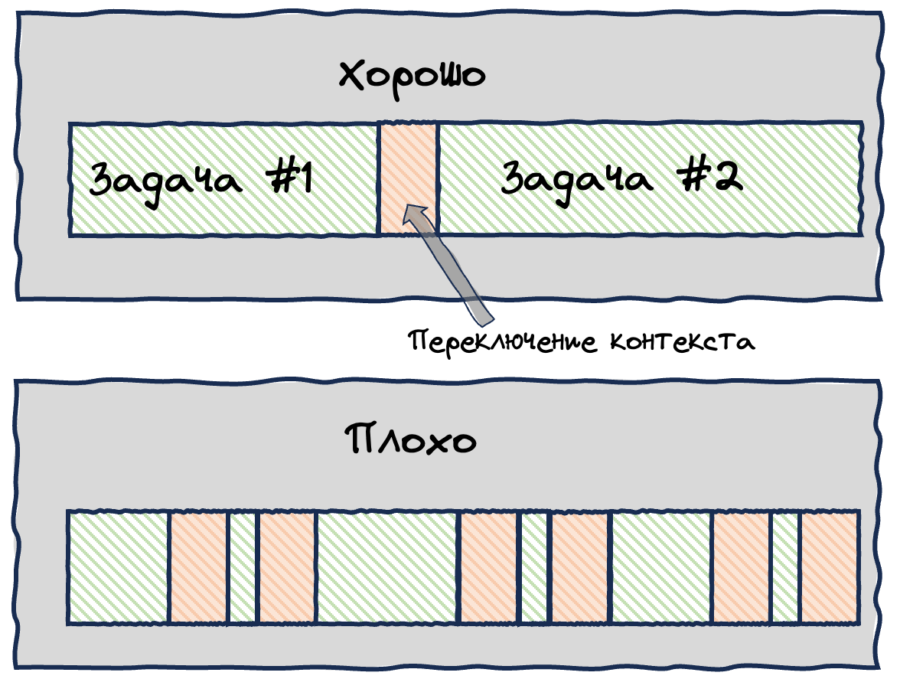
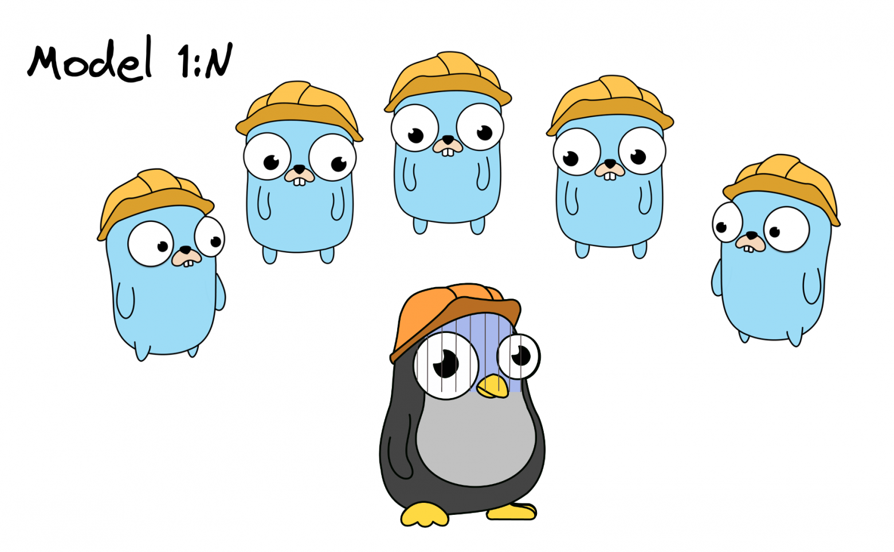
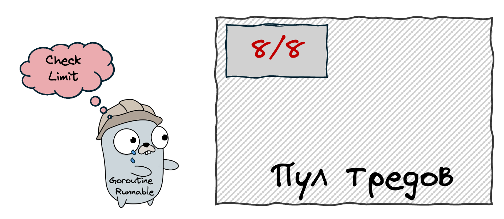
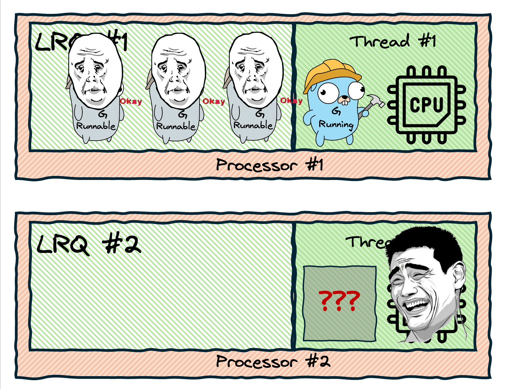
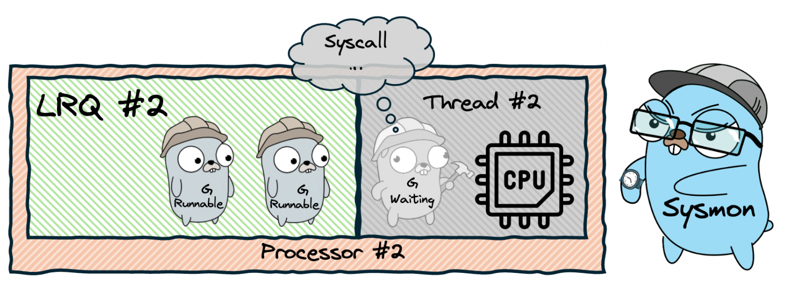
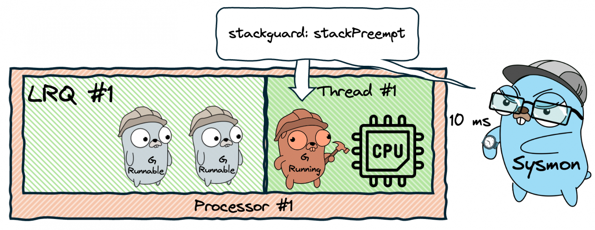

От Тузова хорошая статья


Давайте спроектируем с нуля планировщик Go — начнём с самой простой и понятной наивной реализации, а затем шаг за шагом будем разбираться, какие изъяны в ней есть, и придумывать как их решать, постепенно усложняя общую модель.

Это один из лучших способов понять сложную систему или концепцию — пройти путь её поэтапного проектирования. Система сложна, осознать её очень непросто, но мы разобьём её на простые шаги, понять которые очень легко. После этого пазл сам собой сложится в голове, и общая картина системы будет для вас такой же простой и очевидной.

## **Вводные слова и зачем изучать планировщик?**

Конкурентность это очень полезная, но очень сложная штука. Обычно при работе с ней разработчикам приходится решать множество проблем, но язык Go свёл эти проблемы к минимуму. Здесь работа с конкурентным кодом реализована очень просто, понятно и эффективно.

Ключевые сущности, помогающие в этом:

- **Горутины**, которые могут работать конкурентно и независимо друг от друга

- **Планировщик**, который ими управляет

- **Каналы**, которые помогают обмениваться данными между горутинами

Про внутреннее устройство каналов у меня тоже есть [подробный ролик](https://youtu.be/ZTJcaP4G4JM) — его я также советую посмотреть, чтобы взглянуть на всю эту машинерию под другим углом. В этой же статье мы разберем планировщик и горутины.

Статья не для новичков — я предполагаю, что читатель уже знаком с Go. Как минимум:

- Прошел [Tour of Go](https://go.dev/tour/)

- Понимает как работать с горутинами, хотя бы на самом базовом уровне

> У этой статьи есть также видео-версия. Я постарался приложить максимум усилий, чтобы изложить свои мысли максимально эффективно в обоих форматах, поэтому просто выбирайте тот, что ближе вам. Однако, у текста и видео есть свои плюсы и минусы — некоторые вещи намного проще наглядно показывать в видео, а некоторые концепции лучше усваиваются в виде текста. Поэтому, если хотите усвоить материал максимально эффективно, я бы посоветовал сначала посмотреть видео, а потом прочитать статью для закрепления.
>
> *Кстати, вторая половина видео — это дополнительная практическая часть, в которой я препарирую планировщик с помощью моей утилиты* *[goschedviz](https://github.com/JustSkiv/goschedviz)\_\_. В текущей статье этого нет, так как оформить такое в виде текста довольно сложно. Но если будет достаточно желающих, я готов изложить это в виде отдельной статьи.*

## **Постановка задачи**

Итак, представим, что мы инженеры из Go Team, и перед нами стоит амбициозная задача — научить наши программы работать конкурентно и, по возможности, параллельно. Да, термины "конкуретно" и "параллельно" часто путают, но дальше мы разберём, в чём их суть и в чём разница.

Основные требования к нашим конкурентно работающим программам:

- Должны быть задействованы все доступные ядра процессора (при необходимости)

- Дешевизна в плане быстродействия и используемой памяти — мы хотим запускать конкурентно тысячи, сотни тысяч задач!

- Решение должно быть понятным и простым в использовании — код должен быть интуитивно понятным

Также обращаю внимание, что несмотря на объём статьи, мне приходится во многих случаях делать упрощения, чтобы материал было легче усвоить, и чтобы статья не превратилась в книгу. В некоторых местах я буду обращать на это ваше внимание, а в некоторых нет.

## **Краткий ликбез по основам**

Для того чтобы приступить к проектированию планировщика, нам необходимо понимание некоторых базовых понятий — процессор компьютера и его ядра, планировщик операционной системы и системные треды, что такое конкурентность и параллелизм. Если вам всё это хорошо знакомо, можете смело переходить к следующему разделу.

_Если вам покажется, что после прочтения этого раздела вы мало что запомнили и не всё осознали — это нормально. По ходу дальнейшего повествования я буду регулярно возвращаться к отдельным понятиям отсюда, и постепенно всё само разложится в голове по полочкам, придёт понимание, и тогда всё запомнится само собой._

### **Как устроена параллельная работа компьютера**

Как вы наверняка понимаете, наш компьютер может выполнять несколько действий одновременно (параллельно) только в том случае, если у его процессора есть несколько ядер.


Но есть хорошие новости — процессор это очень быстрая штука, поэтому он даже с одним ядром может выполнять огромное количество действий почти одновременно, быстро переключаясь между ними. К примеру, даже на компьютере с одноядерным процессором вы можете "одновременно" смотреть мои ролики на YouTube, писать код, запускать его и выполнять ряд других задач. В каждый момент времени процессор будет выполнять лишь одну задачу, но он так быстро будет переключаться между ними, что вам будет казаться, будто сразу все.


### **Мысли о параллельности событий**

Вообще, в некотором смысле параллельность — это функция от времени, вернее от временного промежутка. К примеру, вы увидели два события, которые показались вам одновременными. Но на самом деле они выполнились с разницей в 0.02 мс. Для нашего мозга это одновременные события, а, к примеру, для камеры замедленной съёмки - нет. Если же события выполнились с разницей в 2 секунды, то даже мы заметим, что они не одновременные.

Таким образом, все зависит от размера "окошка" наблюдения. Например, если скорость выполнения операции 10мс, а наше окошко 100мс, то можно сказать, что за это время одновременно выполнится 10 операций, и не важно в каком порядке. Если же взять период в 10мс, то операции будут выполняться последовательно.


Конкурентность и параллелизм\*\*

Тем временем мы подобрались к пониманию разницы между параллельным и конкурентным выполнением.

**Конкурентность** (Concurrency) — это про дизайн нашей программы. А именно, когда у нас есть несколько процессов, которые могут выполняться независимо друг от друга, не важно в каком порядке.

**Параллельность** (Parallelism) — это уже про выполнение программы, а именно — выполнение нескольких задач в один момент времени.

При этом, независимые (конкурентные) процессы могут выполняться как одновременно (параллельно), так и последовательно. К примеру, процессор может постоянно между ними переключаться, но в один момент времени выполняется лишь один процесс. Однако переключаться он может в любые моменты времени, и это не должно никак повлиять на корректность выполнения процессов.

> Другими словами, конкурентность это когда мы работаем со множеством вещей одновременно, а параллелизм — когда выполняем множество вещей одновременно.

На самом деле, эта тема сложная и глубокая, а её обсуждение может вылиться в отдельный пост — кстати, такой пост у меня [уже есть](https://t.me/ntuzov/411)! В нём я объяснил эти понятия подробнее, а ещё прикрепил ссылки на интересные материалы для дальнейшего изучения.

В любом случае, даже если вы сейчас не до конца осознали суть этих понятий, это нормально — во время чтения статьи всё постепенно разложится в голове по полочкам и станет понятней.

### **Параллельность и конкурентность на уровне ОС**

А кто же занимается переключением задач и решает, какие из них будут выполняться на ядре, а какие подождут? Занимается этим планировщик операционной системы, и управляет он тредами.

Тред (поток) - это последовательность команд, которые выполняются в рамках одного процесса. Говоря простыми словами, это та работа, которая выполняется на процессоре, либо ждёт своей очереди.

Каждый тред может находиться в одном из трёх состояний:

- **Executing**: выполняется прямо сейчас на одном из ядер

- **Runnable**: готов к выполнению, дожидается своей очереди

- **Waiting**: не готов к выполнению, так как ждёт какого-то события. Например, это может быть связано с i/o операцией, взаимодействием с ОС (syscall) и др.


### **Переключение контекста**

Планировщик ОС может в произвольные моменты времени переключать треды — отключать выполняющиеся от ядра процессора и заменять их Runnable тредами. Это называется переключением контекста (context switching). Мы никак не можем повлиять на решения планировщика, как и не можем строить какие-то предсказания на этот счёт — все решения он принимает самостоятельно. Такой подход называется [вытесняющей многозадачностью](https://ru.wikipedia.org/wiki/%D0%92%D1%8B%D1%82%D0%B5%D1%81%D0%BD%D1%8F%D1%8E%D1%89%D0%B0%D1%8F_%D0%BC%D0%BD%D0%BE%D0%B3%D0%BE%D0%B7%D0%B0%D0%B4%D0%B0%D1%87%D0%BD%D0%BE%D1%81%D1%82%D1%8C)(Preemptive multitasking).

> [!IMPORTANT]
> Для сравнения, у планировщика Go многозадачность кооперативная — это значит, что горутины (аналог тредов) сами решают, когда уступить ресурсы своим ждущим товарищам. Правда, с одной оговоркой, которая появилась в Go v1.14. К этому мы ещё вернёмся позже.


_**Самое главное, что здесь нужно понимать: треды, это дорого.**_ Давайте разберёмся почему.

Во-первых, переключение контекста, занимает довольно много времени: нужно обновить данные в кэшах процессора, сохранить состояние треда и др. Чем больше у нас тредов в состоянии Runnable, тем чаще будет переключаться контекст, и тем медленнее будет работать программа. К примеру, если переключений слишком много, то всем они суммарно могут занимать столько же времени, сколько само выполнение задач (а то и больше):



Во-вторых, каждый тред отъедает существенную часть памяти нашего компьютера: стек каждого треда часто может занимать до пары мегабайт (в нём хранятся локальные переменные, цепочки вызова функций и др.)

Теперь, зная что треды действительно дорогие, мы приходим к пониманию того, что хотим создавать их как можно меньше. Чем меньше тредов, тем реже переключается контекст, тем меньше памяти мы тратим. Это важный момент, на который мы в будущем будем ссылаться очень часто.

Для понимания дальнейшего материала нам этого достаточно, но если хотите глубже, то у меня есть более [подробный пост](https://t.me/ntuzov/410) на тему тредов и процессов.

## **Проектируем собственный планировщик для Go**

Итак, наконец-то мы добрались до самого интересного. Напомню, наша основная задача — научить наши программы на Go конкурентности и параллельности. Допустим, у нас есть такой код:

```Go
func main() {
  task1() // запускаем первую функцию и ждём её завершения
  task2() // после этого запускаем следующую

  // ...
}
```

Функции `task1` и `task2` выполнятся **синхронно**, то есть последовательно — `task2`запустится только после завершения `task1.` А хотим мы, чтобы `task2` запускалась не дожидаясь завершения `task1`, то есть **асинхронно** — то самое конкурентное выполнение. В плане синтаксиса это выглядит очень просто — достаточно лишь добавить go перед вызовом функции:

````Go
func main() {
  go task1() // запускаем функцию и идём дальше, не дожидаясь её завершения
  go task2() // запускаем следующую и также идём дальше

  // do some other work..
}

Таким образом, конкурирующими процессами у нас будут функции, запускаемые с префиксом go. И поскольку у нас появилась конкуренция за ресурсы — за процессорное время, нам нужна некая сущность, которая будет этим делом управлять. Назовём такую сущность - Планировщик (Scheduler). Вот мы и встретились с этим парнем!

Чем же он будет управлять? Вспоминаем, что планировщик ОС управлял тредами, давайте своруем у него эту концепцию! Назовём свой аналог тредов — горутинами (goroutine). В некотором смысле, это будут те же самые потоки выполнения, но внутри нашей программы.

> [!TIP]
> В других материалах вы могли также видеть определения kernel space (пространство ядра) и user space (пространство пользователя). Так вот — планирование горутин происходит на уровне user space, то есть ими управляет планировщик Go (если точнее — [Go Runtime](https://pkg.go.dev/runtime)), а планирование тредов на уровне kernel space, то есть ими управляет ОС.


Поскольку все наши программы выполняются внутри ОС, треды нам всё ещё понадобятся — именно на них будут выполняться горутины. То есть, когда нам необходимо выполнить горутину, мы привязываем к ней тред, и она в нём будет выполняться.

Но зачем нам вообще вводить какие-то горутины, если есть треды? Потому что, как мы обсудили выше, треды нас не всегда устраивают в плане эффективности работы. Горутины же мы можем построить таким образом, чтобы они были намного более легковесными по памяти и, самое главное — чтобы переключение между ними было гораздо дешевле, чем переключение между тредами. Это возможно, потому что все они будут жить внутри одного процесса (нашей программы) и иметь общий доступ к памяти, а переключение между ними будет происходить без участия ядра ОС. На самом деле, там есть множество хитрых оптимизаций и нюансов, которые мы будем разбирать, но если кратко — понимая все ограничения тредов, мы будем строить работу горутин таким образом, чтобы максимально выгодно эти треды использовать.

> [!NOTE]
> Вообще, можно сказать, что планировщик Go, это просто способ оптимизировать использование системных тредов — оптимизировать в плане использования ресурсов, а также в плане простоты кода для работы с ними. И чем дальше вы будете погружаться в статью, тем больше будете приходить к пониманию этого.


Итак, давайте всё это подытожим:

- Основной ресурс для выполнения программ — ядра процессора

- Ядер мало, а работы у них много, поэтому вводится концепция тредов: треды выполняются на ядрах.

- Планировщик ОС управляет тредами и оптимизирует работу с ними таким образом, чтобы ядра не простаивали без работы.

- Треды ОС большие и страшные — не потому что их плохо спроектировали, а потому что на уровне ОС есть свои ограничения и особенности работы, поэтому тредов нам доступно мало.

- Тредов мало, а работы внутри нашей программы очень много, поэтому вводится концепция горутин: горутины выполняются на тредах

- Планировщик Go управляет горутинами и оптимизирует работу с ними таким образом, чтобы создать максимально эффективно использовать треды — создавать их как можно меньше и не позволять им простаивать

Едем дальше, нашим горутинам, очевидно, понадобятся состояния. Позаимствуем их также у тредов:

- **Waiting** — горутина не готова к запуску, так как чего-то ждёт

- **Runnable** — готова к запуску, как только освободится тред

- **Executing** — выполняется на каком-то треде

Таким образом, получаем схему:


Ничего не напоминает? Это же точная копия схемы планировщика ОС, которую я приводил выше, отличаются лишь имена сущностей. Действительно, в самом базовом понимании, здесь можно провести аналогию.

Далее нам нужно ввести ещё две сущности:

- **Машина** для выполнения (M, Machine) — будет непосредственно выполнять горутину.

- **Процессор** (P, Processor) — будет помещать горутины (G) в Машину.

_Не путайте этот Процессор с процессором компьютера или ядрами CPU — названия у них похожие, но суть абсолютно разная (это не моя прихоть, это_ _[официальный термин](https://github.com/golang/go/blob/master/src/runtime/proc.go#L28)__)._

Теперь картина у нас следующая:


По сути, Машина — это просто системный тред. То есть, Процессор, помещая горутину в Машину, просто привязывает эту горутину к треду. А раз так, то я далее буду называть треды именно тредами, а не машинами, мне так удобней. Термин "Машина" я здесь привёл лишь для того, чтобы вы лучше понимали связь моей статьи с другими материалами.

> К слову, это те самые G, M и P которые вы могли встречать в других статьях и материалах. И вместе они образуют так называемую модель - GMP. Именно к ней мы и придём в конечном итоге.

Итак, набор базовых сущностей у нас есть. Как с их помощью будем добиваться конкурентного и параллельного выполнения? Давайте придумывать. Будем действовать итеративно — сначала придумаем простейшее наивное решение, а затем будем пошагово его усложнять, решая возникающие проблемы.

### **1. Создаём тред для каждого вызова — Модель 1:1**


Самое простое, что можно придумать — создавать по отдельному треду на каждую горутину, а после завершения уничтожать эти треды за ненадобностью. То есть, мы передаём все новые горутины Процессору, он для каждой из них запрашивает новый тред, а когда горутина заканчивает работу, её тред утилизируется.

> Это называется — Модель 1:1, то есть сколько горутин, столько и потоков. Решение вполне рабочее — у нас будет и конкурентность, и параллельность, и мы точно задействуем все ядра процессора при необходимости (потому что планировщик ОС не допустит простаивание тредов, если есть свободные ядра).

К слову, бывает ещё Модель 1:N — это когда все горутины (или их аналоги) всегда используют лишь один поток ОС. Из рассуждений выше мы понимаем, что нам такое не подходит — ведь в этом случае мы лишаемся возможности запускать что-либо параллельно. Но полезно понимать, что бывает и так.



По сути, модель 1:1 делегирует всю работу планировщику ОС. Но всё ли нас тут устраивает? К сожалению, нет. Из вступительного ликбеза мы помним, что создавать и уничтожать треды — это слишком дорого, и мы хотим это минимизировать. Давайте думать, как.

**2. Пул тредов**
Хорошо, если создание и уничтожение тредов дорого, давайте не будем их уничтожать, и вместо создания, по возможности, будем переиспользовать имеющиеся.

То есть, как и прежде, мы будем создавать новые треды для горутин, но теперь только при необходимости. А когда тред освобождается (например, горутина завершила свою работу), Процессор вместо уничтожения поместит его в пул, чтобы придержать для других горутин. Ждущий тред не будет выполнять работу, а значит не будет занимать ядро процессора.


Отлично, мы оптимизировали наш планировщик, избавившись от множества дорогих и ненужных операций создания и уничтожения тредов! Теперь всё хорошо?

Нет, всё еще плохо. Вспоминаем - не только создание тредов дорогое, но и само их существование, а мы хотим создавать сотни.. нет, миллионы горутин! Увы, миллионы тредов мы себе позволить не можем. Что будем делать?

### **3. Ограничиваем размер пула тредов — Модель M:N**

Если мы не хотим создавать слишком много тредов, очевидно, что нам нужно просто ограничить их максимальное количество, давайте так и сделаем. Схема реализации такого подхода всё ещё довольно простая — когда запускается новая горутина, мы делаем следующее:

**1. Проверяем, есть ли в пуле свободный тред**. Если есть, берём его для выполнения горутины.


**2. Если нет, проверяем сколько сейчас задействовано тредов**. Если меньше установленного нами лимита, то создаём новый тред и отдаём ему горутину. Когда горутина закончит работу, отправим этот тред в пул.


**3. Если же количество тредов достигло лимита**, горутина **будет ждать** пока какой-нибудь из ранее созданных не освободится, вернувшись в пул. Как освободится, передадим ему горутину в работу.


Таким образом, у нас появилась концепция ждущих горутин. Но где они будут ждать? Давайте просто выстроим их в очередь, и назовём эту очередь Global Run Queue (GRQ). Таким образом, каждая новая горутина, которой не достался тред, будет отправляться в GRQ и ждать своего часа.


Поскольку очереди бывают разные, стоит уточнить — мы будем использовать [FIFO-очередь](https://ru.wikipedia.org/wiki/FIFO)(first in, first out), это когда первыми берутся те горутины, которые пришли первыми. Получается логично и честно — чем раньше горутина пришла, тем раньше получит тред.

[LIFO-очередь](https://ru.wikipedia.org/wiki/LIFO) (last in, first out) была бы мене честной и порой проблематичной. К примеру, у нас могла бы возникнуть ситуация, когда горутина, пришедшая первой, никогда не выполняется, потому что постоянно приходят новые горутины и выполняются вместо неё. У LIFO-очередей есть свои плюсы, но сейчас не будем на этом останавливаться.

### **Размер пула**

Давайте теперь подумаем, какой лимит на количество тредов мы хотим установить — то есть, какой размер будет у нашего пула? Если мы используем слишком мало тредов, то у нас не будут задействованы все ядра процессора — к примеру, если ядер 8, а тредов всего 4, то 4 ядра будут простаивать. Но и слишком много тредов мы создавать не хотим, ведь это дорого и неэффективно. Так какое же значение будет оптимальным?

Ответ лежит на поверхности — мы создадим ровно столько тредов, сколько ядер нам доступно, и тогда ни одно ядро не будет простаивать без работы. Создавать ещё больше тредов нет смысла, ведь тогда часть из них точно будет простаивать в ожидании свободного ядра. То есть, если ядер у нас 8, а тредов 10, то даже в самом лучшем случае 2 треда будут простаивать.


**Важный момент**: теперь, когда количество тредов у нас строго ограничено, мы можем себе позволить к каждому из них приставить по отдельному Процессору (P). То есть, у каждого Процессора теперь будет свой собственный тред. Это пока никак не влияет на общую картину, но дальше работа с каждым тредом будет становиться всё сложнее, и такой подход нам очень поможет.

> Таким образом, мы пришли к реальной модели, которая называется M:N Threading. Она заключается в том, что мы выполняем N горутин на M тредах.

Кстати, уже сейчас мы приблизились к пониманию функции `runtime.GOMAXPROCS()` — Она задаёт максимальное количество Процессоров, которые наша программы будет использовать. То есть, по дефолту их будет ровно столько, сколько ядер доступно — `runtime.NumCPU()`, но если мы хотим меньше, то можем задать их точное количество следующим образом:

```Go
// Максимальное количество процессоров = 2,
// вне зависимости от количества ядер CPU
runtime.GOMAXPROCS(2)
````

Также эта функция возвращает текущую настройку, и если вы хотите просто посмотреть это значение, не изменяя его, можете вызвать с аргументом 0:

```Go
// Максимальное количество процессоров не изменится,
// а функция просто вернёт это значение
n := runtime.GOMAXPROCS(0)
```

### **Mutex для Global Run Queue**

Тем временем, у нас возникла ещё одна серьезная проблема. Если несколько параллельных процессов имеют доступ к общему ресурсу, то нам необходим механизм синхронизации доступа. Иначе может получиться так, что два Процессора попытаются забрать себе в работу одну горутину и что-нибудь сломают — например, оба начнут эту горутину выполнять.

> Поведение, когда несколько конкурентных процессов получают доступ к общему ресурсу называется - состояние гонки (race condition). В общем случае оно непредсказуемо и опасно. Его нельзя допускать ни в коем случае.

Чтобы избежать этого, мы используем самый простой примитив синхронизации — [мьютекс](https://ru.wikipedia.org/wiki/%D0%9C%D1%8C%D1%8E%D1%82%D0%B5%D0%BA%D1%81)(mutex, lock). Если вы с ним не знакомы, советую обязательно познакомиться — это очень простой, но важный механизм, который очень часто встречается. Говоря простым языком, с его помощью каждый Процессор сможет временно блокировать очередь, чтобы поработать с ней — в нашем случае, достать оттуда горутину. Пока она заблокирована, никто другой не может с ней взаимодействовать. Таким образом, пока один Процессор достаёт из GRQ горутину, остальным Процессорам придется подождать.


Кстати, мы уже начинаем приближаться к реальному планировщику Go, у него тоже:

- Есть Global Run Queue с мьютексом

- Количество рабочих тредов совпадает с количеством ядер CPU

- У каждого процессора есть свой тред

Вы спросите: *Николай, неужели и эта схема тебе чем-то не нравится? Всё ведь идеально работает! Да?* Нет! Вернее, не совсем. Если у нашего компьютера всего 2 ядра, то всё супер, схема будет работать хорошо. Но что если ядер будет больше? Например, 16, 32.. 64? С ростом количества ядер у нас вырастет и количество тредов, а очередь при этом остаётся одна на всех.

То есть, даже если у нас будет очень много Процессоров, в каждый момент времени с очередью может работать лишь один из них. Введение мьютекса решило одну нашу проблему, но создало другую — работа с общим ресурсом (GRQ) сильно замедлилась.

> [!IMPORTANT]
> К слову, здесь вы можете осознать очень важный момент в любых системах — в проектировании любых систем не бывает бесплатных оптимизаций, это почти всегда трейдофы: оптимизировали работу CPU, пожертвовав памятью; оптимизировали память, но увеличили нагрузку на CPU и т.п.

>
> И, как обычно, об этом у меня также [есть более подробный пост](https://t.me/ntuzov/633).

Как будем решать эту проблему?

### **4. Локальные очереди**

Чтобы решить проблему блокировок.. Нужно избавиться от блокировок! А для этого надо сделать так, чтобы процессоры не обращались к общей очереди. Чтобы этого добиться, мы подарим каждому Процессору собственную очередь — Local Run Queue (LRQ). Поскольку к каждой LRQ будет иметь доступ лишь один процессор, блокировка не потребуется.

При этом, от GRQ с её мьютексом мы не избавляемся, она нам ещё пригодится — туда мы будем помещать горутины, которые пока не привязаны ни к одному из Процессоров, и оттуда горутины, в конечном итоге, всегда попадают в LRQ, и лишь после этого выполняются. К этому мы ещё вернёмся позже.

Теперь вся наша схема выглядит так:


В получившейся схеме мы видим горутины в состоянии Runnable (находятся в очереди) и Running (выполняются Процессором). Ничего не забыли? А где же Waiting горутины? Напомню, это те горутины, которые чем-то заблокированы и не могут быть запущены. Так куда же их поместить? Может, для них нужно завести в Процессоре отдельную очередь — Wait Queue?

На самом деле, Процессору не придется следить за Waiting горутинами, этим будут заниматься другие сущности. К примеру, если горутина заблокирована из-за чтения или записи в канал, то она попадёт в Wait Queue этого канала, и уже оттуда попадёт в GRQ и LRQ. У меня есть очень подробный [ролик про каналы](https://youtu.be/ZTJcaP4G4JM?si=RQC5T1LstdhIRLrM), где я, кроме прочего, разбираю и этот механизм. Аналогичные механизмы также есть у мьютексов, таймеров и Network IO.

### **Порядок проверки очередей**

Теперь у нас есть два типа очередей - LRQ и GRQ. Соответственно, каждый Процессор может брать работу в двух местах, а значит нам нужно определиться, в каком порядке он будет это делать.

> Очевидно, что сначала Процессор будем заглядывать в LRQ, ведь она самая быстрая, именно ради этого мы её и ввели. Но если там пусто, то далее Процессор заглянет в GRQ.

Правда, тут может возникнуть ещё одна проблема — если LRQ всех процессоров постоянно пополняется, то Процессоры всегда будут брать работу оттуда, и никогда не доберутся до GRQ. Это плохо, потому что горутины в глобальной очереди начнут застаиваться, поэтому нам стоит иногда проверять её вне очереди. Но как часто? Очевидно, один раз из 61! То есть, алгоритм получения горутины Процессором такой:

1. 1/61 раз проверяем GRQ, и если там есть горутины, то берём оттуда

2. Если нет, проверяем LRQ

3. Если и там нет, проверяем GRQ

4. ... Тут будут ещё пункты, но о них поговорим позже

Вы спросите — но почему 1/61, что за магическое число? Самое главное тут — оно простое, и это помогает избежать синхронизации проверок между разными P, распределяя их более равномерно. К тому же, оно не слишком большое и не слишком маленькое — то есть, GRQ будет проверяться не слишком часто и не слишком редко.

### **5. Work stealing**

Итак, наш планировщик становится всё сложнее, но работает всё лучше и становится всё больше похожим на настоящий. Однако, до идеала всё ещё далеко. Какая же проблема нас беспокоит в этот раз? Вы наверняка помните, что с самого начала нас очень беспокоила проблема простаивающих без дела ядер. Казалось бы, мы от этой проблемы давно избавились, но нет. Взгляните на эту схему:


Итак, у одного Процессора работы много, а у другого её нет вовсе. Как быть? Давайте научим Процессоры воровать работу друг у друга! А именно, если LRQ одного Процессора пустая, то он заглянет в LRQ любого другого Процессора и возьмёт горутину оттуда. Или даже лучше — пусть он заберёт оттуда сразу половину горутин, чтобы не ходить потом лишний раз.


Таким образом мы будем автоматически балансировать работу между всеми нашими Процессорами. И полный алгоритм теперь будет выглядеть так:

1. 1/61 раз проверяем GRQ, и если там есть горутины, то берём оттуда

2. Если нет, проверяем LRQ

3. Если там нет, пытаемся украсть у другого Процессора

4. Если не получилось, проверяем GRQ

5. _... Здесь мы будем проверять Network Poller, но об этом позже_

### **6. Handoff**

Как же хорош стал наш Планировщик! Но давайте и здесь найдём проблему. Что если горутина выполнит какую-то блокирующую операцию, например системный вызов (syscall)? Тогда эта горутина заблокирует нам целый тред, и ядро процессора снова будет простаивать, при том что у нас в очереди есть Runnable горутины.


Ещё раз обращаю ваше внимание — заблокированы не только горутина с Процессором, но и сам тред тоже заблокирован системным вызовом. То есть, мы не можем просто отправить эту ждущую горутину ждать где-нибудь в другом месте, передав треду какую-то другую работу. Поэтому нам придётся отправить их куда-нибудь вместе — и тред, и горутину.

> Здесь важно понимать, что вообще такое системный вызов (он же syscall, он же сискол). Если не знаете — это очередная must have тема вам в копилочку, обязательно разберитесь глубже.
>
> А пока давайте так — представьте, что вы позвонили коллеге и задали ему вопрос. Вопрос был сложный, коллега глубоко задумался, а вы вынуждены ждать. Пока он думает, вы не можете заниматься другими полезными делами, вы заблокированы ожиданием. Освободитесь вы как только коллега придумает ответ и сообщит его вам.
>
> _Так вот, звонок коллеге — это и есть syscall, а вы — тред, который его выполняет_.

Итак, если тред заблокирован системным вызовом, он больше не может выполнять работу. В таком состоянии он нам не особо полезен, поэтому мы просто отвяжем его от Процессора, создадим новый тред и привяжем к Процессору его. Такой механизм называется - handoff.


Возвращаясь к аналогии с вопросом коллеге — пока вы с ним болтаете, ваш начальник просит освободить рабочий компьютер, чтобы другой коллега смог на нём поработать (да, у вашей компании тяжелые времени и компьютеров на всех не хватает...)

Что ж, механизм неплохой, но он довольно дорогой, так как из-за него постоянно создаются новые треды, а ведь мы очень старались этого избежать. К сожалению, здесь это неизбежно — большое количество syscall'ов всегда будет порождать большое количество тредов. Однако, мы можем немного оптимизировать процесс.

### **Sysmon**

Некоторые системные вызовы короткоживущие, то есть блокируют треды на очень короткий промежуток времени. Создавать для них каждый раз по отдельному треду невыгодно, поэтому сделаем такую хитрую оптимизацию:

- Если мы знаем, что системный вызов заблокирует тред надолго, то мы сразу выполним handoff.

- В остальных случаях мы позволим треду какое-то время оставаться в заблокированном состоянии, периодически проверяя, не освободился ли он. Если он превысит некоторый таймаут (а именно, 10ms), то также запускаем handoff

Процесс, который выполняет эти проверки, будет постоянно выполняться в фоне, и называется он - **Sysmon**.


Кстати, а на каком треде будет выполняться сам Sysmon? Очевидно, что тредам, которые выполняют горутины, мы не можем это доверить, так как они в любой момент могут заснуть (а именно это мы и пытаемся отследить). Да и своих дел у них без того хватает. Получается, нам нужно завести для мониторинга отдельный тред, который будет выполнять свою работу независимо от рабочих тредов.

Так, стоп.. Мы ведь ранее договорились, что ограничиваем количество тредов - их не должно быть больше количества ядер. Да, это всё ещё в силе, но тут стоит уточнить, что эта договорённость касается лишь активных тредов, обрабатывающих горутины. То есть, это не касается специальных тредов, выполняющих особые задачи, а также тредов с состоянии Waiting. Так что, тут у нас всё хорошо, противоречий нет.

Итак, мы отвязали горутину вместе с тредом и оставили их где-то ждать возврата из системного вызова. Что будем делать, когда они дождутся? Первым делом, из соображений оптимизации, мы хотим вернуть горутину тому процессору, у которого её забрали. Но только при условии, что он сейчас свободен, то есть не занят выполнением другой горутины. Если занят, мы поищем другие свободные процессоры. Если же свободных нет, отправим горутину в GRQ.

> К слову, можно сказать, что теперь мы перешли от модели M:N Threading к модели M:P:N Threading. То есть, у нас по прежнему N горутин и M тредов, но также у нас P процессоров. Конечно, сущность процессора мы ввели уже давно, но ранее общее количество используемых тредов и процессоров у нас совпадало, а теперь нет.

Handoff — крутой механизм, но он всё же неизбежно приводит к созданию новых тредов. Можем ли мы ещё как-то оптимизировать работу планировщика, чтобы реже прибегать к его использованию? Да, можем - если syscall способен выполняться асинхронно.

### **7. Network Poller**

Блокировка треда при системном вызове, это ограничение на уровне операционной системы, то есть программно мы никак не можем с этим бороться. Но, к счастью, сама ОС обычно предоставляет механизмы, с помощью которых это ограничение можно обойти. А именно, это механизмы для выполнения асинхронных системных вызовов, например: [epoll](https://ru.wikipedia.org/wiki/Epoll) (Linux), [kqueue](https://en.wikipedia.org/wiki/Kqueue)(MacOS, BSD), [IOCP](https://en.wikipedia.org/wiki/Input/output_completion_port) (Windows). Чаще всего, это касается сетевых операций. Мы не будем здесь сильно углубляться в эти механизмы, но если у вас появится такое желание, вы уже знаете куда копать.

Давайте разберемся, в чем суть. Ранее наши треды действовали так:

1. Совершается системный вызов

2. Тред блокируется на время ожидания ответа

3. После получения ответа тред разблокируется

4. Продолжение работы

Перечисленные же выше механизмы позволяют делать так:

1. Тред инициирует системный вызов и идёт по другим своим делам. Системный вызов будет зарегистрирован в специальной системе, и мы сможем вернуться к нему позже.

2. Периодически проверяем, не пришел ли ответ для системного вызова

Таким образом, работа с системным вызовов происходит асинхронно.


Чтобы стало ещё понятней, давайте вернёмся к примеру со звонком коллеге из раздела про Handoff.

> [!TIP]
> Представьте, что вместо телефонного звонка вы решили отправить коллеге сообщение в мессенджере. Теперь вам не нужно тратить время на ожидание, вы просто сворачиваете мессенджер и продолжаете заниматься другими делами. Вам лишь нужно переодически открывать окошко диалога с коллегой, чтобы проверить наличие ответа. Именно в этом и заключается суть описанных выше механизмов. То есть, вы — тред, ваш диалог с коллегой — горутина, а мессенджер — этот самый механизм (epoll и т.п.)


К сожалению, не все syscall'ы могут выполняться асинхронно — представьте, что ваш коллега не может просто дать ответ на вопрос, вам нужно активно эту тему обсуждать. В таком случае, не получится просто подождать, вы в любом случае будете заблокированы.

Итак, мы получили крутой инструмент, и теперь давайте научим наш планировщик им пользоваться. Для начала, нам понадобится компонент, который будет вести учёт системных вызовов, которые нужно проверить на наличие ответов — назовём его Network Poller (netpoller).

Если горутина собирается выполнить системный вызов, который может выполняться асинхронно, мы, вместо блокировки треда:

- Регистрируем операцию в Network Poller

- Переводим горутину в состояние Waiting и передаём её Netpoller'у

- Процессор освобождается для выполнения других горутин

  Ещё раз подчеркну основную фишку данного механизма — ждущие горутины не занимают тред, и могут находиться в таком состоянии сколько понадобится, никак не замедляя работу программы.

Когда сисколл заканчивается, горутина снова переходит в состояние runnable, то есть она готова продолжать работу. Когда у Процессоров будет заканчиваться работа, они сами будут обращаться к Netpoller'у, чтобы забрать себе освободившиеся горутины. Итого, алгоритм поиска работы для каждого Процессора выглядит так:

1. 1/61 раз проверяем GRQ, и если там есть горутины, то берём оттуда

2. Если нет, проверяем LRQ

3. Если там нет, пытаемся украсть у другого Процессора

4. Если не получилось, проверяем GRQ

5. Проверяем Network Poller

   Здесь всё еще остаётся маленькая проблемка — может так получиться, что работы у Процессоров всегда хватает, и они вообще перестают проверять netpoller, либо делают это очень редко. Это не очень честно по отношению к ожидающим там горутинам, поэтому мы научим Sysmon делать подобные проверки в фоне — если к netpoller'у никто не обращался более 10мс, то это сделает Sysmon. При этом, он переместит освободившиеся горутины в GRQ, а дальше Процессоры сами выполнят балансировку с помощью механизмов, которые мы обсудили выше (помните, что GRQ проверяется вне очереди раз в 1/61 итерацию).

Теперь давайте ещё раз подчеркнём, что не все syscall'ы поддерживают асинхронную работу. К примеру, сетевые операции поддерживают, а файловые — нет. Как это знание можно использовать на практике? Очень просто:

```Go
// Это будет работать через netpoller
conn, _ := net.Dial("tcp", "example.com:80")
data, _ := conn.Read(buf)

// А это заблокирует тред
file, _ := os.Open("bigfile.dat") data, _ := file.Read(buf)
```

Поэтому при проектировании Go приложений важно понимать эту разницу:

- Для I/O операций с сетью можно смело использовать горутины — они будут эффективно обрабатываться через netpoller (тут тоже есть свои ограничения, но другие)

- Для операций с файлами нужно быть намного аккуратнее, так как они будут блокировать треды.

> На самом деле, в обоих случаях мы приходим к тому, что нам лучше использовать пул воркеров, но по разным причинам и с разными ограничениями.

Что ж, одной проблемой меньше, поэтому двигаемся дальше и решаем следующую.

### **8. Порядок выполнения горутин**

Итак, мы придумали очень сложный механизм распределения горутин по Процессорам. Он уже работает достаточно хорошо, горутины распределяются очень эффективно. Теперь давайте обсудим, в каком порядке процессоры будут выполнять свои горутины из LRQ.

Самое простое, что тут можно придумать — просто выполнять все горутины по очереди (слово "очереди" вам сегодня будет сниться!). То есть, Процессор берёт первую горутину из LRQ, выполняет её, затем берёт следующую, выполняет её и так далее. Если горутины у нас короткоживущие, то это будет неплохо работать.

Вы уже понимаете в чём тут проблема? А что если у нас есть долгие или даже вечные горутины? К примеру, нам ничто не мешает запустить сотню горутин, которые будут периодически что-нибудь проверять на протяжении всей работы программы. Но поскольку ядер и, соответственно, Процессоров у нас ограниченное количество — скажем, 8 штук, из всех этих горутин выполняться будут только 8, остальные будут вечно ждать.


Это плохо, ведь каждая горутина должна получить свою долю процессорного времени. Как будем решать? Очень просто — *в определенные моменты времени горутина будет проверять, не пора ли ей прерваться и дать поработать другим*.

Осталось определиться, в какие именно моменты она будет это делать и как будет понимать, что ей пора отдохнуть. Начнём с первого — проверки нужно выполнять в те моменты, которые безопасны и оптимальны для вытеснения. Лучше всего нам подходят вот такие точки:

- **Перед вызовом функций** (пролог): Когда функция вызывается, создаётся фрейм стека (выделенная область в памяти, где хранятся локальные переменные, адрес возврата и другие данные функции). При прерывании в момент вызова функции вся нужная информация уже сохранена во фрейме, поэтому горутину можно приостановить без риска потерять данные. При возобновлении выполнения горутина начнёт с этого вызова функции, используя те же значения переменных.

- **При совершении блокирующих операций** (наши любимые syscall'ы, таймеры и прочее): в эти моменты горутина всё равно будет ждать и простаивать, поэтому пусть поработает кто-то другой

Окей, вот горутина попала в точку проверки. А по какому признаку она поймёт, что ей пора уступить Процессор? Давайте поступим максимально просто и топорно — выдадим каждой горутине флаг `stackguard`. Когда нам нужно прервать горутину, мы установим этому флагу специальное значение `stackPreempt`. При следующей проверке горутина увидит это значение и поймет, что ей пора передать управление планировщику.

Теперь разберёмся, кто и когда будет сообщать горутине о необходимости прерваться. И здесь нам снова поможет наш старый знакомый — Sysmon. Давайте добавим ему ещё одну задачу. Помимо проверки заблокированных syscall'ов, он также будет проверять время выполнения активных горутин. Если какая-то из них работает слишком долго (больше 10мс), Sysmon установит ей флаг `stackguard=stackPreempt`, чтобы при следующей проверке она прервалась.


Такой подход к планированию называется кооперативной многозадачностью (Cooperative multitasking) — это когда процессы сами решают, когда отдать управление другим. В отличие от вытесняющей многозадачности операционной системы, где тред может быть прерван в любой момент, здесь горутины сами контролируют момент передачи управления.

Всё ли тут хорошо? В целом, уже достаточно неплохо — в таком виде планировщик Go существовал долгое время и назывался кооперативным. Но всё это время существовала одна очень известная проблема, которую [окончательно решили только в версии Go 1.14](https://go.dev/doc/go1.14#runtime).

### **Принудительное вытеснение жадных горутин в Go v1.14**

Давайте представим следующую ситуацию. Допустим, у нас всего один Процессор — этого легко добиться с помощью функции runtime.GOMAXPROCS, и он обрабатывает горутину. Эта горутина что-то активно считает и не хочет передавать управление — например, выполняет какие-то вычисления в бесконечном цикле:

```Go
func main() {
   // Устанавливаем количество процессоров = 1
   runtime.GOMAXPROCS(1)

   // запускаем "жадную" горутину, которая захватит процессор
gofunc() {
       sum := 0
for {
           sum++ // бесконечный цикл без вызовов функций
       }
   }()

   // Запускаем time.Sleep, чтобы передать управление жадной горутине
   // и не выйти раньше времени из main()
   time.Sleep(time.Second)
}
```

У нас возникла серьёзная проблема — горутина заблокировала весь Процессор и не собирается его отдавать! Она не вызывает функции, а значит не проверяет `stackguard`, она не выполняет блокирующие операции, она просто ворует все ресурсы, и наш Sysmon ничего не может с этим поделать.


Как же нам быть? Мы никак не можем достучаться до горутины — каким бы способом мы не передавали ей сообщения, она их просто не читает, занимаясь без остановки другой работой. Нам нужен какой-то механизм, который сам её прервёт извне. К счастью, такой механизм нам предоставляет ОС — это сигналы.

> Сигналы — это механизм уведомления процессов о каких-либо событиях на уровне ОС. Ключевой для нас момент — при отправке сигнала, ОС прерывает выполнение процесса и запускает специальный обработчик, который установил сам процесс. Именно этот обработчик сохранит состояние горутины и вернёт управление планировщику.
>
> Как вы могли догадаться, на эту тему у меня также [есть подробный пост](https://t.me/ntuzov/615).

В Unix системах для этого используется сигнал `SIGURG`. Он выбран потому что редко используется в обычных программах (изначально предназначен для уведомления о срочных сетевых событиях), а значит мы можем его безопасно использовать для своих целей.

_Windows, кстати, отдельная история, и мне совсем не хочется в это погружаться (даже отдельного подробного поста на этот раз нет...). Просто имейте в виду, что реализация несколько отличается, но суть примерно та же._

Теперь, когда у нас есть подходящий механизм, мы можем поступать следующим образом. Если горутина слишком долго не передаёт управление добровольно (~10мс), то мы отправим ей сигнал и прервём принудительно.

Теперь у нас два способа вытеснения горутин:

1. Основной — через проверку stackguard в безопасных точках. Горутина сама решает когда остановиться

2. Запасной — через сигналы операционной системы, если горутина не хочет останавливаться сама

Правда, второй способ работает не всегда. В некоторых участках кода прерывать горутину опасно — например, во время сборки мусора или выполнения системных вызовов. В таких случаях нам остается полагаться только на первый способ.

Именно такой механизм был [введён в версии Go 1.14](https://go.dev/doc/go1.14#runtime), и планировщик стал *кооперативно-вытесняющим*. Скорее всего, вы об этом слышали, но, возможно, плохо поняли или даже забыли. Но теперь вы даже знаете как это работает.

_Кстати, не путайте этот механизм с тем, что мы обсуждали в разделе про handoff. Там Sysmon тоже следит за временем работы тредов (тоже с таймаутом 10мс), но с другой целью — он проверяет не освободился ли тред из системного вызова, и если нет - выполняет handoff. В том случае нас интересуют только заблокированные треды, а здесь мы следим за активно работающими горутинами, которые не хотят отдавать управление добровольно._

## **Итоги**

Что ж, вот мы и построили эффективный планировщик — он максимально эффективно использует доступные ядра процессора и при этом минимизирует количество тредов операционной системы.

И теперь очень полезно посмотреть и поразглядывать итоговую схему целиком:

