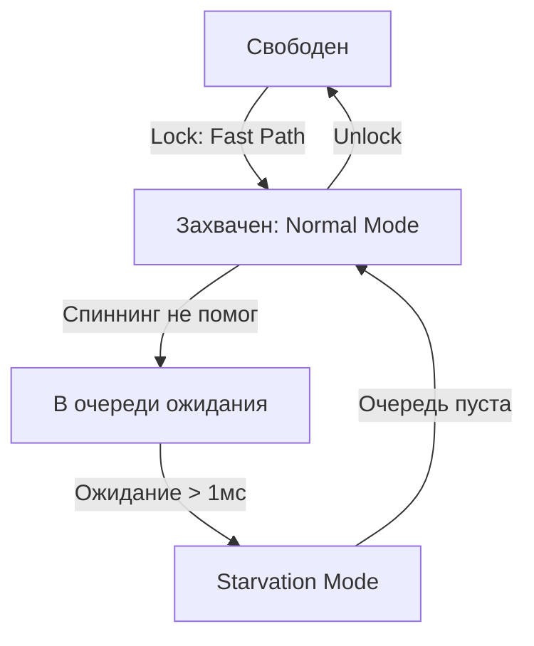
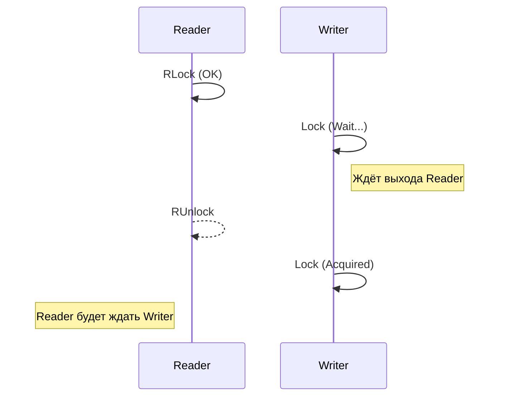

### 1. sync.WaitGroup

### Зачем нужен?

WaitGroup используется для ожидания завершения группы горутин. Это удобно, когда у вас есть несколько параллельных задач, и вы хотите дождаться, пока все они завершатся, прежде чем продолжить выполнение программы.

### Как работает?

- WaitGroup — это по сути счётчик, который увеличивается, когда вы добавляете задачу (.Add(n)), и уменьшается, когда задача завершается (.Done()).

- Метод .Wait() блокирует выполнение до тех пор, пока счётчик не станет равен нулю.

### Реализация "под капотом"

В Go **WaitGroup** реализован через структуру `sync.WaitGroup`, которая использует два ключевых поля:

- **Счётчик** (state): хранит количество активных задач и количество ожидающих горутин (**waiters**).
- **Семафор** (sema): используется для блокировки вызова `.Wait()` до момента, пока счётчик не обнулится.

> [!IMPORTANT]
> **Выравнивание (Alignment)**: На 32-битных архитектурах `WaitGroup` должен быть выровнен по 8 байтам, иначе атомарные операции со `state` упадут с ошибкой. В 64-битном Go это происходит автоматически.

**Внутреннее устройство WaitGroup:**
```mermaid
graph LR
    subgraph state64 [Состояние - 64 бита]
        C[Counter: 32 бита]
        W[Waiters: 32 бита]
    end
    S[Sema: Семафор]
    Note over C: Кол-во .Add()
    Note over W: Кол-во .Wait()
```

Когда вы вызываете `.Add(n)`, счётчик увеличивается на `n`. `.Done()` уменьшает его на 1. Метод `.Wait()` использует низкоуровневую синхронизацию через **семафоры** (например, **futex** в Linux), чтобы эффективно блокировать поток выполнения.

### Пример использования

```Go
package main

import (
	"fmt"
	"sync"
)
func main() {
	var wg sync.WaitGroup

	for i := 0; i < 5; i++ {
		wg.Add(1) // Добавляем задачу
		go func(id int) {
			defer wg.Done() // Уменьшаем счётчик после завершения
			fmt.Printf("Горутина %d выполнена\n", id)
		}(i)
	}
	wg.Wait() // Ждём завершения всех горутин
	fmt.Println("Все задачи завершены")
}
```

### Когда использовать?

- Когда нужно запустить несколько независимых задач и дождаться их завершения.

- Простой сценарий "запустил и жду".

### Ограничения

- Нельзя использовать WaitGroup повторно после .Wait() (нужно создавать новый экземпляр).

- Нет возможности узнать текущее состояние счётчика (только ждать).

---

### 2. sync.Mutex

### Зачем нужен?

Mutex (взаимное исключение) используется для защиты критической секции кода, где доступ к общим данным должен быть только у одной горутины в определённый момент. Это предотвращает состояние гонки (race condition).

### Как работает?

- .Lock() блокирует мьютекс, и только одна горутина может его захватить.

- .Unlock() освобождает мьютекс, позволяя другой горутине захватить его.

- Если мьютекс уже захвачен, вызов .Lock() блокирует вызывающую горутину до его освобождения.

### Реализация "под капотом"

`sync.Mutex` использует комбинацию **атомарных операций** и системных вызовов:

- Внутри он хранит **state** (битовое поле: захвачен, есть ли ожидающие, режим голодания) и использует инструкцию **CAS** (**Compare-And-Swap**) для установки состояния.
- Если мьютекс занят короткими операциями, горутина может «спиниться» (**spinning**) — ждать в цикле, не отдавая управление ОС.

#### Режимы работы (с Go 1.9):

1. **Normal Mode**: Очередь ожидающих работает по принципу FIFO, но проснувшаяся горутина конкурирует с новыми «налетающими» горутинами. Новые обычно выигрывают, так как они уже на CPU.
2. **Starvation Mode** (Режим голодания): Если горутина ждёт мьютекс более **1 мс**, он переходит в режим голодания. В этом режиме владение передаётся строго по очереди.

**Схема состояний Mutex:**


> [!TIP]
> **Медленный путь (Slow Path)**: Если **CAS** не сработал сразу, Go задействует семафор ОС, чтобы «запарковать» горутину.

### Пример использования

```Go
package main

import (
	"fmt"
	"sync"
)
func main() {
	var counter int
	var mu sync.Mutex

	var wg sync.WaitGroup
	for i := 0; i < 100; i++ {
		wg.Add(1)
		go func() {
			defer wg.Done()
			mu.Lock()         // Захватываем мьютекс
			counter++         // Критическая секция
			mu.Unlock()       // Освобождаем мьютекс
		}()
	}

	wg.Wait()
	fmt.Println("Итоговое значение:", counter) // Всегда 100
}
```

### Когда использовать?

- Когда нужно защитить общие данные от одновременного доступа (например, счётчик, массив, мапу).

- Простые сценарии, где требуется полная блокировка.

### Ограничения

- Блокирует даже операции чтения, что может быть избыточным, если данные только читаются (см. RWMutex ниже).

- Забытый .Unlock() приводит к дедлоку.

---

### 3. sync.RWMutex

### Зачем нужен?

RWMutex (Read-Write Mutex) — это улучшенная версия Mutex, которая различает операции чтения и записи. Позволяет множественным горутинам одновременно читать данные, но только одной записывать.

### Как работает?

- .RLock() и .RUnlock() — для чтения (множественные читатели допускаются).

- .Lock() и .Unlock() — для записи (полная блокировка, как в обычном Mutex).

- Чтение блокируется только во время записи, а запись блокируется, если есть активные читатели или другой писатель.

### Реализация "под капотом"

- Хранит счётчик активных читателей и флаг для писателя.
- Использует **атомарные операции** для управления счётчиком читателей.
- **Приоритет писателя**: Если писатель ждёт мьютекс, новые читатели не смогут захватить его (через `.RLock()`), пока писатель не закончит работу. Это предотвращает «заваливание» писателя бесконечным потоком читателей.

**Логика RWMutex:**


### Пример использования

```Go
package main

import (
	"fmt"
	"sync"
	"time"
)
func main() {
	var rwmu sync.RWMutex
	data := 0

	// Читатели
	for i := 0; i < 5; i++ {
		go func(id int) {
			rwmu.RLock()
			fmt.Printf("Читатель %d: данные = %d\n", id, data)
			time.Sleep(100 * time.Millisecond)
			rwmu.RUnlock()
		}(i)
	}
	// Писатель
	go func() {
		time.Sleep(50 * time.Millisecond)
		rwmu.Lock()
		data = 42
		fmt.Println("Писатель обновил данные")
		rwmu.Unlock()
	}()
	time.Sleep(500 * time.Millisecond)
}
```

### Когда использовать?

- Когда операции чтения преобладают над записью (например, кэш, конфигурация).

- Для повышения производительности в сценариях с частым чтением.

### Ограничения

- Более сложен в реализации и может быть избыточным для простых случаев.

---

### 4. sync/atomic

### Зачем нужен?

Пакет atomic предоставляет низкоуровневые операции для работы с примитивными типами данных (например, int32, int64, uint32) без использования мьютексов. Это быстрее, чем Mutex, так как операции выполняются на уровне процессора.

### Как работает?

- Операции вроде AddInt32, CompareAndSwapInt32, LoadInt32, StoreInt32 выполняются атомарно, то есть как одна неделимая инструкция.

- Гарантируется, что другие горутины не вмешаются в середину операции.

### Реализация "под капотом"

- Используются инструкции процессора, такие как **LOCK** (в x86) или **LDREX/STREX** (в ARM).
- **CAS** (**Compare-And-Swap**): Метод `atomic.CompareAndSwapInt32(&addr, old, new)` проверяет, равно ли значение по адресу `old`, и если да — записывает `new`. Всё это происходит за один такт процессора.

> [!IMPORTANT]
> **Это быстрее мьютекса**, потому что нет вызова планировщика Go и нет блокировки потока в ОС. Это «неблокирующая» синхронизация.

### Пример использования

```Go
package main

import (
	"fmt"
	"sync"
	"sync/atomic"
)
func main() {
	var counter int32

	var wg sync.WaitGroup
	for i := 0; i < 100; i++ {
		wg.Add(1)
		go func() {
			defer wg.Done()
			atomic.AddInt32(&counter, 1) // Атомарное увеличение
		}()
	}

	wg.Wait()
	fmt.Println("Итоговое значение:", atomic.LoadInt32(&counter)) // Всегда 100
}
```

### Когда использовать?

- Для простых операций с одним значением (счётчики, флаги).

- Когда важна максимальная производительность и нет сложной логики.

### Ограничения

- Только для примитивов (int32, int64, uint32, pointer и т.д.).

- Не подходит для сложных структур данных.

---

### 5. Каналы (chan)

### Зачем нужен?

Каналы — это встроенный в Go механизм синхронизации и передачи данных между горутинами. Они позволяют избежать явных блокировок и упрощают координацию.

### Как работает?

- Каналы блокируют горутину при чтении или записи, если другая сторона не готова.

- Буферизованные каналы позволяют записывать данные без немедленного чтения (до заполнения буфера).

### Реализация "под капотом"

- Канал — это структура с очередью (для буферизованных) и мьютексом для синхронизации.

- Использует планировщик Go для парковки горутин при ожидании данных.

### Пример использования

```Go
package main

import "fmt"

func main() {
	ch := make(chan int)

	go func() {
		ch <- 42 // Отправка данных
	}()
	data := <-ch // Получение данных
	fmt.Println("Получено:", data)
}
```

### Когда использовать?

- Для передачи данных между горутинами.

- Когда нужна синхронизация с передачей состояния.

### Ограничения

- Меньше контроля над синхронизацией по сравнению с Mutex.

---

### Сравнение и выбор инструмента

|            |                                 |                    |                               |
| ---------- | ------------------------------- | ------------------ | ----------------------------- |
| Инструмент | Когда использовать              | Плюсы              | Минусы                        |
| WaitGroup  | Ожидание группы горутин         | Простота           | Нет повторного использования  |
| Mutex      | Защита общих данных             | Надёжность         | Блокирует чтение              |
| RWMutex    | Частое чтение, редкая запись    | Производительность | Сложнее в использовании       |
| atomic     | Быстрые операции с примитивами  | Высокая скорость   | Ограниченная функциональность |
| Каналы     | Передача данных и синхронизация | Удобство в Go      | Не всегда гибко               |

---

### Вывод

Каждый инструмент решает свою задачу:

- WaitGroup — для ожидания.

- Mutex/RWMutex — для защиты данных.

- atomic — для скорости.

- Каналы — для передачи и координации.
