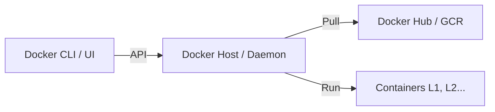

# 🐳 Docker: Контейнеризация и инструменты

## 📑 Содержание
1. [Как работает Docker: Под капотом](#как-работает-docker-под-капотом)
2. [Ключевые компоненты (Daemon, Images, Volumes)](#ключевые-компоненты-docker)
3. [Работа с сетями](#5-networks-сети)
4. [Docker Compose](#docker-compose)
5. [Docker для Go-разработчика](#как-это-работает-в-go-приложении)
6. [Best Practices](#рекомендации)

---

**Docker** — это стандарт де-факто для упаковки и запуска приложений. Он позволяет создать "слепок" системы, который будет работать одинаково на вашем ноутбуке, сервере коллеги или в облаке.

---

## 1. ⚙️ Как работает Docker: Под капотом

Docker не является виртуальной машиной. Он использует ядро хостовой ОС и изолирует процессы.

### Архитектура (Client-Server)


### Технологии изоляции
- **Namespaces**: Решает, ЧТО контейнер может видеть (свои процессы, свою сеть).
- **Cgroups**: Решает, СКОЛЬКО ресурсов может потреблять контейнер (CPU, RAM).
- **OverlayFS**: Слоистая файловая система. Если два образа используют один слой (например, `ubuntu`), он хранится на диске в одном экземпляре.

---

## 2. 🧩 Ключевые компоненты

### Образы (Images) и Слои
Образ — это "матрешка" из слоев. Каждый `RUN`, `COPY`, `ADD` в Dockerfile создает новый слой.

```mermaid
stack
    direction TB
    layer1["ReadOnly: OS Base (Alpine/Ubuntu)"]
    layer2["ReadOnly: Dependencies (Python/Go)"]
    layer3["ReadOnly: Application Code"]
    layer4["Read-Write: Container Layer (Runtime)"]
```

> [!TIP]
> **Принцип кэширования**: Размещайте редко меняющиеся команды (установка зависимостей) в начале Dockerfile, а часто меняющиеся (копирование кода) — в конце. Это ускорит сборку.

### Данные: Volumes и Bind Mounts
Контейнеры эфимерны (данные пропадают при удалении). Для сохранения используем:
- **Volumes**: Управляются Docker, хранятся в спец. папке. Безопасно и быстро.
- **Bind Mounts**: Прямая привязка папки с хоста (например, конфиги или исходный код для разработки).

---

## 3. 🌐 Сети (Networking)

| Тип | Описание | Применение |
|:---|:---|:---|
| **Bridge** | Виртуальный мост (подсеть). | Стандарт для большинства приложений. |
| **Host** | Убирает изоляцию сети (контейнер = хост). | Максимальная скорость, нет портов проброса. |
| **None** | Полная изоляция. | Задачи, не требующие сети. |

---

## 4. 🔗 Docker Compose

Инструмент для запуска "пачки" контейнеров одной командой.

```yaml
version: "3.8"
services:
  api:
    build: .
    ports: ["8080:8080"]
    depends_on: ["db"]
  db:
    image: postgres:15-alpine
    volumes: ["db-data:/var/lib/postgresql/data"]

volumes:
  db-data:
```

---

## 5. 🐹 Docker для Go-разработчика

Для Go идеально подходит **Multi-stage build**. Это позволяет получить финальный образ весом в 15-20 МБ вместо 1 ГБ.

```dockerfile
# Этап 1: Сборка
FROM golang:1.21-alpine AS builder
WORKDIR /app
COPY . .
RUN go build -o main .

# Этап 2: Финальный образ
FROM alpine:latest
WORKDIR /root/
COPY --from=builder /app/main .
CMD ["./main"]
```

---

## 6. 🛡️ Best Practices и Безопасность

> [!CAUTION]
> **Не запускайте процессы от root**. Внутри контейнера по умолчанию вы — root. Используйте инструкцию `USER` в Dockerfile, чтобы ограничить права в случае взлома.

- **Alpine images**: Используйте `-alpine` версии образов для минимизации размера и дыр в безопасности.
- **.dockerignore**: Всегда добавляйте `.git`, `node_modules`, `vendor` и бинарники в игнор.
- **ReadOnly FS**: Если приложению не нужно писать на диск, запускайте его с флагов `--read-only`.

---

## Ключевые команды (Шпаргалка)

- `docker ps -a` — список всех контейнеров.
- `docker images` — список образов.
- `docker exec -it <id> sh` — зайти внутрь работающего контейнера.
- `docker system prune` — очистить всё неиспользуемое (осторожно!).
- `docker logs -f <id>` — смотреть логи в реальном времени.
