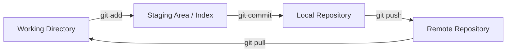
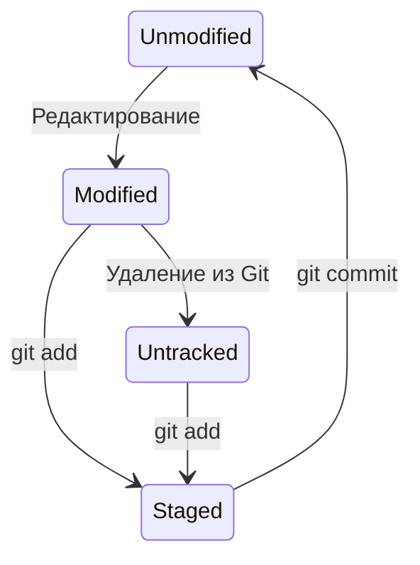
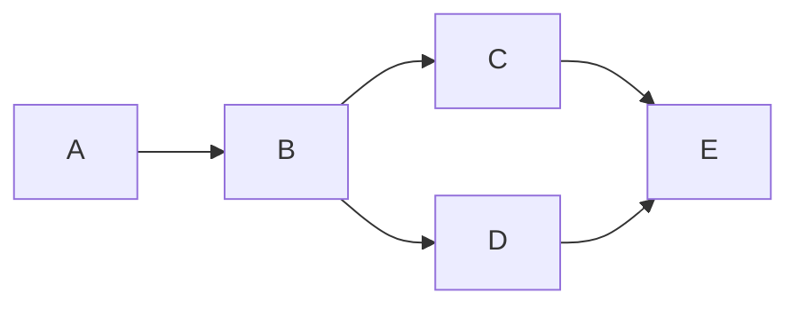

# Git: Система контроля версий

## Содержание
1. [Три состояния Git](#основные-стадии-работы-в-git)
2. [Жизненный цикл файла](#жизненный-цикл-файла)
3. [Основные команды](#основные-команды-git)
4. [Ветки и Слияния](#ветки-branches)
5. [Merge vs Rebase](#merge-vs-rebase)
6. [Best Practices](#советы)

---

**Git** — это распределенная система контроля версий. "Распределенная" значит, что каждый разработчик имеет у себя на компьютере **полную** копию всей истории проекта, а не только текущие файлы.

---

## 1. Три области Git

Понимание того, где физически находятся ваши изменения — ключ к мастерству в Git.

- **Working Directory**: Текущие файлы, которые вы редактируете.
- **Staging Area**: "Черновик" для следующего коммита. Здесь вы выбираете, какие изменения войдут в историю.
- **Local Repo**: База данных коммитов (папка `.git`).

---

## 2. Жизненный цикл файла

---

## 3. Merge vs Rebase

### Merge (Слияние)
Создает новый "коммит слияния" (merge commit). Сохраняет историю такой, какой она была на самом деле.

### Rebase (Перебазирование)
Переписывает историю, делая её линейной. Как будто вы начали писать свою фичу только что.

> [!CAUTION]
> **Золотое правило Rebase**: Никогда не делайте rebase веток, которые уже отправлены в удаленный репозиторий и используются другими людьми. Вы перепишете историю, и у коллег всё сломается.

---

## 4. Полезные "спасательные" команды

- `git checkout -- <file>` — вернуть файл к состоянию последнего коммита (отменить правки).
- `git commit --amend` — добавить забытые файлы в последний коммит или поправить текст сообщения.
- `git stash` — быстро "спрятать" текущие изменения, чтобы переключиться на другую ветку, не делая коммит.
- `git reset --hard HEAD~1` — полностью удалить последний коммит и все изменения в нем.

> [!IMPORTANT]
> Если вы случайно сделали коммит в `main` вместо своей ветки — не паникуйте. Сделайте `git branch feature-name`, а затем `git reset --hard HEAD~1` (в `main`). Ветка создастся, а `main` "откатится".

---

## 5. Branching Strategy (Git Flow)

Для работы в команде часто используют стратегию веток:
- `main` — только стабильный код (production).
- `develop` — ветка для интеграции фич.
- `feature/*` — временные ветки для отдельных задач.
- `hotfix/*` — срочные исправления багов.

---

## 6. Как писать сообщения к коммитам? (Conventional Commits)

Плохо: `fixed bug`, `updated code`.
Хорошо: 
- `feat: add user authentication`
- `fix: resolve memory leak in worker`
- `docs: update deployment guide`

---

## Ключевые выводы
- Git — это локальная база данных. Интернет нужен только для `push/pull`.
- Пользуйтесь `git status` как можно чаще.
- `rebase` — для чистоты, `merge` — для правды.
