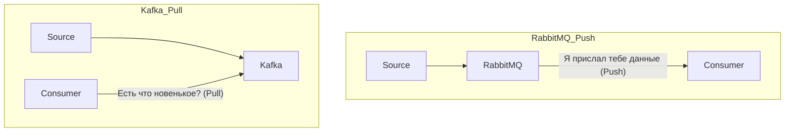
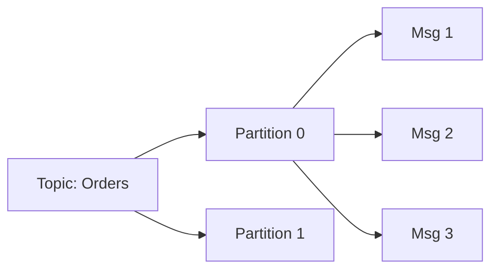
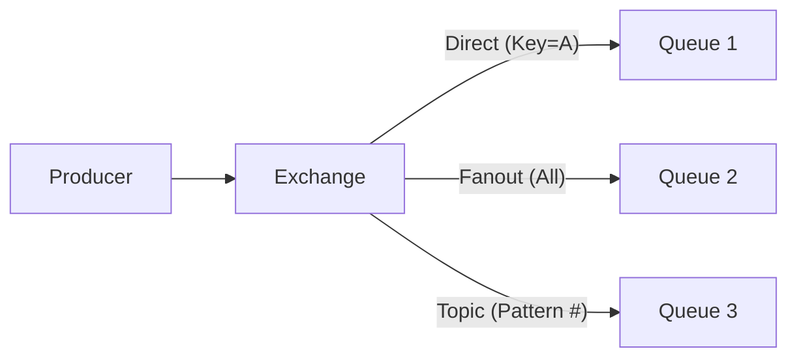

# 📨 Kafka & RabbitMQ: Системы обмена сообщениями

## 📑 Содержание
1. [Архитектура и главные отличия](#основные-отличия)
2. [Apache Kafka: Потоки событий](#apache-kafka)
3. [RabbitMQ: Универсальный брокер](#rabbitmq)
4. [Сравнение семантик доставки](#протокол)
5. [Когда что выбрать?](#как-выбрать)
6. [Рекомендации и примеры на Go](#пример-на-go)

---

В современном бэкенде микросервисы не общаются напрямую. Они шлют сообщения через посредников (Брокеров). Два главных игрока — **Kafka** и **RabbitMQ**.

---

## 1. ⚙️ Фундаментальное отличие: Push vs Pull

Главное различие кроется в способе получения данных потребителем.

- **RabbitMQ**: Брокер следит за потребителем. Как только пришло сообщение — он отправляет его. Как только потребитель подтвердил (ACK) — сообщение **удаляется**.
- **Kafka**: Брокеру всё равно. Он просто складывает сообщения в **лог** (журнал). Потребитель сам заходит и читает с того места, где остановился. Сообщения **хранятся** долго (дни, недели).

---

## 2. 🗞️ Apache Kafka (Event Streaming)

Kafka — это не просто очередь, это **распределенный журнал**.

### Как устроены данные

- **Партиции**: Нужны для скорости. Разные консюмеры могут читать разные партиции одного топика одновременно (параллелизм).
- **Zookeeper / KRaft**: "Мозг" системы, который следит, какой брокер жив и кто главный.

> [!IMPORTANT]
> **Порядок гарантирован только внутри одной партиции**. Если вам важно, чтобы события шли строго друг за другом, шлите их в одну партицию (используя один ключ).

---

## 3. 🐰 RabbitMQ (Message Broker)

RabbitMQ славится своей гибкостью. Он может маршрутизировать сообщения как угодно.

### Принципы маршрутизации (Exchanges)

- **Direct**: Пакет идет в конкретную очередь по совпадению ключа.
- **Fanout**: Продюсер крикнул — все очереди получили копию (рассылка).
- **Topic**: Гибкий фильтр по шаблонам (например, `orders.europe.*`).

---

## 4. 📊 Сравнение

| Фича | Kafka | RabbitMQ |
|:---|:---|:---|
| **Нагрузка** | Миллионы сообщ/сек. | Десятки тысяч сообщ/сек. |
| **Хранение** | Долгосрочно на диске. | До доставки консюмеру. |
| **Сложная логика** | Минимум (только топики). | Максимальная (фильтры, правила). |
| **Перечитать данные** | Да (можно сдвинуть Offset). | Нет (сообщение удалено). |

---

## 5. 💻 Практика на Go (Выбор библиотеки)

- **Kafka**: `confluent-kafka-go` (требует CGO) или `segmentio/kafka-go` (чистый Go).
- **RabbitMQ**: `amqp091-go` (стандарт).

> [!TIP]
> **Graceful Shutdown**: При остановке сервиса в Go всегда дожидайтесь завершения обработки текущего сообщения или корректно закрывайте соединение, чтобы брокер не считал, что сервис "упал" и не переотправлял данные другим.

---

## 🎯 Ключевые выводы

1. Нужна **дикая скорость** и аналитика? (Логи, клики) — **Kafka**.
2. Нужна **хитрая логика** доставки? (Заказы, уведомления, биллинг) — **RabbitMQ**.
3. Kafka — это **матрешка** логов. RabbitMQ — это **умная почта**.
