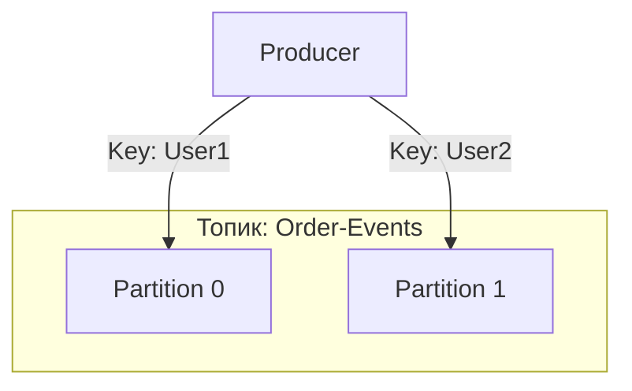
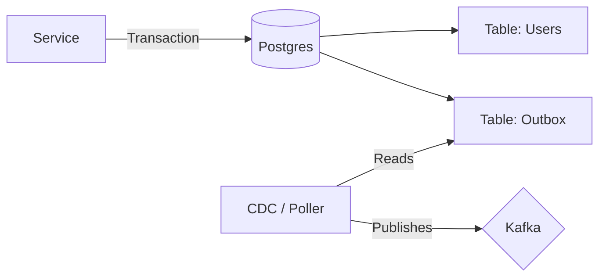

# 🐘 Apache Kafka

## 📑 Содержание
1. [Что это? (Лог, а не очередь)](#1-что-это-лог-а-не-очередь)
2. [Базовые термины](#2-базовые-термины)
3. [Как это работает? (Partitioning)](#3-как-это-работает-partitioning)
4. [Consumer Groups](#4-consumer-groups)
5. [Гарантии доставки (Delivery Semantics)](#5-гарантии-доставки-delivery-semantics)
6. [Паттерны надежности (Reliability)](#6-паттерны-надежности-reliability)
7. [Transactional Outbox](#7-transactional-outbox)

---

## 1. 🤔 Что это? (Лог, а не очередь)

Многие думают, что Kafka — это просто очередь сообщений (как RabbitMQ). Но правильнее думать о ней как о **Распределенном Журнале Событий (Commit Log)**.

### 📜 Аналогия с Журналом
*   **Очередь (RabbitMQ)**: Вы отправили письмо, друг прочитал — письмо исчезло (сгорело).
*   **Журнал (Kafka)**: Вы написали запись в тетрадь. Друг прочитал. Запись **осталась**. Другой друг тоже может её прочитать.

> [!NOTE]
> **Kafka хранит данные вечно** (ну или сколько вы настроите: 3 дня, неделю, год). Сообщения не удаляются после прочтения!

---

## 2. 🧱 Базовые термины

*   **Topic**: Категория сообщений (папка).
*   **Producer**: Пишет данные.
*   **Consumer**: Читает данные (Pull model).
*   **Log**: Упорядоченная последовательность записей.

---

## 3. ⚙️ Как это работает? (Partitioning)

Один топик пилят на кусочки — **Партиции**.
Это нужно для **Параллелизма**. Одна партиция — один поток чтения.

> [!IMPORTANT]
> **Гарантия порядка**: Только внутри **одной** партиции.
> A и B в одной партиции придут как A -> B.
> A и B в разных партициях могут прийти как B -> A.

---

## 4. 👥 Consumer Groups

Группа сервисов объединяется, чтобы читать топик быстрее.
Каждая партиция достается только **одному** консьюмеру в группе.

---

## 5. 🤝 Гарантии доставки (Delivery Semantics)

Как гарантировать, что сообщение не потеряется?

### 📨 Acknowledgement (acks)
Когда Продюсер пишет в Кафку, он может требовать разного уровня подтверждения:
*   `acks=0`: "Выстрелил и забыл". Очень быстро, но можно потерять данные.
*   `acks=1`: Ждем подтверждения только от Лидера партиции.
*   `acks=all`: Ждем подтверждения от Лидера и **всех** живых реплик (ISR). Максимальная надежность.

### Уровни гарантий
1.  **At-most-once (Не более одного раза)**
    *   Сообщение может потеряться, но никогда не продублируется.
    *   *Как*: `acks=0`, или консьюмер коммитит офсет **до** обработки.
2.  **At-least-once (Хотя бы один раз)** — *Стандарт де-факто*.
    *   Сообщение точно дойдет, но может прийти дважды (дубль).
    *   *Как*: `acks=all`, консьюмер коммитит офсет **после** успешной обработки.
    *   *Проблема*: Если консьюмер обработал, но упал до коммита, он обработает снова после рестарта.
3.  **Exactly-once (Ровно один раз)**
    *   Святой Грааль.
    *   *Внутри Kafka*: Используя Idempotent Producer (`enable.idempotence=true`) и транзакции.
    *   *End-to-End*: Требует идемпотентности на стороне консьюмера (БД).

> [!IMPORTANT]
> **Идемпотентность** — свойство операции давать тот же результат при повторном вызове.
> Пример: `Update User Set Status = Active` (Идемпотентно). `User.Balance += 100` (НЕ идемпотентно, придет 2 раза — начислим 200).
> Лучшая защита от дублей — уникальные ключи идемпотентности в БД.

---

## 6. 🛡️ Паттерны надежности (Reliability)

### 💀 Dead Letter Queue (DLQ)
Что делать, если сообщение "битое" и вызывает ошибку в коде (например, невалидный JSON)?
Если просто возвращать ошибку, консьюмер будет пытаться прочитать его бесконечно (**Infinite Loop**).

**Решение**:
1.  Пытаемся обработать N раз (Retry).
2.  Если все равно ошибка — перекладываем сообщение в специальный топик **DLQ** (кладбище сообщений).
3.  Коммитим офсет в основном топике и идем дальше.
4.  Админ смотрит DLQ, чинит баг и переотправляет сообщения ("Replay").

---

## 7. 📦 Transactional Outbox

Классическая проблема микросервисов: **Dual Write**.
Вам нужно:
1.  Сохранить сущность `User` в Postgres.
2.  Отправить событие `UserCreated` в Kafka.

Если 1 упадет — всё ок. Если 1 ок, а 2 упадет (сеть моргнула) — у вас **Рассинхрон**. Юзер создан, а письма приветственного нет.

**Решение (Outbox Pattern)**:
В одной БД транзакции сохраняем и `User`, и `Event` (в табличку `outbox`).
`User` и `Event` коммитятся атомарно (или приходят оба, или никто).

*   **CDC (Change Data Capture)**: Специальная тулза (например, **Debezium**) читает бинарные логи (WAL) базы данных и сама отправляет события в Кафку. Это самый надежный способ интеграции.