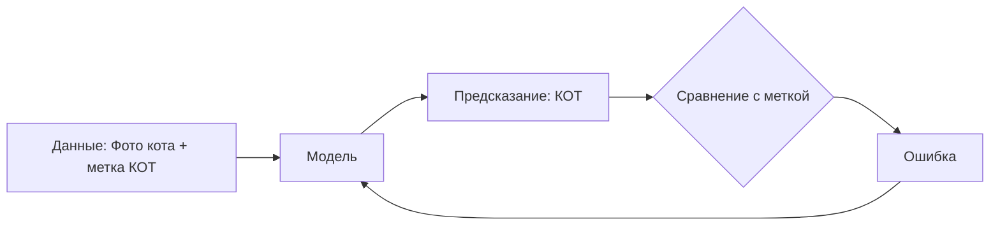
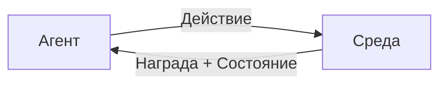
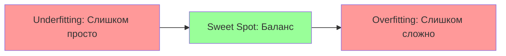

# 🤖 Основы машинного обучения (Machine Learning)

## 📑 Содержание
1. [Что такое машинное обучение?](#что-такое-машинное-обучение)
2. [Три типа обучения](#три-типа-обучения)
3. [Основные задачи ML](#основные-задачи-ml)
4. [Переобучение и недообучение](#переобучение-и-недообучение)
5. [Разделение данных: Train/Val/Test](#разделение-данных)
6. [Метрики качества](#метрики-качества)

---

## ❓ Что такое машинное обучение?

**Машинное обучение (ML)** — это раздел искусственного интеллекта, в котором компьютер учится решать задачи **на основе данных**, а не четких правил, прописанных программистом. 🧠

> [!NOTE]
> **Традиционное программирование**: Вы пишете правила → Программа выдает результат.
> **Машинное обучение**: Вы даете данные и результаты → Модель сама находит правила.

**Пример**: Вместо того чтобы писать 1000 правил "если на картинке есть усы, хвост и уши — это кот", мы показываем модели 10,000 фотографий котов и собак, и она сама учится их различать.

---

## 🎓 Три типа обучения

### 1. Supervised Learning (Обучение с учителем) 👨‍🏫

У нас есть **размеченные данные** (labeled data), где для каждого примера известен правильный ответ.

**Задачи:**
- **Классификация**: Определить категорию (Кот или собака? Спам или не спам?).
- **Регрессия**: Предсказать число (Цена дома, температура завтра).

---

### 2. Unsupervised Learning (Обучение без учителя) 🔍

У нас есть только **данные без меток**. Модель сама ищет закономерности.

**Задачи:**
- **Кластеризация**: Разделить данные на группы (Сегментация клиентов на типы).
- **Снижение размерности**: Сжать данные, сохранив главное (PCA).
- **Поиск аномалий**: Найти выбросы (Fraud detection в банках).

---

### 3. Reinforcement Learning (Обучение с подкреплением) 🎮

Агент учится, взаимодействуя со средой. За правильные действия получает награду, за неправильные — штраф.

**Примеры:**
- Игры (AlphaGo, DeepMind играет в Dota 2).
- Роботы (Самоходные машины).
- Рекомендательные системы.

---

## 📊 Основные задачи ML

| Задача | Тип | Пример |
| :--- | :--- | :--- |
| **Классификация** | Supervised | Распознавание лиц, фильтрация спама |
| **Регрессия** | Supervised | Прогноз цен на акции, погода |
| **Кластеризация** | Unsupervised | Группировка новостей по темам |
| **Рекомендации** | Hybrid | Netflix, YouTube подборка |
| **Детекция аномалий** | Unsupervised | Обнаружение мошенничества |

---

## ⚠️ Переобучение и недообучение

### Переобучение (Overfitting) 📈
Модель **слишком хорошо** запомнила обучающие данные, включая шум и случайности. На новых данных работает плохо.

**Признаки**: Отличный результат на train, плохой на test.

**Решение**:
- Больше данных.
- Регуляризация (L1, L2).
- Упрощение модели (меньше параметров).

---

### Недообучение (Underfitting) 📉
Модель **слишком простая** и не может уловить закономерности даже в обучающих данных.

**Признаки**: Плохой результат на train и на test.

**Решение**:
- Усложнить модель (больше слоев, нейронов).
- Добавить признаки (features).
- Увеличить время обучения.

---

## 🗂️ Разделение данных: Train/Val/Test

Чтобы честно оценить качество модели, данные делят на 3 части:

1.  **Train (70-80%)**: На этих данных модель учится (подбирает веса).
2.  **Validation (10-15%)**: На этих данных мы проверяем модель в процессе обучения и настраиваем гиперпараметры (learning rate, количество слоев).
3.  **Test (10-15%)**: Это данные, которые модель **никогда не видела**. Финальная проверка перед продакшеном.

> [!IMPORTANT]
> Никогда не обучайте модель на тестовых данных! Это как давать студенту билеты перед экзаменом — вы не узнаете его реальный уровень знаний.

---

## 📏 Метрики качества

### Для классификации:
- **Accuracy (Точность)**: Доля правильных ответов. Но она врет, если классы несбалансированы (999 "не спам", 1 "спам").
- **Precision (Точность)**: Из тех, кого мы назвали "спам", сколько действительно спам?
- **Recall (Полнота)**: Из всех настоящих спамов, сколько мы нашли?
- **F1-Score**: Гармоническое среднее Precision и Recall.

### Для регрессии:
- **MAE (Mean Absolute Error)**: Средняя абсолютная ошибка.
- **MSE (Mean Squared Error)**: Средняя квадратичная ошибка (сильно штрафует за большие промахи).
- **RMSE (Root MSE)**: Квадратный корень из MSE.

---

> [!TIP]
> Машинное обучение — это не магия, а итеративный процесс: собрать данные → выбрать модель → обучить → оценить → улучшить. Повторять, пока результат не станет удовлетворительным. 🔄
