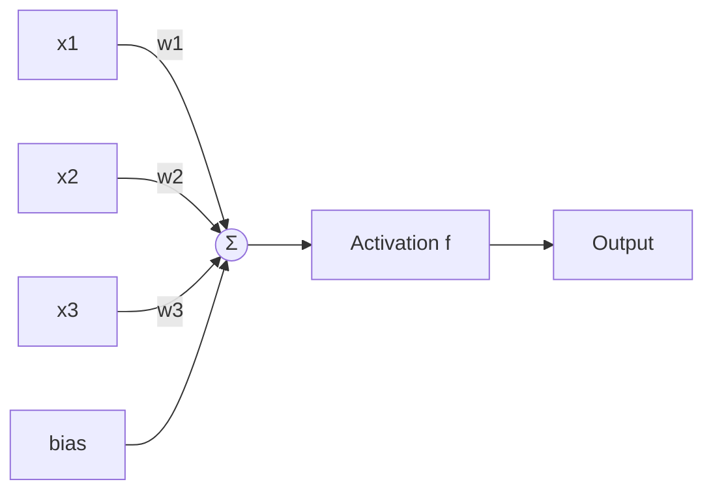
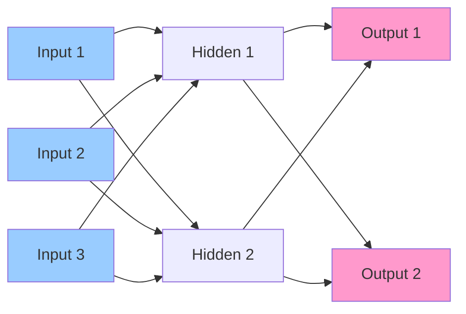
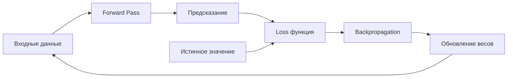

# 🧠 Нейронные сети (Neural Networks)

## 📑 Содержание
1. [Что такое нейронная сеть?](#что-такое-нейронная-сеть)
2. [Персептрон: Простейший нейрон](#персептрон)
3. [Функции активации](#функции-активации)
4. [Архитектура сети](#архитектура-сети)
5. [Обратное распространение (Backpropagation)](#backpropagation)
6. [Градиентный спуск (Gradient Descent)](#gradient-descent)

---

## ❓ Что такое нейронная сеть?

**Нейронная сеть** — это математическая модель, вдохновленная работой биологических нейронов в мозге. Она состоит из множества простых элементов (нейронов), которые соединены между собой и обрабатывают информацию параллельно. 🧬

> [!NOTE]
> В реальном мозге ~86 миллиардов нейронов. В искусственных сетях — от сотен до миллиардов параметров (весов).

---

## ⚡ Персептрон: Простейший нейрон

**Персептрон** — это базовый строительный блок нейронной сети. Он принимает несколько входов, умножает каждый на вес, суммирует и пропускает через функцию активации.



**Формула:**
```
output = activation(w1*x1 + w2*x2 + w3*x3 + bias)
```

- **Веса (w)**: Определяют важность каждого входа.
- **Bias (смещение)**: Позволяет сдвигать функцию активации.

---

## 📈 Функции активации

Функции активации делают нейронную сеть **нелинейной**. Без них даже 100-слойная сеть была бы эквивалентна одному слою (линейная комбинация линейных функций = линейная функция).

### 1. Sigmoid (Сигмоида) 🌊
```
σ(x) = 1 / (1 + e^(-x))
```
- **Диапазон**: [0, 1]
- **Плюсы**: Гладкая, интерпретируется как вероятность.
- **Минусы**: Проблема затухающего градиента (vanishing gradient) при больших/малых x.

---

### 2. Tanh (Гиперболический тангенс) 〰️
```
tanh(x) = (e^x - e^(-x)) / (e^x + e^(-x))
```
- **Диапазон**: [-1, 1]
- **Плюсы**: Центрирована вокруг нуля (лучше для скрытых слоев).
- **Минусы**: Также страдает от затухающего градиента.

---

### 3. ReLU (Rectified Linear Unit) ⚡
```
ReLU(x) = max(0, x)
```
- **Диапазон**: [0, ∞)
- **Плюсы**: Простая, быстрая, решает проблему затухающего градиента, де-факто стандарт.
- **Минусы**: "Мертвые нейроны" (если вес стал отрицательным, градиент = 0 навсегда).

---

### 4. Leaky ReLU 💧
```
Leaky ReLU(x) = max(0.01x, x)
```
- Решает проблему "мертвых нейронов", позволяя малый отрицательный градиент.

---

### 5. Softmax (для классификации) 🎯
Превращает вектор чисел в распределение вероятностей (сумма = 1).
```
softmax(xi) = e^xi / Σ(e^xj)
```
Используется в последнем слое для многоклассовой классификации.

---

## 🏗️ Архитектура сети

Нейронная сеть состоит из **слоев** (layers):

1.  **Входной слой (Input Layer)**: Принимает данные (например, пиксели картинки).
2.  **Скрытые слои (Hidden Layers)**: Извлекают признаки высокого уровня. Чем больше слоев, тем сложнее паттерны сеть может уловить.
3.  **Выходной слой (Output Layer)**: Выдает предсказание.



> [!IMPORTANT]
> **Глубокая сеть (Deep Network)** — это сеть с множеством скрытых слоев (обычно > 3). Отсюда термин **Deep Learning**.

---

## 🔄 Обратное распространение (Backpropagation)

Это алгоритм обучения нейронной сети. Он работает в два этапа:

### 1. Forward Pass (Прямой проход)
Данные проходят через сеть от входа к выходу. Получаем предсказание.

### 2. Backward Pass (Обратный проход)
Считаем ошибку (loss) и распространяем её обратно через сеть, обновляя веса.



**Ключевая идея**: Используется **правило цепочки (chain rule)** из математического анализа, чтобы понять, как изменение каждого веса влияет на итоговую ошибку.

---

## ⛰️ Градиентный спуск (Gradient Descent)

Это метод оптимизации, который минимизирует функцию потерь (loss function).

**Алгоритм:**
1. Вычислить градиент (производную) функции потерь по каждому весу.
2. Сдвинуть вес в направлении, противоположном градиенту.
3. Повторять, пока не достигнем минимума.

```
новый_вес = старый_вес - learning_rate * градиент
```

---

### Варианты:
- **Batch GD**: Считает градиент по всем данным (медленно, но стабильно).
- **Stochastic GD (SGD)**: Считает градиент по одному примеру (быстро, но шумно).
- **Mini-batch GD**: Золотая середина — берет небольшую порцию данных (batch size = 32, 64, 128).

---

### Продвинутые оптимизаторы:
- **Adam**: Самый популярный. Адаптивно меняет learning rate для каждого параметра.
- **RMSprop**: Хорош для рекуррентных сетей.
- **AdaGrad**: Для разреженных данных.

---

> [!TIP]
> **Гиперпараметры, которые нужно настраивать:**
> - Learning rate (слишком большой → не сходится, слишком малый → учится вечно).
> - Batch size.
> - Количество слоев и нейронов в каждом.
> - Функция активации.
> 
> Обычно это делается через **grid search** или **random search**. 🎯
