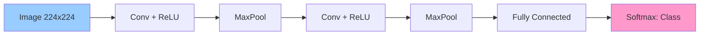
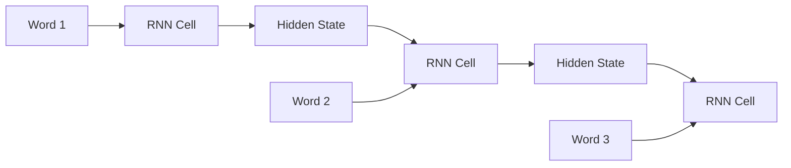
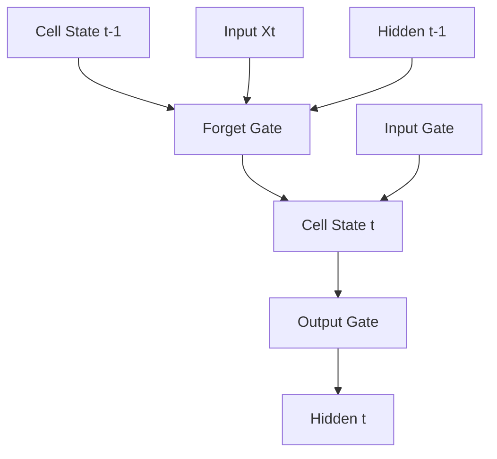
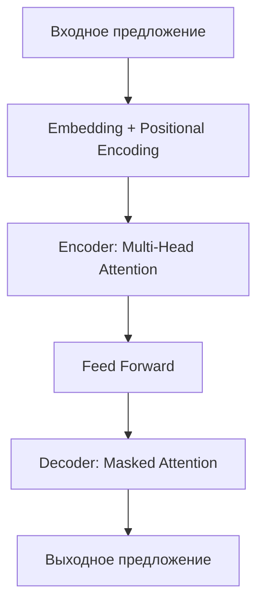
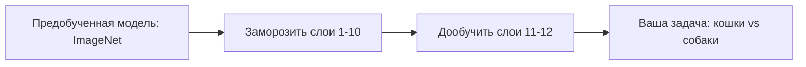

# 🚀 Deep Learning (Глубокое обучение)

## 📑 Содержание
1. [Что такое Deep Learning?](#что-такое-deep-learning)
2. [CNN: Сверточные нейронные сети](#cnn-сверточные-сети)
3. [RNN и LSTM: Рекуррентные сети](#rnn-и-lstm)
4. [Transformers: Революция в AI](#transformers)
5. [Attention Mechanism (Механизм внимания)](#attention-mechanism)
6. [Transfer Learning (Перенос обучения)](#transfer-learning)

---

## ❓ Что такое Deep Learning?

**Deep Learning** — это подраздел машинного обучения, основанный на глубоких нейронных сетях (с большим количеством слоев). Именно глубокие сети позволили достичь прорывов в распознавании изображений, речи, переводе и генерации текста. 🌊

> [!NOTE]
> "Глубокая" сеть — это обычно сеть с **более чем 3 скрытыми слоями**. Современные модели могут иметь сотни слоев (ResNet-152, GPT-3 с 96 слоями Transformer).

---

## 🖼️ CNN: Сверточные нейронные сети (Convolutional Neural Networks)

**CNN** — это архитектура, специально

 разработанная для работы с **изображениями**. Она использует операцию свертки (convolution), чтобы находить локальные паттерны (края, текстуры, формы).

### Основные слои:

1.  **Convolutional Layer (Сверточный слой)**:
    - Применяет фильтры (ядра свертки) к изображению.
    - Каждый фильтр ищет конкретный признак (например, вертикальные линии).
    
2.  **Pooling Layer (Слой подвыборки)**:
    - Уменьшает размерность (обычно MaxPooling).
    - Берет максимум из окна 2×2, уменьшая карту признаков в 4 раза.
    
3.  **Fully Connected Layer (Полносвязный слой)**:
    - Обычный слой нейросети в конце для классификации.



### Почему CNN работают для изображений?
- **Локальные связи**: Нейрон смотрит только на небольшой участок изображения (рецептивное поле).
- **Разделение весов**: Один и тот же фильтр применяется ко всему изображению → меньше параметров.
- **Иерархия признаков**: Первые слои видят простые паттерны (линии), последние — сложные (лица, объекты).

---

## 🔁 RNN и LSTM: Рекуррентные сети

**RNN (Recurrent Neural Networks)** — это сети для **последовательностей** (текст, временные ряды, аудио). Они имеют "память": выход на предыдущем шаге влияет на текущий.



### Проблема обычных RNN:
**Vanishing Gradient** (Затухающий градиент): при обучении на длинных последовательностях градиент становится слишком малым, и сеть "забывает" начало последовательности.

---

### LSTM (Long Short-Term Memory) 🧠
Это улучшенная версия RNN, которая может запоминать информацию на **долгий срок**.

**Ключевые компоненты:**
- **Forget Gate** (Врата забывания): Что удалить из памяти.
- **Input Gate** (Врата ввода): Что добавить в память.
- **Output Gate** (Врата вывода): Что передать дальше.



**Применение**: Перевод, генерация текста, анализ настроений, прогнозирование временных рядов.

---

## ⚡ Transformers: Революция в AI

**Transformer** (2017, Google) — это архитектура, которая **полностью заменила** RNN/LSTM для обработки текста. Она лежит в основе GPT, BERT, ChatGPT. 🔥

### Главное отличие от RNN:
- **Параллелизм**: RNN обрабатывает слова по очереди. Transformer обрабатывает **все слова одновременно**.
- **Self-Attention**: Каждое слово "смотрит" на все остальные слова в предложении и решает, какие из них важны для его понимания.



### Encoder-Decoder структура:
- **Encoder**: Понимает входной текст.
- **Decoder**: Генерирует выходной текст (перевод, ответ).

---

## 👁️ Attention Mechanism (Механизм внимания)

**Attention** — это способ сказать модели: "Сфокусируйся на важных частях входа".

**Пример**: При переводе фразы "Я люблю кошек" на английский, когда модель переводит слово "кошек", она должна обратить **больше внимания** на слово "cats", а не на "I" или "love".

### Self-Attention в Transformers:
Каждое слово вычисляет **веса внимания** для всех других слов:
```
Attention(Q, K, V) = softmax(Q·K^T / √d) · V
```
- **Q (Query)**: "Что я ищу?"
- **K (Key)**: "Что у меня есть?"
- **V (Value)**: "Какую информацию передать?"

---

## 🔄 Transfer Learning (Перенос обучения)

Идея: Вместо обучения модели с нуля, берем **предобученную** модель (например, ResNet обученную на ImageNet с 14 миллионами картинок) и **дообучаем** на своей задаче.

### Преимущества:
- **Меньше данных**: Вам не нужны миллионы примеров.
- **Быстрее**: Обучение занимает часы, а не недели.
- **Лучше качество**: Модель уже знает базовые паттерны.

### Типичный подход:
1. Взять предобученную модель (BERT, GPT, ResNet).
2. **Заморозить** нижние слои (они уже знают базовые признаки).
3. **Дообучить** только последние слои на вашей специфичной задаче.



> [!TIP]
> **Fine-tuning** — это стандартный подход в 2024 году. Обучать модель с нуля имеет смысл только если:
> - У вас уникальные данные (медицинские снимки).
> - У вас огромные ресурсы (как у Google/OpenAI).

---

## 🌟 Популярные архитектуры

| Архитектура | Задача | Год | Особенность |
| :--- | :--- | :--- | :--- |
| **LeNet** | Распознавание цифр | 1998 | Первая CNN |
| **AlexNet** | Классификация ImageNet | 2012 | Прорыв в CV |
| **ResNet** | Классификация | 2015 | Skip connections (остаточные связи) |
| **LSTM** | Последовательности | 1997 | Решает vanishing gradient |
| **BERT** | NLP (понимание текста) | 2018 | Bidirectional Transformer |
| **GPT-3/4** | Генерация текста | 2020/2023 | Огромный (175B параметров) |
| **YOLO** | Детекция объектов | 2015 | Реальное время |

---

> [!IMPORTANT]
> Глубокое обучение требует огромных вычислительных ресурсов. Современные модели обучаются на **GPU** (NVIDIA) или **TPU** (Google). Одна эпоха обучения GPT-3 стоит миллионы долларов. Для личных проектов используйте Transfer Learning и облачные платформы (Google Colab, AWS). 💰⚡
