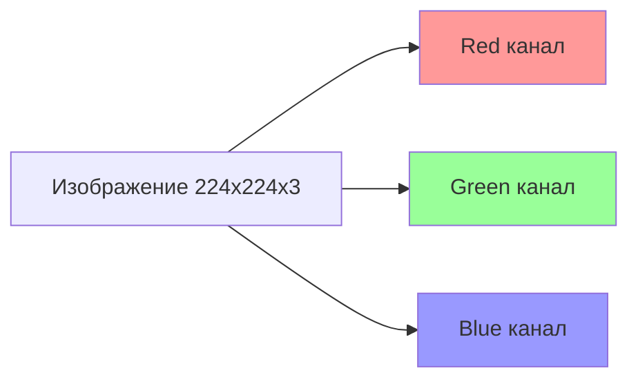
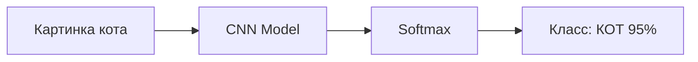
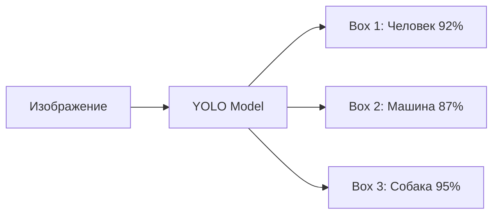
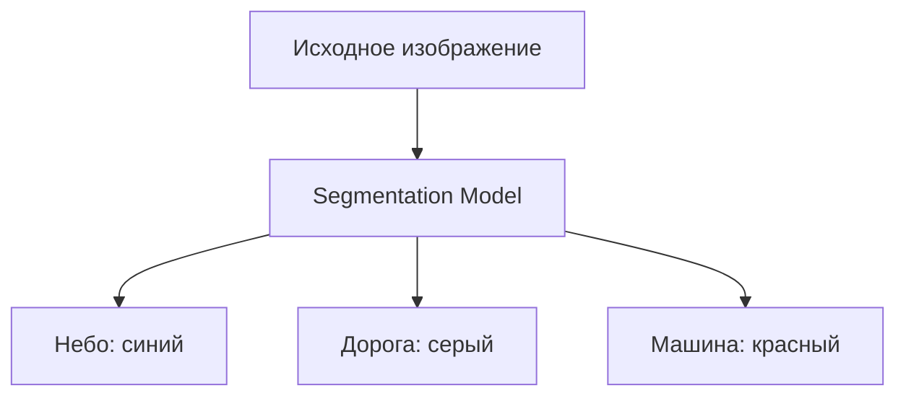

# 👁️ Computer Vision (Компьютерное зрение)

## 📑 Содержание
1. [Что такое Computer Vision?](#что-такое-computer-vision)
2. [Обработка изображений (Image Processing)](#обработка-изображений)
3. [Задачи Computer Vision](#задачи-computer-vision)
4. [Детекция объектов (Object Detection)](#детекция-объектов)
5. [Сегментация (Segmentation)](#сегментация)
6. [Популярные модели и архитектуры](#популярные-модели)

---

## ❓ Что такое Computer Vision?

**Computer Vision (CV)** — это область AI, которая учит компьютеры "видеть" и понимать визуальную информацию из изображений и видео. 📸

**Применения**:
- Распознавание лиц (Face ID в iPhone).
- Автопилот (Tesla видит дорогу, машины, пешеходов).
- Медицинская диагностика (определение рака на снимках).
- Дополненная реальность (AR-фильтры в Instagram).

---

## 🖼️ Обработка изображений (Image Processing)

### Представление изображения:
Изображение — это **матрица пикселей**. Каждый пиксель имеет значения цвета.

- **Grayscale (Градации серого)**: 1 канал, значения 0-255.
- **RGB**: 3 канала (Red, Green, Blue).
- **Размер**: Например, 224×224×3 (высота × ширина × каналы).



### Базовые операции:
- **Resize**: Изменение размера (для подачи в нейросеть).
- **Normalization**: Приведение значений к диапазону [0, 1] или [-1, 1].
- **Data Augmentation**: Случайные повороты, отражения, обрезки для увеличения датасета.

---

## 🎯 Задачи Computer Vision

### 1. Классификация изображений (Image Classification)
**Задача**: Определить, что на картинке (кот, собака, самолет).
**Выход**: Одна метка класса.



---

### 2. Локализация объектов (Object Localization)
**Задача**: Найти объект и нарисовать вокруг него прямоугольник (bounding box).
**Выход**: Координаты (x, y, width, height) + класс.

---

### 3. Детекция объектов (Object Detection)
**Задача**: Найти **все** объекты на изображении и их классы.
**Выход**: Множество bounding boxes с метками.

**Популярные модели**:
- **YOLO (You Only Look Once)**: Очень быстрая, работает в реальном времени (30-60 FPS).
- **R-CNN, Fast R-CNN, Faster R-CNN**: Более точные, но медленнее.
- **SSD (Single Shot Detector)**: Баланс скорости и точности.



---

### 4. Сегментация (Segmentation)

#### Semantic Segmentation (Семантическая):
Каждый пиксель относится к классу (небо, дорога, человек).

#### Instance Segmentation (По экземплярам):
Разделяет разные объекты одного класса (Человек 1, Человек 2).

**Модели**: U-Net, Mask R-CNN, DeepLab.



---

## 🚗 Детекция объектов: YOLO подробнее

**YOLO (You Only Look Once)** — революционная архитектура, которая обрабатывает изображение за **один проход**.

### Как работает:
1. Делит изображение на сетку (например, 7×7).
2. Каждая ячейка предсказывает несколько bounding boxes и их уверенность.
3. Фильтрует плохие предсказания (Non-Maximum Suppression).

**Преимущества**:
- **Скорость**: 45-155 FPS (зависит от версии).
- **Реальное время**: Идеально для видео, автопилота, камер безопасности.

**Версии**: YOLOv1 → YOLOv8 (каждая версия быстрее и точнее).

---

## 🏗️ Популярные модели и архитектуры

| Модель | Год | Особенность | Задача |
| :--- | :--- | :--- | :--- |
| **LeNet-5** | 1998 | Первая CNN | Распознавание цифр MNIST |
| **AlexNet** | 2012 | Прорыв на ImageNet | Классификация |
| **VGGNet** | 2014 | Очень глубокая (16-19 слоев) | Классификация |
| **ResNet** | 2015 | Skip connections, 152 слоя | Классификация |
| **YOLO** | 2015 | Реальное время | Детекция |
| **U-Net** | 2015 | Encoder-Decoder | Сегментация (медицина) |
| **EfficientNet** | 2019 | Оптимальное соотношение точность/скорость | Классификация |
| **Vision Transformer (ViT)** | 2020 | Transformers для изображений | Классификация |

---

## 🧪 Практический пример: Transfer Learning

Вместо обучения модели с нуля, используем **предобученную ResNet-50**:

```python
from tensorflow.keras.applications import ResNet50
from tensorflow.keras.layers import Dense, GlobalAveragePooling2D
from tensorflow.keras.models import Model

# Загружаем предобученную модель
base_model = ResNet50(weights='imagenet', include_top=False, input_shape=(224, 224, 3))

# Замораживаем слои
for layer in base_model.layers:
    layer.trainable = False

# Добавляем свои слои
x = base_model.output
x = GlobalAveragePooling2D()(x)
x = Dense(1024, activation='relu')(x)
predictions = Dense(10, activation='softmax')(x)  # 10 классов

model = Model(inputs=base_model.input, outputs=predictions)
model.compile(optimizer='adam', loss='categorical_crossentropy', metrics=['accuracy'])
```

---

> [!IMPORTANT]
> Современные CV модели требуют **огромных датасетов** (ImageNet = 14 млн картинок). Поэтому практически всегда используется Transfer Learning. Обучение с нуля имеет смысл только для уникальных данных (спутниковые снимки, медицинские МРТ). 🛰️🏥
