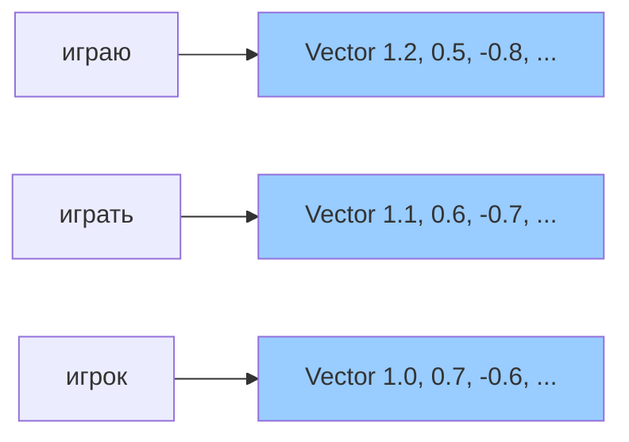
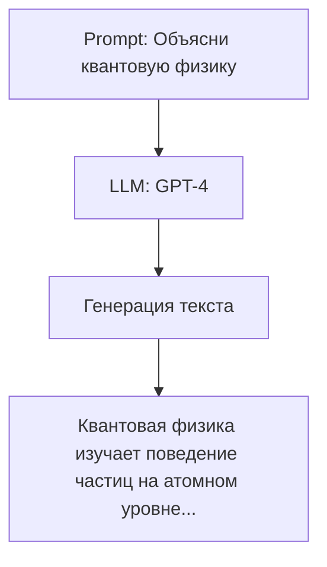

# 💬 NLP: Обработка естественного языка

## 📑 Содержание
1. [Что такое NLP?](#что-такое-nlp)
2. [Векторизация текста](#векторизация-текста)
3. [Word Embeddings (Векторные представления)](#word-embeddings)
4. [Transformer-модели (BERT, GPT)](#transformer-модели)
5. [Основные задачи NLP](#основные-задачи-nlp)
6. [Large Language Models (LLM)](#large-language-models)

---

## ❓ Что такое NLP?

**NLP (Natural Language Processing)** — это область AI, которая занимается пониманием и генерацией человеческого языка. 🗣️

**Применения**:
- Перевод (Google Translate).
- Виртуальные ассистенты (Siri, Alexa, ChatGPT).
- Анализ настроений (отзывы клиентов).
- Поиск (Google Search понимает ваш запрос).
- Суммаризация текста, генерация контента.

---

## 🔤 Векторизация текста

Нейронные сети работают с числами, а не словами. Нужно **превратить текст в числа**.

### 1. One-Hot Encoding (Самый простой)
Каждое слово = вектор, где 1 на позиции этого слова, остальное 0.
```
словарь = ["кот", "собака", "мышь"]
"кот" = [1, 0, 0]
"собака" = [0, 1, 0]
```

**Проблема**: Огромные размеры (если словарь = 100,000 слов), нет смысловой связи (кот и котенок = совершенно разные векторы).

---

### 2. TF-IDF (Term Frequency - Inverse Document Frequency)
Оценивает важность слова в документе относительно коллекции документов.
- **TF**: Как часто слово встречается в документе.
- **IDF**: Насколько редкое это слово в целом (штрафует частые слова типа "и", "в").

---

## 🧬 Word Embeddings (Векторные представления)

**Word Embedding** — это плотные векторы фиксированной длины (обычно 100-300 размерностей), где похожие по смыслу слова находятся близко в векторном пространстве. ✨

### Word2Vec (2013, Google)
Обучается предсказывать соседние слова (Skip-gram) или слово по контексту (CBOW).

**Пример**:
```
"Король" - "Мужчина" + "Женщина" ≈ "Королева"
```
Это работает, потому что векторы кодируют **семантику**.

---

### GloVe (Global Vectors)
Похож на Word2Vec, но использует статистику совместной встречаемости слов.

---

### FastText (Facebook)
Разбивает слова на подслова (character n-grams), поэтому понимает редкие и несуществующие слова.



---

## ⚡ Transformer-модели (BERT, GPT)

### BERT (Bidirectional Encoder Representations from Transformers)
**Google, 2018**

- **Bidirectional**: Читает текст в обе стороны (понимает контекст слева и справа).
- **Предобучение**: На огромном корпусе текстов (Wikipedia, книги).
- **Fine-tuning**: Дообучается на конкретной задаче (классификация, Q&A).

**Задачи**:
- Классификация текста (спам/не спам).
- Named Entity Recognition (NER): Найти имена, даты, организации.
- Question Answering.

---

### GPT (Generative Pre-trained Transformer)
**OpenAI, 2018 → GPT-4**

- **Unidirectional**: Читает текст только слева направо.
- **Генеративная модель**: Обучена предсказывать следующее слово.
- **Огромный размер**: GPT-3 = 175 млрд параметров.

**Применение**: ChatGPT, генерация текста, кода, перевод, суммаризация.

---

## 📊 Основные задачи NLP

| Задача | Описание | Модели |
| :--- | :--- | :--- |
| **Классификация текста** | Определить категорию (спам, новости, отзыв) | BERT, RoBERTa |
| **Sentiment Analysis** | Позитивный/негативный отзыв | BERT, DistilBERT |
| **Named Entity Recognition** | Найти имена, места, организации | SpaCy, BERT |
| **Machine Translation** | Перевод с языка на язык | Transformer, mBERT |
| **Question Answering** | Ответить на вопрос по тексту | BERT, GPT |
| **Text Generation** | Генерация текста | GPT-3/4, T5 |
| **Summarization** | Сокращение текста | BART, Pegasus |

---

## 🤖 Large Language Models (LLM)

**LLM** — это огромные модели (миллиарды параметров), обученные на триллионах слов. Они умеют:
- Генерировать текст, который выглядит как написанный человеком.
- Отвечать на сложные вопросы.
- Писать код, переводить, составлять резюме, эссе.

### Примеры LLM:
- **GPT-3/4** (OpenAI): 175B → ~1T параметров.
- **PaLM, Gemini** (Google).
- **LLaMA** (Meta): Открытая модель.
- **Claude** (Anthropic).



---

## 🧠 Как работают LLM?

1.  **Pretraining (Предобучение)**: Модель читает огромные объемы текста (интернет, книги, код) и учится предсказывать следующее слово.
2.  **Fine-tuning (Дообучение)**: Модель обучается на специфичных задачах (инструкции, диалоги).
3.  **RLHF (Reinforcement Learning from Human Feedback)**: Люди оценивают ответы, модель учится генерировать "хорошие" ответы.

---

## 🛠️ Практический пример: Sentiment Analysis с BERT

```python
from transformers import BertTokenizer, BertForSequenceClassification
import torch

# Загрузка модели и токенизатора
tokenizer = BertTokenizer.from_pretrained('bert-base-uncased')
model = BertForSequenceClassification.from_pretrained('bert-base-uncased', num_labels=2)

# Текст для анализа
text = "I love this product! It's amazing!"
inputs = tokenizer(text, return_tensors='pt', padding=True, truncation=True)

# Предсказание
with torch.no_grad():
    outputs = model(**inputs)
    logits = outputs.logits
    prediction = torch.argmax(logits, dim=1)
    
print("Sentiment:", "Positive" if prediction == 1 else "Negative")
```

---

> [!IMPORTANT]
> **Контекстное окно (Context Window)**: LLM может "видеть" ограниченное количество токенов за раз. Например, GPT-3.5 = 4096 токенов, GPT-4 = 8192-32768 токенов. Это важно при работе с длинными документами. 📏

> [!CAUTION]
> LLM могут "галлюцинировать" — генерировать правдоподобный, но неверный текст. Всегда проверяйте факты, особенно в критичных областях (медицина, финансы, право). ⚠️
