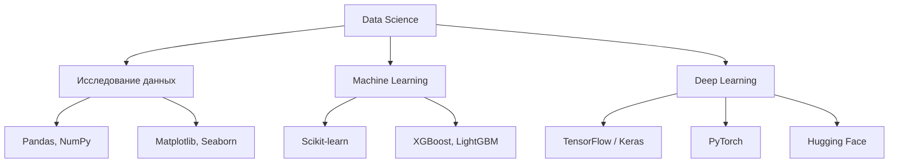
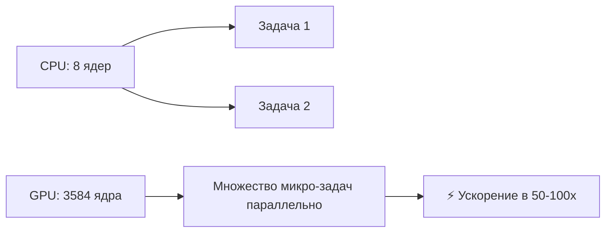

# 🛠️ Инструменты и фреймворки для ML/AI

## 📑 Содержание
1. [Экосистема ML](#экосистема-ml)
2. [TensorFlow vs PyTorch](#tensorflow-vs-pytorch)
3. [Scikit-learn: Классическое ML](#scikit-learn)
4. [Hugging Face Transformers](#hugging-face)
5. [Jupyter Notebook и Google Colab](#jupyter-и-colab)
6. [GPU vs CPU: Почему GPU?](#gpu-vs-cpu)

---

## 🌐 Экосистема ML



---

## ⚔️ TensorFlow vs PyTorch

### **TensorFlow** (Google) 🟦
- **Экосистема**: Keras (высокоуровневый API), TensorBoard (визуализация), TFLite (мобильные устройства).
- **Production**: Отличная поддержка для деплоя (TensorFlow Serving).
- **Особенность**: Статичный граф вычислений (в TF 1.x), TF 2.x стал более юзер-френдли.

**Когда использовать**: Промышленное развертывание, мобильные/web приложения.

```python
import tensorflow as tf
from tensorflow import keras

model = keras.Sequential([
    keras.layers.Dense(128, activation='relu', input_shape=(784,)),
    keras.layers.Dropout(0.2),
    keras.layers.Dense(10, activation='softmax')
])

model.compile(optimizer='adam',
              loss='sparse_categorical_crossentropy',
              metrics=['accuracy'])
```

---

### **PyTorch** (Meta/Facebook) 🔥
- **Динамический граф**: Граф вычислений строится на лету → проще отлаживать.
- **Академичность**: Любимец исследователей и университетов.
- **Простота**: Более питоничный синтаксис.

**Когда использовать**: Исследования, прототипирование, если нужна гибкость.

```python
import torch
import torch.nn as nn

class SimpleNN(nn.Module):
    def __init__(self):
        super(SimpleNN, self).__init__()
        self.fc1 = nn.Linear(784, 128)
        self.fc2 = nn.Linear(128, 10)
        
    def forward(self, x):
        x = torch.relu(self.fc1(x))
        x = self.fc2(x)
        return x

model = SimpleNN()
```

---

## 📊 Scikit-learn: Классическое ML

**Scikit-learn** — это библиотека для традиционного машинного обучения (НЕ deep learning). 🏆

**Алгоритмы**:
- Классификация: Logistic Regression, SVM, Random Forest, KNN.
- Регрессия: Linear Regression, Ridge, Lasso.
- Кластеризация: K-Means, DBSCAN.
- Снижение размерности: PCA, t-SNE.

```python
from sklearn.ensemble import RandomForestClassifier
from sklearn.model_selection import train_test_split
from sklearn.metrics import accuracy_score

# Простой пример
X_train, X_test, y_train, y_test = train_test_split(X, y, test_size=0.2)

clf = RandomForestClassifier(n_estimators=100)
clf.fit(X_train, y_train)

predictions = clf.predict(X_test)
print(f"Accuracy: {accuracy_score(y_test, predictions)}")
```

> [!TIP]
> Всегда начинайте с **простых моделей** (Logistic Regression, Random Forest) перед переходом к deep learning. Иногда простая модель работает лучше и учится быстрее!

---

## 🤗 Hugging Face Transformers

**Hugging Face** — это библиотека, которая предоставляет **готовые предобученные модели** для NLP (BERT, GPT, T5) и CV (ViT). 🎁

**Преимущества**:
- Тысячи предобученных моделей.
- Унифицированный API для всех моделей.
- Легко загрузить и использовать.

```python
from transformers import pipeline

# Анализ настроений
classifier = pipeline('sentiment-analysis')
result = classifier("I love this product!")
print(result)  # [{'label': 'POSITIVE', 'score': 0.9998}]

# Генерация текста
generator = pipeline('text-generation', model='gpt2')
text = generator("Once upon a time", max_length=50)
print(text)
```

---

## 📓 Jupyter Notebook и Google Colab

### **Jupyter Notebook** 📔
Интерактивная среда для анализа данных и ML. Код выполняется по ячейкам, можно визуализировать результаты прямо в ноутбуке.

---

### **Google Colab** ☁️
Бесплатный Jupyter в облаке от Google с:
- Бесплатным GPU (Tesla T4 или даже A100 в платной версии).
- Предустановленными библиотеками (TensorFlow, PyTorch, scikit-learn).
- Интеграцией с Google Drive.

**Идеально для**:
- Обучения (не нужна мощная локальная машина).
- Экспериментов с моделями.
- Sharing работы (просто дать ссылку).

```python
# В Colab легко использовать GPU:
import torch
print(torch.cuda.is_available())  # True если GPU доступен

# Установка библиотек
!pip install transformers
```

---

## 🖥️ GPU vs CPU: Почему GPU?

### CPU (Central Processing Unit)
- **Универсальный**: Хорош для последовательных задач.
- **Мало ядер**: 4-16 мощных ядер.

### GPU (Graphics Processing Unit)
- **Параллельные вычисления**: Тысячи маленьких ядер.
- **Идеален для ML**: Матричные операции (умножение матриц) выполняются в 10-100 раз быстрее!



### Примеры GPU:
- **NVIDIA RTX 3090** (24 GB VRAM): Для личного использования.
- **NVIDIA A100** (40-80 GB): Для крупных моделей (LLM).
- **Google TPU**: Специализированные чипы Google (в Colab Pro).

> [!IMPORTANT]
> Обучение глубоких моделей на CPU практически невозможно. Например, обучение ResNet-50 на CPU займет недели, на GPU — часы. 🕐➡️⚡

---

## 🧰 Дополнительные инструменты

| Инструмент | Назначение |
| :--- | :--- |
| **Pandas** | Работа с табличными данными |
| **NumPy** | Матрицы и числовые вычисления |
| **Matplotlib / Seaborn** | Визуализация данных |
| **OpenCV** | Обработка изображений |
| **NLTK / spaCy** | NLP (токенизация, лемматизация) |
| **Weights & Biases (W&B)** | Трекинг экспериментов |
| **MLflow** | Управление моделями и версиями |
| **Docker** | Контейнеризация моделей |

---

## 🚀 Как начать?

1.  **Изучите основы Python** (NumPy, Pandas).
2.  **Попробуйте Scikit-learn** для классического ML.
3.  **Освойте PyTorch или TensorFlow** для deep learning.
4.  **Используйте Google Colab** для экспериментов.
5.  **Изучайте Kaggle** (соревнования по ML с реальными данными).

---

> [!TIP]
> **Лучший способ учиться** — делать проекты. Начните с простого (классификация цветков Iris), потом переходите к более сложным (распознавание объектов на изображениях, чат-бот). Теория важна, но практика — ключ к мастерству! 🔑🎯
