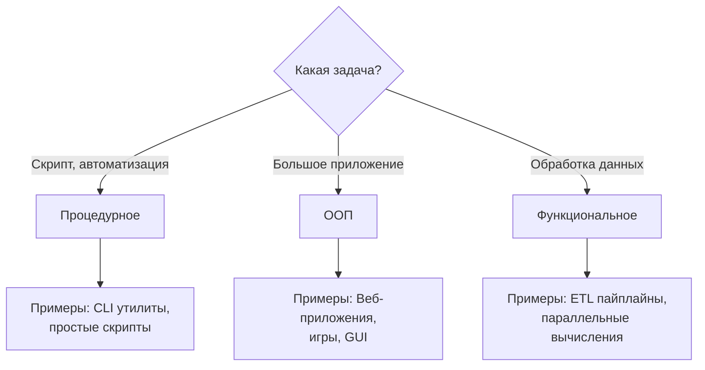

# 🎯 Парадигмы программирования

## 📑 Содержание
1. [Что такое парадигма?](#что-такое-парадигма)
2. [Процедурное программирование](#процедурное-программирование)
3. [Объектно-ориентированное программирование (ООП)](#объектно-ориентированное-программирование-ооп)
4. [Функциональное программирование](#функциональное-программирование)
5. [Сравнение парадигм](#сравнение-парадигм)
6. [Мультипарадигмальные языки](#мультипарадигмальные-языки)

---

## 🤔 Что такое парадигма?

**Парадигма программирования** — это способ или стиль написания программы. Это как разные подходы к решению одной и той же задачи.

> [!TIP]
> **Аналогия**: Представьте, что вам нужно добраться из точки А в точку Б. Можно идти пешком, ехать на машине или лететь на самолете. Цель одна, но способы разные. Так и в программировании!

Три основные парадигмы:
- **Процедурное** — программа как список инструкций (пошаговый рецепт)
- **Объектно-ориентированное (ООП)** — программа как взаимодействие объектов (город из зданий)
- **Функциональное** — программа как вычисления через функции (математические формулы)

---

## 🔧 Процедурное программирование

### Основная идея

Программа — это **последовательность команд**, которые компьютер выполняет одну за другой. Как кулинарный рецепт: взять яйца → разбить → взбить → пожарить.

### Ключевые элементы

1. **Переменные** — хранят данные
2. **Функции/Процедуры** — группы инструкций
3. **Условия** — `if/else` (если... то...)
4. **Циклы** — `for/while` (повторять, пока...)

### Пример на C

```c
#include <stdio.h>

// Функция для подсчета суммы
int sum(int a, int b) {
    return a + b;
}

// Функция для вывода результата
void printResult(int result) {
    printf("Результат: %d\n", result);
}

int main() {
    int x = 5;
    int y = 10;
    
    // Шаг 1: Вычисляем
    int result = sum(x, y);
    
    // Шаг 2: Выводим
    printResult(result);
    
    return 0;
}
```

### Пример на Go

```go
package main

import "fmt"

// Функция для подсчета суммы
func sum(a, b int) int {
    return a + b
}

// Функция для вывода результата
func printResult(result int) {
    fmt.Printf("Результат: %d\n", result)
}

func main() {
    x := 5
    y := 10
    
    // Шаг 1: Вычисляем
    result := sum(x, y)
    
    // Шаг 2: Выводим
    printResult(result)
}
```

### Плюсы и минусы

✅ **Плюсы**:
- **Простота**: Легко понять и изучить  
- **Прямолинейность**: Код выполняется сверху вниз  
- **Производительность**: Близко к работе процессора  

❌ **Минусы**:
- **Трудно масштабировать**: В больших программах легко запутаться  
- **Повторяющийся код**: Часто приходится копировать похожий код  
- **Глобальные переменные**: Могут создавать проблемы в больших проектах  

> [!NOTE]
> **Где используется**: Системное программирование (драйверы, ОС), встроенные системы, скрипты автоматизации.

---

## 🧱 Объектно-ориентированное программирование (ООП)

### Основная идея

Программа — это **взаимодействие объектов**. Объект содержит и данные, и функции для работы с ними. Как в реальном мире: у машины есть свойства (цвет, скорость) и действия (ехать, тормозить).

> [!TIP]
> Подробнее об ООП читайте в файле [`1_OOP.md`](file:///Users/ilasgibadullin/Documents/develop/qwerty/data_structure:%20algorithms/go/информатика(теория)/architecture/1_OOP.md)

### Краткий пример на Go

```go
package main

import "fmt"

// Структура (класс) - чертеж объекта
type BankAccount struct {
    owner   string
    balance int
}

// Метод - функция, привязанная к объекту
func (acc *BankAccount) Deposit(amount int) {
    acc.balance += amount
    fmt.Printf("%s пополнил счет на %d\n", acc.owner, amount)
}

func (acc *BankAccount) GetBalance() int {
    return acc.balance
}

func main() {
    // Создаем объект
    account := BankAccount{
        owner:   "Иван",
        balance: 1000,
    }
    
    account.Deposit(500)
    fmt.Printf("Баланс: %d\n", account.GetBalance())
}
```

**Вывод:**
```
Иван пополнил счет на 500
Баланс: 1500
```

### Плюсы ООП

✅ Данные и функции вместе (инкапсуляция)  
✅ Переиспользование кода (наследование)  
✅ Легко моделировать реальный мир  

---

## 🧮 Функциональное программирование

### Основная идея

Программа — это **вычисление через функции**, как в математике: `f(x) = x + 2`. Функции не меняют данные, а создают новые.

### Ключевые принципы

1. **Чистые функции**: Одинаковый вход → одинаковый выход (нет побочных эффектов)
2. **Иммутабельность**: Данные не изменяются, создаются новые
3. **Функции высшего порядка**: Функции могут принимать и возвращать другие функции

### Пример: Чистая функция

```go
// ❌ НЕ чистая - зависит от внешней переменной
var counter = 0

func incrementBad() int {
    counter++ // Изменяет внешнее состояние!
    return counter
}

// ✅ Чистая - всегда одинаковый результат для одинаковых аргументов
func increment(n int) int {
    return n + 1
}
```

### Пример: Иммутабельность

```go
// ❌ Процедурный стиль - изменяем массив
func doubleValuesMutable(nums []int) {
    for i := range nums {
        nums[i] = nums[i] * 2 // Меняем оригинал!
    }
}

// ✅ Функциональный стиль - создаем новый массив
func doubleValuesImmutable(nums []int) []int {
    result := make([]int, len(nums))
    for i, v := range nums {
        result[i] = v * 2 // Создаем новый
    }
    return result
}

func main() {
    original := []int{1, 2, 3}
    
    doubled := doubleValuesImmutable(original)
    
    fmt.Println(original) // [1, 2, 3] - не изменился!
    fmt.Println(doubled)  // [2, 4, 6] - новый массив
}
```

### Пример: Функции высшего порядка

```go
package main

import "fmt"

// Функция принимает другую функцию как аргумент
func applyOperation(nums []int, operation func(int) int) []int {
    result := make([]int, len(nums))
    for i, v := range nums {
        result[i] = operation(v)
    }
    return result
}

func main() {
    numbers := []int{1, 2, 3, 4, 5}
    
    // Удвоить каждое число
    doubled := applyOperation(numbers, func(x int) int {
        return x * 2
    })
    
    // Возвести в квадрат
    squared := applyOperation(numbers, func(x int) int {
        return x * x
    })
    
    fmt.Println(doubled) // [2, 4, 6, 8, 10]
    fmt.Println(squared) // [1, 4, 9, 16, 25]
}
```

### Замыкания (Closures)

Функция "запоминает" переменные из внешней области.

```go
package main

import "fmt"

// Функция возвращает функцию
func makeCounter() func() int {
    count := 0 // Эта переменная "захватывается"
    
    return func() int {
        count++ // Изменяется при каждом вызове
        return count
    }
}

func main() {
    counter1 := makeCounter()
    counter2 := makeCounter()
    
    fmt.Println(counter1()) // 1
    fmt.Println(counter1()) // 2
    fmt.Println(counter1()) // 3
    
    fmt.Println(counter2()) // 1 (свой собственный счетчик!)
    fmt.Println(counter2()) // 2
}
```

### Плюсы и минусы

✅ **Плюсы**:
- **Предсказуемость**: Чистые функции легко тестировать  
- **Параллелизм**: Иммутабельные данные безопасны в многопоточности  
- **Читаемость**: Код как математические формулы  

❌ **Минусы**:
- **Сложность для новичков**: Непривычный стиль мышления  
- **Производительность**: Создание новых данных вместо изменения может быть медленнее  
- **Не для всего**: Некоторые задачи (например, работа с файлами) естественнее в процедурном стиле  

> [!NOTE]
> **Где используется**: Обработка данных (map/reduce), асинхронное программирование, параллельные вычисления.

---

## 📊 Сравнение парадигм

| Характеристика | Процедурное | ООП | Функциональное |
|:---|:---|:---|:---|
| **Основа** | Функции и процедуры | Объекты и классы | Чистые функции |
| **Данные** | Глобальные переменные | Инкапсулированы в объектах | Иммутабельные |
| **Изменение состояния** | ✅ Частое | ✅ Контролируемое | ❌ Избегается |
| **Переиспользование кода** | Через функции | Через наследование | Через композицию функций |
| **Сложность** | 🟢 Низкая | 🟡 Средняя | 🔴 Высокая (для новичков) |
| **Подходит для** | Скрипты, системы | Большие приложения | Данные, параллелизм |
| **Примеры языков** | C, Pascal, Go (базовое) | Java, C++, Python, Go | Haskell, Erlang, Clojure |

### Пример одной задачи в разных стилях

**Задача**: Найти сумму квадратов четных чисел

```go
package main

import "fmt"

// ===== ПРОЦЕДУРНЫЙ СТИЛЬ =====
func sumSquaresEvenProcedural(nums []int) int {
    sum := 0
    for i := 0; i < len(nums); i++ {
        if nums[i]%2 == 0 {
            sum += nums[i] * nums[i]
        }
    }
    return sum
}

// ===== ООП СТИЛЬ =====
type NumberProcessor struct {
    numbers []int
}

func (np *NumberProcessor) SumSquaresEven() int {
    sum := 0
    for _, num := range np.numbers {
        if np.isEven(num) {
            sum += np.square(num)
        }
    }
    return sum
}

func (np *NumberProcessor) isEven(n int) bool {
    return n%2 == 0
}

func (np *NumberProcessor) square(n int) int {
    return n * n
}

// ===== ФУНКЦИОНАЛЬНЫЙ СТИЛЬ =====
func filter(nums []int, predicate func(int) bool) []int {
    result := []int{}
    for _, n := range nums {
        if predicate(n) {
            result = append(result, n)
        }
    }
    return result
}

func mapFunc(nums []int, fn func(int) int) []int {
    result := make([]int, len(nums))
    for i, n := range nums {
        result[i] = fn(n)
    }
    return result
}

func reduce(nums []int, initial int, fn func(int, int) int) int {
    result := initial
    for _, n := range nums {
        result = fn(result, n)
    }
    return result
}

func sumSquaresEvenFunctional(nums []int) int {
    evens := filter(nums, func(n int) bool { return n%2 == 0 })
    squares := mapFunc(evens, func(n int) int { return n * n })
    sum := reduce(squares, 0, func(a, b int) int { return a + b })
    return sum
}

func main() {
    numbers := []int{1, 2, 3, 4, 5, 6}
    
    // Все три способа дают одинаковый результат
    fmt.Println("Процедурный:", sumSquaresEvenProcedural(numbers)) // 56
    
    processor := NumberProcessor{numbers: numbers}
    fmt.Println("ООП:", processor.SumSquaresEven()) // 56
    
    fmt.Println("Функциональный:", sumSquaresEvenFunctional(numbers)) // 56
}
```

**Вывод:**
```
Процедурный: 56
ООП: 56
Функциональный: 56
```

---

## 🌈 Мультипарадигмальные языки

Современные языки поддерживают **несколько парадигм** одновременно!

### Go — Мультипарадигмальный

**Процедурный**:
```go
func calculateTotal(prices []float64) float64 {
    total := 0.0
    for _, price := range prices {
        total += price
    }
    return total
}
```

**ООП** (через структуры и методы):
```go
type Cart struct {
    items []float64
}

func (c *Cart) GetTotal() float64 {
    total := 0.0
    for _, item := range c.items {
        total += item
    }
    return total
}
```

**Функциональный** (через функции высшего порядка):
```go
func calculateTotalFunctional(prices []float64, discount func(float64) float64) float64 {
    total := 0.0
    for _, price := range prices {
        total += discount(price)
    }
    return total
}
```

### Python, JavaScript — Тоже мультипарадигмальные

Вы можете выбирать стиль в зависимости от задачи!

---

## 💡 Когда какую парадигму использовать?



### Рекомендации

| Задача | Парадигма | Почему |
|:---|:---|:---|
| CLI утилита | Процедурное | Простота, прямолинейность |
| Веб-приложение | ООП | Структурированность, переиспользование |
| Обработка больших данных | Функциональное | Иммутабельность, параллелизм |
| Игра | ООП | Объекты (игроки, враги) естественны |
| Конфигурационный скрипт | Процедурное | Читаемость, простота |
| Асинхронная система | Функциональное | Предсказуемость, отсутствие состояния |

> [!TIP]
> **Главный совет**: В реальных проектах используйте **комбинацию парадигм**! Например, в Go часто используют:
> - Процедурный стиль для простых функций
> - ООП через структуры для организации кода
> - Функциональный подход для обработки данных (через `map`, `filter`, замыкания)

---

## 🎯 Итог

- **Процедурное** — пошаговые инструкции (простой и прямолинейный код)
- **ООП** — объекты и их взаимодействие (хорошо для больших систем)
- **Функциональное** — вычисления через чистые функции (надежно для параллелизма)

Лучшие программисты **знают все парадигмы** и выбирают подходящую для конкретной задачи! 🚀
