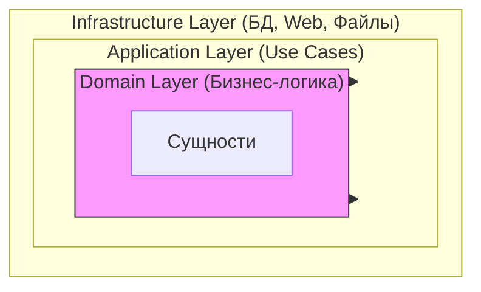
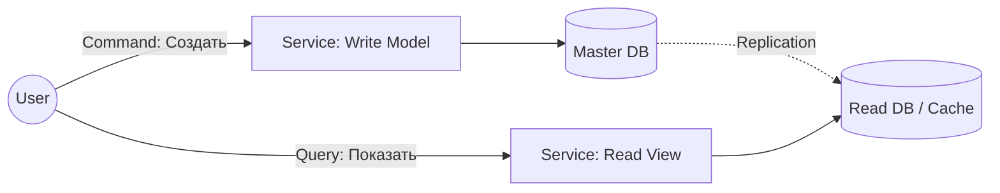

# 🏗️ Архитектурные паттерны

## 📑 Содержание
1. [Clean / Onion / Hexagonal Architecture](#1-clean--onion--hexagonal-architecture)
2. [CQRS (Command and Query Responsibility Segregation)](#2-cqrs)
3. [Event Driven Architecture](#3-event-driven-architecture)
4. [Saga Pattern](#4-saga-pattern)
5. [S.O.L.I.D. и Dependency Injection](#5-solid-и-dependency-injection)

---

## 1. 🧅 Clean / Onion / Hexagonal Architecture

Все эти архитектуры (Луковая, Гексагональная, Чистая) говорят об одном главном правиле: **Зависимости должны быть направлены ВНУТРЬ**.

### 🧩 Основная идея
Бизнес-логика (самая важная часть) должна быть в центре и **ничего не знать** о базах данных, вебе или фреймворках. Все внешние штуки (БД, API) зависят от бизнес-логики, а не наоборот.



### 🍰 Слои (Layers)

#### 1. Domain Layer (Доменный слой) 🧠
Сердце приложения.
*   **Что тут**: Бизнес-сущности (User, Order) и чистая бизнес-логика.
*   **Правило**: Не зависит НИ ОТ ЧЕГО. Никаких SQL, HTTP или JSON.

#### 2. Application Layer (Прикладной слой) 🤝
"Клей" между миром и доменом.
*   **Что тут**: Сценарии использования (Use Cases), например `CreateUserHandler`.
*   **Правило**: Координирует работу: "Достать юзера из репозитория -> Проверить скидку -> Сохранить".

#### 3. Infrastructure Layer (Инфраструктура) 🔌
Внешний мир.
*   **Что тут**: Базы данных (Postgres, Redis), HTTP хендлеры, внешние API.
*   **Правило**: Реализует интерфейсы, которые определены внутри (в домене или приложении).

#### 4. Presentation Layer (Представление) 🖥️
Часть инфраструктуры, отвечающая за UI.
*   **Что тут**: Веб-контроллеры, CLI команды.

---

## 2. ⚡ CQRS

**Command and Query Responsibility Segregation** — разделение ответственности на Чтение и Запись.

### 🤔 Зачем?
Обычно мы читаем данные гораздо чаще, чем пишем. Зачем использовать одну и ту же модель для всего?

*   **Command (Команда)**: Изменяет состояние ("Создать заказ"). Не возвращает данных (или минимум).
*   **Query (Запрос)**: Читает данные ("Дай список заказов"). Не меняет состояние.



> [!WARNING]
> **Это сложно!** Не используйте CQRS везде. Это нужно только для высоконагруженных частей системы.

---

## 3. 📡 Event Driven Architecture

Архитектура, управляемая событиями. Компоненты общаются не прямыми вызовами (`service.doSomething()`), а через события (`EventBus.publish(SomethingHappened)`).

### 🎞️ Event Sourcing (ES)
Вместо хранения *текущего состояния* (User Balance: 100), мы храним *историю всех изменений*:
1. `UserCreated`
2. `MoneyDeposited(50)`
3. `MoneyDeposited(50)`

Чтобы получить баланс, мы просто "проигрываем" все события.

*   **Плюсы**: Полная история, машину времени можно отмотать назад.
*   **Минусы**: Сложно, нужно постоянно пересчитывать состояние (Snapshot'ы помогают).

---

## 4. 📜 Saga Pattern

Как делать транзакции в микросервисах? `ACID` транзакции (как в SQL) там не работают. На помощь приходит **Saga**.

**Saga** — это цепочка локальных транзакций. Если что-то пошло не так, выполняются **компенсирующие действия** (откат).

### Пример: Покупка тура ✈️🏨

1.  **Сервис Билетов**: Забронировать самолет ✅
2.  **Сервис Отеля**: Забронировать отель ✅
3.  **Сервис Машины**: Аренда авто... ❌ Ошибка! Машин нет.

**Откат (Compensating Transactions)**:
*   3 -> (Ошибка)
*   2 -> **Отменить** бронь отеля ↩️
*   1 -> **Отменить** бронь самолета ↩️

---

## 5. 💉 Dependency Injection (DI) и IoC

### 🔄 Inversion of Control (IoC)
"Не звоните нам, мы сами вам позвоним".
*   **Библиотека**: Вы управляете кодом.
*   **Фреймворк**: Фреймворк управляет вашим кодом (вызывает ваши функции).

### 🔌 Dependency Injection (DI)
Ваш класс не должен создавать свои зависимости (`new Database()`). Он должен получать их извне (через конструктор).

**Плохо (Жесткая сцепка):**
```go
type Service struct {
    db MySQLDatabase // Зависим от конкретной БД ❌
}
```

**Хорошо (Зависимость от абстракции):**
```go
type Service struct {
    repo UserRepository // Зависим от интерфейса ✅
}
```

> [!TIP]
> **DIP (Dependency Inversion Principle)**: Модули верхнего уровня не должны зависеть от модулей нижнего уровня. Оба должны зависеть от абстракций.