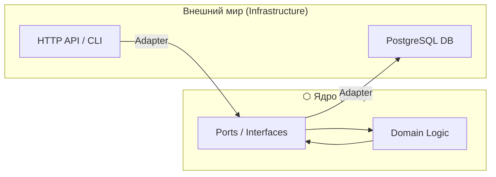
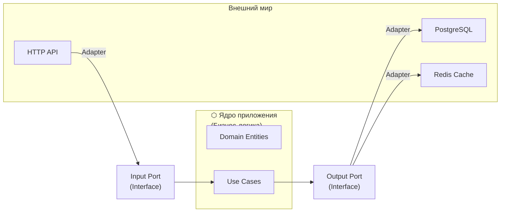

# 🏗️ Архитектурные паттерны

## 📑 Содержание
1. [Clean / Onion / Hexagonal Architecture](#1-clean--onion--hexagonal-architecture)
2. [CQRS (Command and Query Responsibility Segregation)](#2-cqrs)
3. [Event Driven Architecture](#3-event-driven-architecture)
4. [Saga Pattern](#4-saga-pattern)
5. [S.O.L.I.D. и Dependency Injection](#5-solid-и-dependency-injection)

---

## 1. 🏗️ Domain-Centric Architectures (Общая концепция)

Существует три очень похожих подхода: **Чистая (Clean)**, **Луковая (Onion)** и **Гексагональная (Hexagonal)** архитектуры. 

> [!IMPORTANT]
> **Главное правило**: Зависимости должны быть направлены **ВНУТРЬ**.
> Бизнес-логика (самая важная часть) должна быть в центре и **ничего не знать** о базах данных, вебе или фреймворках. Все внешние штуки зависят от бизнес-логики, а не наоборот.

### ⬡ 1.1 Hexagonal Architecture (Ports and Adapters)
Придумана Алистером Кокберном. Её суть — изолировать "Ядро" (бизнес-логику) от "Внешнего мира".

*   **Порты (Ports)**: Интерфейсы (протоколы), которые определяют, как мир может общаться с приложением (Input) и как приложение может общаться с миром (Output).
*   **Адаптеры (Adapters)**: Конкретные реализации. Например, Адаптер для Postgres, Адаптер для REST API.



---

### 🧅 1.2 Onion Architecture (Луковая архитектура)
Придумана Джеффри Палермо. Делает акцент на слоях, которые как слои луковицы обволакивают друг друга.

*   **Центр (Domain Model)**: Только сущности и правила.
*   **Domain Services**: Логика, которая не влезает в одну сущность.
*   **Application Services**: То же самое, что и Use Cases (сценарии использования).

**В чем фишка?** В классической 3-слойной архитектуре (UI -> Business -> Data) всё зависит от базы данных. В Луковой — База Данных вынесена на самый край.

---

### 🏗️ 1.3 Clean Architecture (Чистая архитектура)
Популяризирована "Дядей Бобом" (Роберт Мартин). Она объединяет идеи предыдущих двух и делит всё на 4 круга:

1.  **Entities (Сущности)**: Бизнес-объекты (Юзер, Заказ).
2.  **Use Cases (Сценарии)**: Описывают, что делает приложение (например, "Оформить заказ").
3.  **Interface Adapters**: Контроллеры, Презентеры, Репозитории.
4.  **Frameworks & Drivers**: БД, Веб-фреймворки, внешние API.

---

### 📊 Сравнительная таблица терминов

| Чистая (Clean) | Луковая (Onion) | Гексагональная (Hex) | Что это на самом деле? |
| :--- | :--- | :--- | :--- |
| **Entities** | Domain Model | Core/Domain | Самые важные бизнес-правила |
| **Use Cases** | Application Services | Core (Input/Output) | Сценарий (что нажать, куда бежать) |
| **Interface Adapters** | Adapters / Infrastructure | Adapters | Перевод с языка JSON на язык бизнес-объектов |
| **Frameworks** | External World | Infrastructure | База данных, HTTP, Логи, Файлы |

---

### 💻 Пример: Как это выглядит в коде (на Go)

#### 1. Слой Domain (Самый центр — чистая логика)
```go
// domain/order.go
package domain

type Order struct {
    ID      string
    Amount  int
    Status  string
}

// Бизнес-логика внутри домена
func (o *Order) ApplyDiscount(percent int) {
    o.Amount = o.Amount - (o.Amount * percent / 100)
}
```

#### 2. Слой Use Case (Сценарий использования)
Здесь мы описываем **ЧТО** сделать, но не знаем **КАК** это сохранится в БД.
```go
// application/usecase.go
package application

import "myapp/domain"

// Порт (Интерфейс) для базы данных
type OrderRepository interface {
    Save(order *domain.Order) error
}

type OrderService struct {
    repo OrderRepository // Зависимость от интерфейса, а не от БД!
}

func (s *OrderService) CreateOrder(amount int) error {
    order := &domain.Order{Amount: amount, Status: "New"}
    order.ApplyDiscount(10) // Используем логику домена
    return s.repo.Save(order)
}
```

#### 3. Слой Infrastructure (Внешний мир — База данных)
А вот тут мы пишем конкретный SQL код.
```go
// infrastructure/postgres.go
package infrastructure

import "myapp/domain"

type PostgresRepo struct {
    // тут подключение к БД
}

// Реализация того самого интерфейса из слоя Application
func (r *PostgresRepo) Save(order *domain.Order) error {
    // INSERT INTO orders ...
    return nil
}
```

---

#### 3. 🟢 Interface Adapters (Адаптеры интерфейсов)

**Что тут:**
- **Controllers**: Принимают HTTP запросы, вызывают Use Cases
- **Presenters**: Форматируют данные для ответа (JSON, HTML)
- **Gateways/Repositories**: Реализуют интерфейсы для работы с БД

**Правило:** Превращают данные из формата внешнего мира в формат для Use Cases (и обратно).

**Пример на Go:**
```go
// infrastructure/http/user_controller.go
package http

import (
    "encoding/json"
    "net/http"
    "myapp/application"
)

type UserController struct {
    createUserUseCase *application.CreateUserUseCase
}

func (c *UserController) CreateUser(w http.ResponseWriter, r *http.Request) {
    // 1. Парсим запрос (адаптация из HTTP в структуру)
    var req struct {
        Email    string `json:"email"`
        Password string `json:"password"`
    }
    json.NewDecoder(r.Body).Decode(&req)
    
    // 2. Вызываем Use Case
    err := c.createUserUseCase.Execute(req.Email, req.Password)
    
    // 3. Форматируем ответ (адаптация из ошибки в HTTP)
    if err != nil {
        w.WriteHeader(http.StatusBadRequest)
        json.NewEncoder(w).Encode(map[string]string{"error": err.Error()})
        return
    }
    
    w.WriteHeader(http.StatusCreated)
    json.NewEncoder(w).Encode(map[string]string{"status": "created"})
}
```

```go
// infrastructure/postgres/user_repository.go
package postgres

import (
    "database/sql"
    "myapp/domain"
)

type PostgresUserRepository struct {
    db *sql.DB
}

// Реализуем интерфейс из Application Layer
func (r *PostgresUserRepository) Save(user *domain.User) error {
    query := "INSERT INTO users (id, email, password, balance) VALUES ($1, $2, $3, $4)"
    _, err := r.db.Exec(query, user.ID, user.Email, user.Password, user.Balance)
    return err
}

func (r *PostgresUserRepository) GetByEmail(email string) (*domain.User, error) {
    var user domain.User
    query := "SELECT id, email, password, balance FROM users WHERE email = $1"
    err := r.db.QueryRow(query, email).Scan(&user.ID, &user.Email, &user.Password, &user.Balance)
    if err != nil {
        return nil, err
    }
    return &user, nil
}
```

---

#### 4. 🔵 Frameworks & Drivers (Фреймворки и Драйверы)

**Что тут:**
- Базы данных (Postgres, MongoDB, Redis)
- Веб-фреймворки (Gin, Echo, Chi)
- Внешние API, файловая система

**Правило:** Только технические детали. Никакой бизнес-логики.

```go
// cmd/main.go
package main

import (
    "database/sql"
    "net/http"
    _ "github.com/lib/pq"
    
    "myapp/application"
    httpInfra "myapp/infrastructure/http"
    "myapp/infrastructure/postgres"
)

func main() {
    // 1. Инициализация БД (Frameworks Layer)
    db, _ := sql.Open("postgres", "connection_string")
    
    // 2. Создание репозитория (Interface Adapters)
    userRepo := &postgres.PostgresUserRepository{db: db}
    
    // 3. Создание Use Case (Application Layer)
    createUserUseCase := application.NewCreateUserUseCase(userRepo)
    
    // 4. Создание контроллера (Interface Adapters)
    userController := &httpInfra.UserController{
        createUserUseCase: createUserUseCase,
    }
    
    // 5. Запуск веб-сервера (Frameworks Layer)
    http.HandleFunc("/users", userController.CreateUser)
    http.ListenAndServe(":8080", nil)
}
```

---

### 🔷 Hexagonal Architecture (Порты и Адаптеры)

**Альтернативное название** Clean Architecture. Основная идея та же, но с другой терминологией:

- **Порт (Port)** — интерфейс (например, `UserRepository`)
- **Адаптер (Adapter)** — реализация интерфейса (например, `PostgresUserRepository`)



**Плюсы:**
- Легко заменить Postgres на MongoDB (просто другой адаптер)
- Легко тестировать (используем mock адаптеры)

---

### ✅ Преимущества такой архитектуры

1. **Независимость от фреймворков**: Можно поменять Gin на Echo
2. **Тестируемость**: Бизнес-логику можно тестировать без БД и HTTP
3. **Независимость от UI**: Можно добавить CLI, gRPC, WebSocket без изменения Use Cases
4. **Независимость от БД**: Можно поменять Postgres на Mongo

> [!TIP]
> **Когда использовать**: Для средних и больших проектов с долгой жизнью. Для маленьких проектов это может быть избыточно.

---

## 2. ⚡ CQRS

**Command and Query Responsibility Segregation** — разделение ответственности на Чтение и Запись.

### 🤔 Зачем?
Обычно мы читаем данные гораздо чаще, чем пишем. В классической архитектуре мы используем одну и ту же модель (и таблицу в БД) для `SELECT` и для `UPDATE`. Это создает проблемы с масштабированием и производительностью.

*   **Command (Команда)**: Изменяет состояние ("Создать заказ", "Сменить адрес"). Содержит бизнес-логику и валидацию.
*   **Query (Запрос)**: Читает данные. Максимально простая, часто вообще без логики, просто возвращает DTO (Data Transfer Object).

### 🏗️ Как это работает в реальности?
Чаще всего CQRS используют вместе с разделением баз данных:
1.  **Write DB**: Оптимизирована для записи (часто реляционная, нормализованная).
2.  **Read DB**: Оптимизирована для чтения (NoSQL или просто денормализованные таблицы, кеш).

> [!WARNING]
> **Eventual Consistency (Согласованность в конечном счете)**: Поскольку данные из Write DB попадают в Read DB не мгновенно, пользователь может увидеть старые данные на долю секунды после обновления. Это цена за скорость.

---

## 3. 📡 Event Driven Architecture (EDA)

Архитектура, где системы общаются через **события**.

*   **Событие (Event)**: Факт, который уже случился ("OrderCreated", "PaymentReceived"). Его нельзя отменить.
*   **Брокер сообщений**: Kafka, RabbitMQ, NATS.

### 🎞️ Event Sourcing (ES)
Мы не храним текущее состояние объекта (например, "Баланс: 100"). Вместо этого мы храним **цепочку всех событий**, которые привели к этому состоянию.

**Пример (Банковский счет):**
1. Счёт открыт (+0)
2. Пополнение (+100)
3. Покупка (-30)
*Текущий баланс (70) высчитывается путем сложения всех событий.*

*   **Зачем?**: Аудит, возможность "отмотать" время назад, легкое исправление багов (исправили логику и пересчитали события).
*   **Сложность**: Нужно делать **Snapshot'ы** (снимки состояния), чтобы не пересчитывать миллион событий каждый раз.

---

## 4. 📜 Saga Pattern

Используется для управления распределенными транзакциями в микросервисах. В облаках нельзя сделать `BEGIN TRANSACTION ... COMMIT` сразу на три базы данных.

Существует два способа реализации Саги:

### 🩰 4.1 Хореография (Choreography)
Микросервисы общаются друг с другом напрямую через события. Нет центрального контроллера.
*   **Как работает**: Сервис А сделал дело -> кинул событие -> Сервис Б услышал -> сделал своё дело -> кинул событие.
*   **Плюсы**: Нет единой точки отказа, просто добавить новый сервис.
*   **Минусы**: Сложно понять, что происходит (запутанная цепочка), риск циклических зависимостей.

### 💂 4.2 Оркестрация (Orchestration)
Есть центральный "дирижер" (Orchestrator), который говорит всем, что делать.
*   **Как работает**: Оркестратор шлет команду Сервису А -> получает ответ -> шлет команду Сервису Б.
*   **Плюсы**: Вся логика процесса в одном месте, легко отлаживать.
*   **Минусы**: Оркестратор становится сложным и важным компонентом (если он упал — процесс встал).

---

## 🎯 Итог: Что выбрать?

| Ситуация | Рекомендуемый паттерн |
| :--- | :--- |
| Нужно изолировать бизнес-логику от БД и веба | **Clean Architecture / Hexagonal** |
| Очень много чтений и сложная запись | **CQRS** |
| Нужно хранить историю изменений и аудит | **Event Sourcing** |
| Сложная транзакция между микросервисами | **Saga (Orchestration/Choreography)** |
| Высокая нагрузка и слабая связанность компонентов | **Event Driven Architecture** |

## 5. 💉 Dependency Injection (DI) и IoC

### 🔄 Inversion of Control (IoC)
"Не звоните нам, мы сами вам позвоним".
*   **Библиотека**: Вы управляете кодом.
*   **Фреймворк**: Фреймворк управляет вашим кодом (вызывает ваши функции).

### 🔌 Dependency Injection (DI)
Ваш класс не должен создавать свои зависимости (`new Database()`). Он должен получать их извне (через конструктор).

**Плохо (Жесткая сцепка):**
```go
type Service struct {
    db MySQLDatabase // Зависим от конкретной БД ❌
}
```

**Хорошо (Зависимость от абстракции):**
```go
type Service struct {
    repo UserRepository // Зависим от интерфейса ✅
}
```

> [!TIP]
> **DIP (Dependency Inversion Principle)**: Модули верхнего уровня не должны зависеть от модулей нижнего уровня. Оба должны зависеть от абстракций.