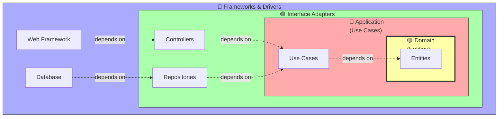
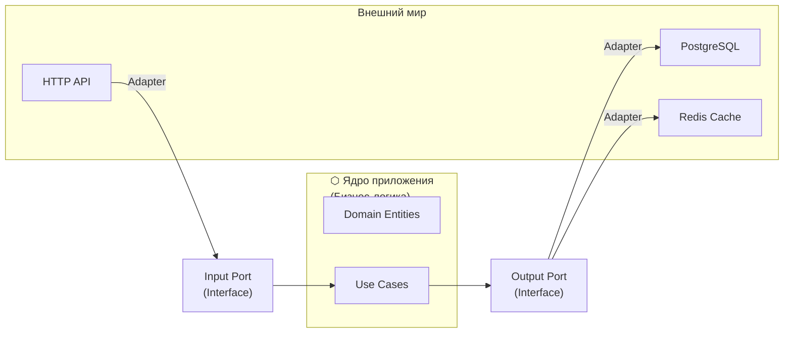
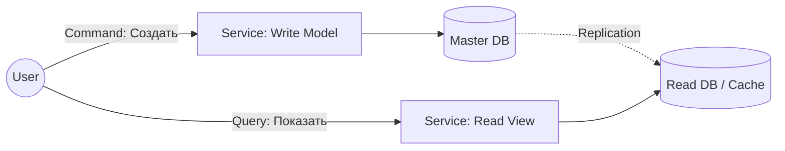

# 🏗️ Архитектурные паттерны

## 📑 Содержание
1. [Clean / Onion / Hexagonal Architecture](#1-clean--onion--hexagonal-architecture)
2. [CQRS (Command and Query Responsibility Segregation)](#2-cqrs)
3. [Event Driven Architecture](#3-event-driven-architecture)
4. [Saga Pattern](#4-saga-pattern)
5. [S.O.L.I.D. и Dependency Injection](#5-solid-и-dependency-injection)

---

## 1. 🧅 Clean / Onion / Hexagonal Architecture

Все эти архитектуры (Луковая, Гексагональная, Чистая) говорят об одном главном правиле: **Зависимости должны быть направлены ВНУТРЬ**.

### 🧩 Основная идея

Бизнес-логика (самая важная часть) должна быть в центре и **ничего не знать** о базах данных, вебе или фреймворках. Все внешние штуки (БД, API) зависят от бизнес-логики, а не наоборот.

> [!IMPORTANT]
> **Золотое правило (The Dependency Rule)**: Исходный код зависимостей может указывать только **ВНУТРЬ**, в сторону бизнес-логики. Внутренние круги ничего не знают о внешних.



---

### 🍰 Слои (Layers)

#### 1. 🟡 Domain Layer (Доменный слой) — Сердце приложения

**Что тут:**
- Бизнес-сущности (`User`, `Order`, `Product`)
- Чистая бизнес-логика
- Правила и ограничения предметной области

**Правило:** Не зависит **НИ ОТ ЧЕГО**. Никаких SQL, HTTP, JSON, фреймворков.

**Пример на Go:**
```go
// domain/user.go
package domain

import "errors"

type User struct {
    ID       string
    Email    string
    Password string
    Balance  int
}

// Бизнес-правило: нельзя снять больше, чем есть на балансе
func (u *User) Withdraw(amount int) error {
    if amount > u.Balance {
        return errors.New("insufficient balance")
    }
    u.Balance -= amount
    return nil
}

// Бизнес-правило: email должен быть валидным
func (u *User) ChangeEmail(newEmail string) error {
    if !isValidEmail(newEmail) {
        return errors.New("invalid email format")
    }
    u.Email = newEmail
    return nil
}

func isValidEmail(email string) bool {
    // Простая проверка для примера
    return len(email) > 3 && contains(email, "@")
}
```

---

#### 2. 🔴 Application Layer (Прикладной слой) — Use Cases

**Что тут:**
- Сценарии использования (`CreateUser`, `ProcessPayment`)
- Интерфейсы для репозиториев (определяем, но НЕ реализуем)
- Координация потока данных

**Правило:** Координирует работу: "Достать юзера → Проверить → Сохранить". Зависит только от Domain Layer.

**Пример на Go:**
```go
// application/create_user.go
package application

import "myapp/domain"

// Интерфейс репозитория (определен в Application, реализован в Infrastructure)
type UserRepository interface {
    Save(user *domain.User) error
    GetByEmail(email string) (*domain.User, error)
}

// Use Case
type CreateUserUseCase struct {
    userRepo UserRepository
}

func NewCreateUserUseCase(repo UserRepository) *CreateUserUseCase {
    return &CreateUserUseCase{userRepo: repo}
}

func (uc *CreateUserUseCase) Execute(email, password string) error {
    // 1. Проверяем, существует ли юзер
    existing, _ := uc.userRepo.GetByEmail(email)
    if existing != nil {
        return errors.New("user already exists")
    }
    
    // 2. Создаем доменный объект
    user := &domain.User{
        ID:       generateID(),
        Email:    email,
        Password: hashPassword(password),
        Balance:  0,
    }
    
    // 3. Валидация через доменную логику
    if err := user.ChangeEmail(email); err != nil {
        return err
    }
    
    // 4. Сохраняем
    return uc.userRepo.Save(user)
}
```

---

#### 3. 🟢 Interface Adapters (Адаптеры интерфейсов)

**Что тут:**
- **Controllers**: Принимают HTTP запросы, вызывают Use Cases
- **Presenters**: Форматируют данные для ответа (JSON, HTML)
- **Gateways/Repositories**: Реализуют интерфейсы для работы с БД

**Правило:** Превращают данные из формата внешнего мира в формат для Use Cases (и обратно).

**Пример на Go:**
```go
// infrastructure/http/user_controller.go
package http

import (
    "encoding/json"
    "net/http"
    "myapp/application"
)

type UserController struct {
    createUserUseCase *application.CreateUserUseCase
}

func (c *UserController) CreateUser(w http.ResponseWriter, r *http.Request) {
    // 1. Парсим запрос (адаптация из HTTP в структуру)
    var req struct {
        Email    string `json:"email"`
        Password string `json:"password"`
    }
    json.NewDecoder(r.Body).Decode(&req)
    
    // 2. Вызываем Use Case
    err := c.createUserUseCase.Execute(req.Email, req.Password)
    
    // 3. Форматируем ответ (адаптация из ошибки в HTTP)
    if err != nil {
        w.WriteHeader(http.StatusBadRequest)
        json.NewEncoder(w).Encode(map[string]string{"error": err.Error()})
        return
    }
    
    w.WriteHeader(http.StatusCreated)
    json.NewEncoder(w).Encode(map[string]string{"status": "created"})
}
```

```go
// infrastructure/postgres/user_repository.go
package postgres

import (
    "database/sql"
    "myapp/domain"
)

type PostgresUserRepository struct {
    db *sql.DB
}

// Реализуем интерфейс из Application Layer
func (r *PostgresUserRepository) Save(user *domain.User) error {
    query := "INSERT INTO users (id, email, password, balance) VALUES ($1, $2, $3, $4)"
    _, err := r.db.Exec(query, user.ID, user.Email, user.Password, user.Balance)
    return err
}

func (r *PostgresUserRepository) GetByEmail(email string) (*domain.User, error) {
    var user domain.User
    query := "SELECT id, email, password, balance FROM users WHERE email = $1"
    err := r.db.QueryRow(query, email).Scan(&user.ID, &user.Email, &user.Password, &user.Balance)
    if err != nil {
        return nil, err
    }
    return &user, nil
}
```

---

#### 4. 🔵 Frameworks & Drivers (Фреймворки и Драйверы)

**Что тут:**
- Базы данных (Postgres, MongoDB, Redis)
- Веб-фреймворки (Gin, Echo, Chi)
- Внешние API, файловая система

**Правило:** Только технические детали. Никакой бизнес-логики.

```go
// cmd/main.go
package main

import (
    "database/sql"
    "net/http"
    _ "github.com/lib/pq"
    
    "myapp/application"
    httpInfra "myapp/infrastructure/http"
    "myapp/infrastructure/postgres"
)

func main() {
    // 1. Инициализация БД (Frameworks Layer)
    db, _ := sql.Open("postgres", "connection_string")
    
    // 2. Создание репозитория (Interface Adapters)
    userRepo := &postgres.PostgresUserRepository{db: db}
    
    // 3. Создание Use Case (Application Layer)
    createUserUseCase := application.NewCreateUserUseCase(userRepo)
    
    // 4. Создание контроллера (Interface Adapters)
    userController := &httpInfra.UserController{
        createUserUseCase: createUserUseCase,
    }
    
    // 5. Запуск веб-сервера (Frameworks Layer)
    http.HandleFunc("/users", userController.CreateUser)
    http.ListenAndServe(":8080", nil)
}
```

---

### 🔷 Hexagonal Architecture (Порты и Адаптеры)

**Альтернативное название** Clean Architecture. Основная идея та же, но с другой терминологией:

- **Порт (Port)** — интерфейс (например, `UserRepository`)
- **Адаптер (Adapter)** — реализация интерфейса (например, `PostgresUserRepository`)



**Плюсы:**
- Легко заменить Postgres на MongoDB (просто другой адаптер)
- Легко тестировать (используем mock адаптеры)

---

### ✅ Преимущества такой архитектуры

1. **Независимость от фреймворков**: Можно поменять Gin на Echo
2. **Тестируемость**: Бизнес-логику можно тестировать без БД и HTTP
3. **Независимость от UI**: Можно добавить CLI, gRPC, WebSocket без изменения Use Cases
4. **Независимость от БД**: Можно поменять Postgres на Mongo

> [!TIP]
> **Когда использовать**: Для средних и больших проектов с долгой жизнью. Для маленьких проектов это может быть избыточно.

---

## 2. ⚡ CQRS

**Command and Query Responsibility Segregation** — разделение ответственности на Чтение и Запись.

### 🤔 Зачем?
Обычно мы читаем данные гораздо чаще, чем пишем. Зачем использовать одну и ту же модель для всего?

*   **Command (Команда)**: Изменяет состояние ("Создать заказ"). Не возвращает данных (или минимум).
*   **Query (Запрос)**: Читает данные ("Дай список заказов"). Не меняет состояние.



> [!WARNING]
> **Это сложно!** Не используйте CQRS везде. Это нужно только для высоконагруженных частей системы.

---

## 3. 📡 Event Driven Architecture

Архитектура, управляемая событиями. Компоненты общаются не прямыми вызовами (`service.doSomething()`), а через события (`EventBus.publish(SomethingHappened)`).

### 🎞️ Event Sourcing (ES)
Вместо хранения *текущего состояния* (User Balance: 100), мы храним *историю всех изменений*:
1. `UserCreated`
2. `MoneyDeposited(50)`
3. `MoneyDeposited(50)`

Чтобы получить баланс, мы просто "проигрываем" все события.

*   **Плюсы**: Полная история, машину времени можно отмотать назад.
*   **Минусы**: Сложно, нужно постоянно пересчитывать состояние (Snapshot'ы помогают).

---

## 4. 📜 Saga Pattern

Как делать транзакции в микросервисах? `ACID` транзакции (как в SQL) там не работают. На помощь приходит **Saga**.

**Saga** — это цепочка локальных транзакций. Если что-то пошло не так, выполняются **компенсирующие действия** (откат).

### Пример: Покупка тура ✈️🏨

1.  **Сервис Билетов**: Забронировать самолет ✅
2.  **Сервис Отеля**: Забронировать отель ✅
3.  **Сервис Машины**: Аренда авто... ❌ Ошибка! Машин нет.

**Откат (Compensating Transactions)**:
*   3 -> (Ошибка)
*   2 -> **Отменить** бронь отеля ↩️
*   1 -> **Отменить** бронь самолета ↩️

---

## 5. 💉 Dependency Injection (DI) и IoC

### 🔄 Inversion of Control (IoC)
"Не звоните нам, мы сами вам позвоним".
*   **Библиотека**: Вы управляете кодом.
*   **Фреймворк**: Фреймворк управляет вашим кодом (вызывает ваши функции).

### 🔌 Dependency Injection (DI)
Ваш класс не должен создавать свои зависимости (`new Database()`). Он должен получать их извне (через конструктор).

**Плохо (Жесткая сцепка):**
```go
type Service struct {
    db MySQLDatabase // Зависим от конкретной БД ❌
}
```

**Хорошо (Зависимость от абстракции):**
```go
type Service struct {
    repo UserRepository // Зависим от интерфейса ✅
}
```

> [!TIP]
> **DIP (Dependency Inversion Principle)**: Модули верхнего уровня не должны зависеть от модулей нижнего уровня. Оба должны зависеть от абстракций.