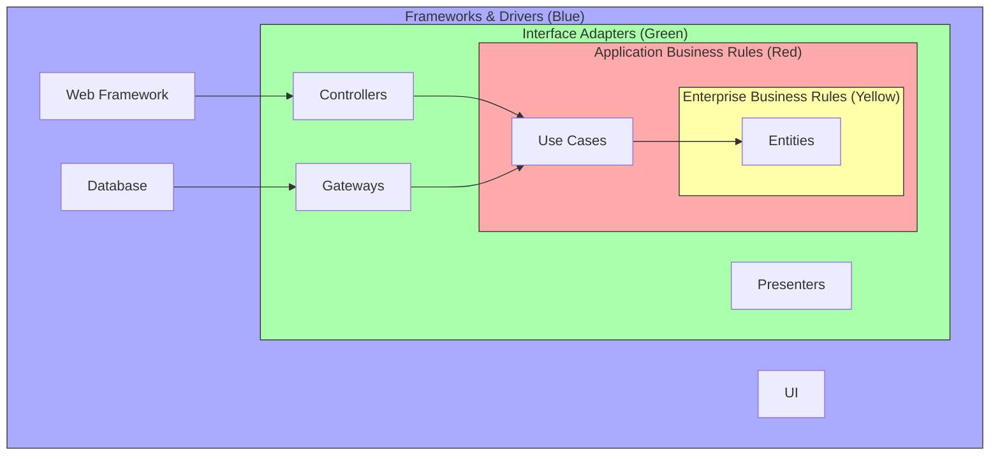

# 🧅 Clean Architecture (Чистая Архитектура)

## 📑 Содержание
1. [Основные принципы](#1-основные-принципы)
2. [Правило Зависимостей (The Dependency Rule)](#2-правило-зависимостей-the-dependency-rule)
3. [Слои (Circles)](#3-слои-circles)

---

## 1. 🧹 Основные принципы

**Clean Architecture** (придуманная Uncle Bob) — это способ организовать код так, чтобы он был:
1.  **Независим от фреймворков**: Фреймворк — это инструмент, а не образ жизни.
2.  **Тестируем**: Бизнес-логику можно проверить без UI, БД и сервера.
3.  **Независим от UI**: Веб-интерфейс можно легко заменить на консольный.
4.  **Независим от БД**: Можно поменять Oracle на Mongo, и бизнес-логика не заметит.

---

## 2. 🏹 Правило Зависимостей (The Dependency Rule)

> [!IMPORTANT]
> **Золотое правило**: Исходный код зависимостей может указывать только **ВНУТРЬ**, в сторону высокоуровневых политик.

Внутренние круги ничего не знают о внешних. Имена классов, функций, переменных из внешнего круга не должны упоминаться во внутреннем.

---

## 3. ⭕ Слои (Circles)

### 🟡 Entities (Сущности)
Самый внутренний слой.
*   Содержит **общие бизнес-правила**.
*   Это просто объекты (User, Loan) с методами.
*   Они меняются реже всего.

### 🔴 Use Cases (Сценарии использования)
Прикладная бизнес-логика.
*   Координирует поток данных (взять данные -> проверить -> сохранить).
*   **Пример**: `CreateUser`, `MakeTransfer`.
*   Не знает, *откуда* пришли данные (из веба или консоли).

### 🟢 Interface Adapters (Адаптеры интерфейсов)
Превращают данные из формата, удобного для Use Cases и Entities, в формат, удобный для внешнего мира (и наоборот).
*   **Пример**: SQL -> Объект User. JSON -> Объект Request.
*   Здесь живут Контроллеры, Презентеры, Шлюзы (Gateways).

### 🔵 Frameworks & Drivers (Фреймворки и Драйверы)
Самый внешний слой.
*   Здесь живут "грязные" детали: База данных, Веб-фреймворк, UI.
*   Тут пишется код, специфичный для конкретной технологии.