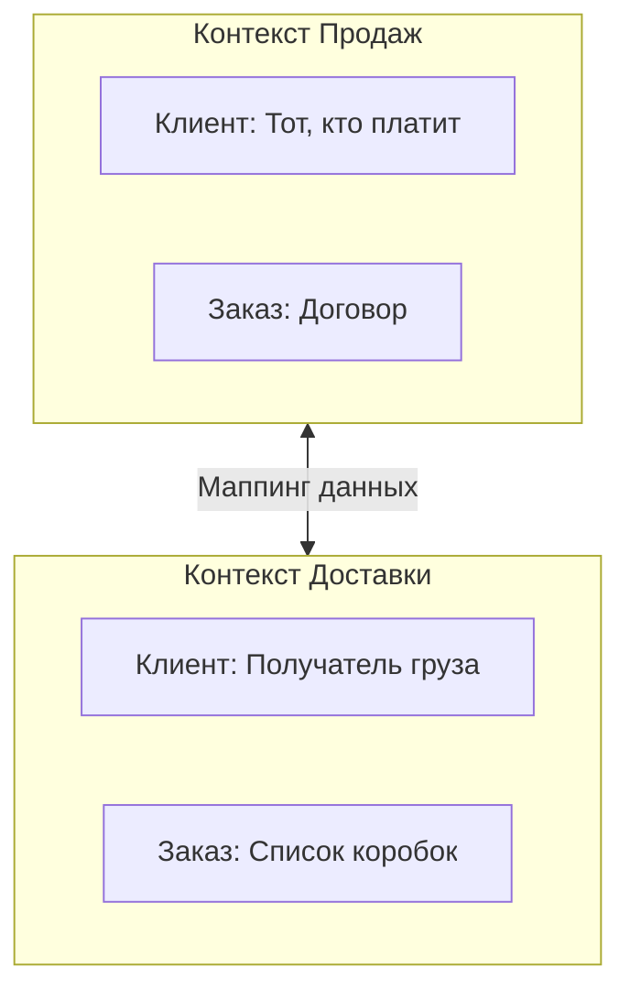

# 🌍 Domain Driven Design (Предметно-Ориентированное Проектирование)

## 📑 Содержание
1. [Что это и зачем?](#что-это-и-зачем)
2. [Стратегическое проектирование (Strategic Design)](#стратегическое-проектирование-strategic-design)
3. [Тактическое проектирование (Tactical Design)](#тактическое-проектирование-tactical-design)

---

## 1. 🤔 Что это и зачем?

**DDD (Domain-Driven Design)** — это подход к разработке сложного софта, где главное внимание уделяется не технологиям (БД, фреймворки), а **бизнесу** и его задачам (предметной области).

> [!NOTE]
> **Главная идея**: Разработчики и бизнес-эксперты должны говорить на одном языке и строить модель программы так, чтобы она отражала реальный бизнес.

---

## 2. 🗺️ Стратегическое проектирование (Strategic Design)

Это "вид сверху". Как разбить огромную систему на понятные куски.

### 🗣️ Ubiquitous Language (Единый язык)
Общий словарь терминов, который используют **ВСЕ**: разработчики, менеджеры, эксперты.

*   Если эксперт говорит "Списать бонусы", то в коде должен быть метод `DeductBonuses()`, а не `UpdateUserScore()`.
*   **Исключает недопонимание**: "Клиент" для отдела продаж и "Клиент" для логистики — это разные сущности.

### 🎁 Bounded Context (Ограниченный контекст)
Явная граница, внутри которой термины имеют конкретный смысл.



*   В **Продажах** "Товар" — это цена и описание.
*   На **Складе** "Товар" — это габариты и вес.
*   Не пытайтесь создать одну мега-модель "Товар" для всех. Лучше сделайте две разные модели в разных контекстах.

---

## 3. 🛠️ Тактическое проектирование (Tactical Design)

Это "вид изнутри". Как писать код внутри одного контекста.

### 🧬 Сущность (Entity)
Объект, у которого есть **уникальный ID**. Нам важно, *какой именно* это объект.

*   **Пример**: Человек, Заказ, Банковский счет.
*   Если у Ивана сменится имя, он останется тем же Иваном (ID тот же).

### 🏷️ Объект-Значение (Value Object)
Объект, который определяется только своими **атрибутами**. У него нет ID.

*   **Пример**: Деньги (100 руб), Координаты GPS, Адрес.
*   Нам не важно, *какая именно* это купюра в 100 рублей. Нам важен номинал.
*   **Иммутабельность**: Обязательно должны быть неизменяемыми.

### 📦 Агрегат (Aggregate)
Группа объектов (Сущностей и VO), которые живут и умирают вместе. Снаружи можно обращаться только к главному объекту — **Корню Агрегата (Aggregate Root)**.

```mermaid
graph TD
    Order[Заказ (ROOT)] --> Item1[Позиция 1]
    Order --> Item2[Позиция 2]
    Order --> Address[Адрес доставки]
    
    style Order fill:#f9f,stroke:#333,stroke-width:4px
```

> [!IMPORTANT]
> **Правило**: Вы не можете удалить "Позицию заказа" отдельно. Вы сохраняете и загружаете целиком "Заказ". Это гарантирует целостность данных.

### 🏭 Фабрика (Factory)
Создает сложные объекты или агрегаты. Инкапсулирует логику создания (`new Order(...)`).

### 🏛️ Репозиторий (Repository)
Абстракция для работы с коллекцией агрегатов. Притворяется, что все объекты лежат в памяти.
*   `Save(order)`
*   `GetById(id)`

НЕ должен содержать методы SQL типа `UpdateUserName`. Только работа с целым агрегатом.

### 🔌 Domain Service (Доменный сервис)
Когда действие не ложится ни на Сущность, ни на VO.
*   **Пример**: `PaymentService.Transfer(from, to, amount)`. Перевод денег затрагивает два счета, поэтому логика лежит в сервисе, а не внутри счета.

---

## 💡 Итог
DDD помогает бороться со сложностью в больших проектах, разбивая их на контексты и заставляя код говорить на языке бизнеса.