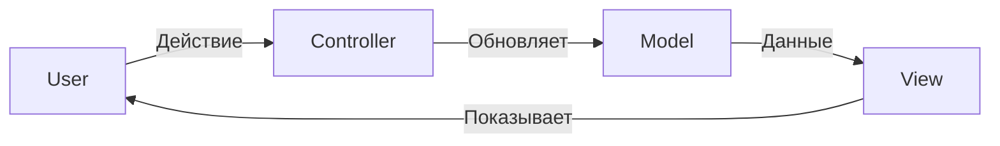

# 🎭 Другие архитектурные паттерны

## 📑 Содержание
1. [Паттерны UI (MVC, MVP, MVVM)](#1-паттерны-ui-mvc-mvp-mvvm)
2. [Паттерны работы с БД (Active Record, Data Mapper)](#2-паттерны-работы-с-бд-active-record-data-mapper)
3. [Разное (Lazy Load, Delegation)](#3-разное)

---

## 1. 🖼️ Паттерны UI (MVC, MVP, MVVM)

Как разделить "картинку" (UI) и логику?

### 🚦 MVC (Model - View - Controller)
Классика веба (особенно серверного, как Spring MVC, Django, Ruby on Rails).

*   **Model**: Данные и бизнес-логика.
*   **View**: Отображение (HTML страница).
*   **Controller**: Принимает ввод пользователя, обновляет модель.



### 🎤 MVP (Model - View - Presenter)
Часто в десктопных или старых Android приложениях.
*   **Presenter**: Посредник. View сама ничего не знает о Модели. Presenter берет данные из Модели и "кладет" их во View.

### 🧬 MVVM (Model - View - ViewModel)
Современный стандарт для фронтенда (React, Vue, Angular) и мобилок (WPF, Jetpack Compose).
*   **ViewModel**: Специальная модель именно для отображения.
*   **Data Binding**: Магия! Изменил переменную в коде — кнопка на экране сама перекрасилась.

| Паттерн | Кто главный? | Связь View и Model | Где популярен? |
| :--- | :--- | :--- | :--- |
| **MVC** | Controller | Часто прямая | Веб-бэкенд (SSR) |
| **MVP** | Presenter | Нет (через Presenter) | Android (old), Desktop |
| **MVVM** | ViewModel | Data Binding (Авто) | React, Vue, Mobile |

---

## 2. 🗄️ Паттерны работы с БД

Как подружить объекты в коде (OOP) и таблицы в базе (RDBMS)?

### 🏃 Active Record
Объект сам умеет себя сохранять.
*   **Пример**: `user.save()`, `user.delete()`.
*   **Где**: Ruby on Rails, Eloquent (Laravel).
*   **Плюсы**: Очень быстро писать простой код.
*   **Минусы**: Нарушает принцип единственной ответственности (SRP). Объект и данные хранит, и с базой общается.

### 🗺️ Data Mapper
Объект и База полностью разделены. Есть посредник (Mapper/Repository), который их дружит.
*   **Пример**: `repository.save(user)`.
*   **Где**: Hibernate (Java), TypeORM (Node), GORM (Go - частично).
*   **Плюсы**: Чистый код, бизнес-логика не зависит от базы.
*   **Минусы**: Больше кода писать.

```mermaid
graph TD
    subgraph AR ["Active Record"]
        Obj1[User Object\n+Save()\n+Delete()]
    end

    subgraph DM ["Data Mapper"]
        Obj2[User Entity\n(Только данные)]
        Mapper[Repository\n+Save(user)\n+Delete(user)]
        Mapper --> Obj2
    end
```

---

## 3. 🧩 Разное

### 💤 Lazy Load (Ленивая загрузка)
"Не грузи то, что не нужно".
*   **Пример**: Загрузили Пользователя, но его список Заказов (который может быть огромным) не грузим. Загрузим только тогда, когда в коде обратимся к `user.getOrders()`.

### 🤝 Delegation (Делегирование)
"Пусть сделает профессионал".
Объект не делает работу сам, а вызывает метод у другого объекта. Это основа паттерна Композиция.

### 📚 Registry (Реестр)
Глобальный объект (или Singleton), где хранятся настройки или сервисы, доступные всему приложению.
*   Сейчас считается анти-паттерном, лучше использовать **Dependency Injection**.