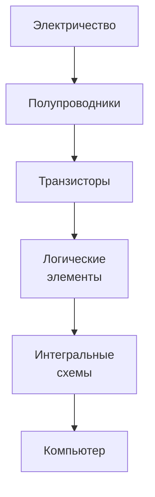
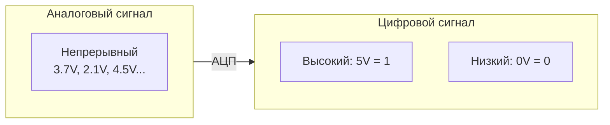
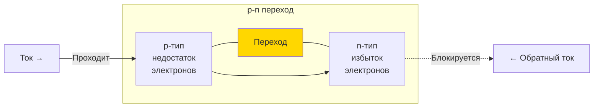
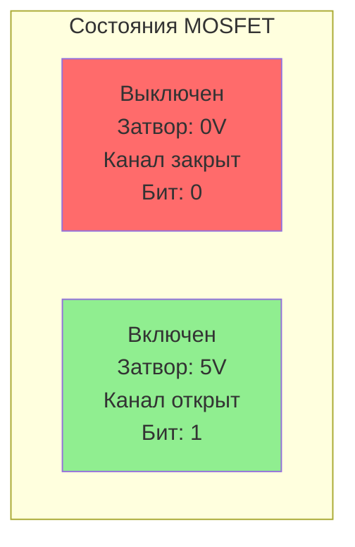
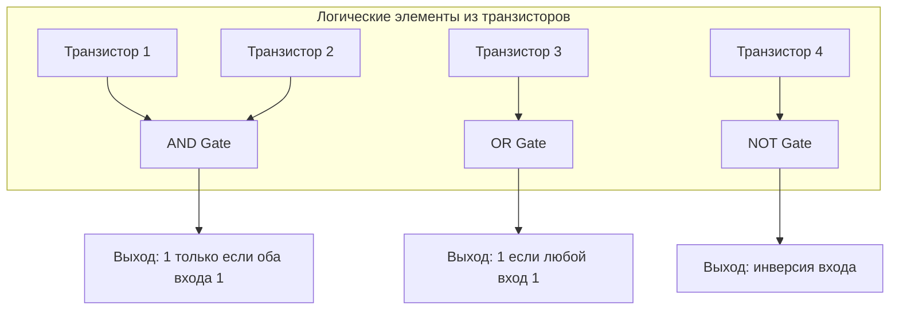
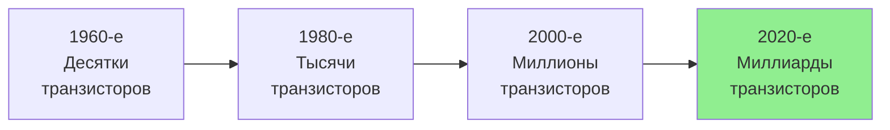
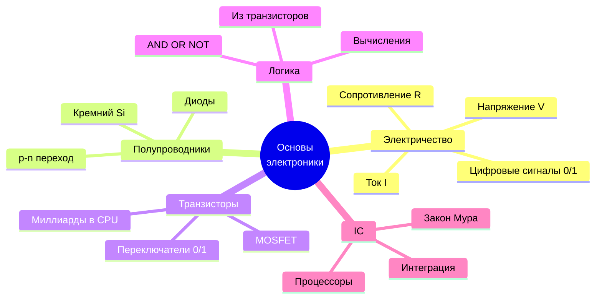

# ⚡ Основы электроники и физические принципы

## 📑 Содержание
1. [Электричество и сигналы](#1-электричество-и-сигналы)
2. [Полупроводники](#2-полупроводники)
3. [Транзисторы](#3-транзисторы)
4. [Логические элементы](#4-логические-элементы)
5. [Интегральные схемы](#5-интегральные-схемы)

---

Электроника лежит в основе работы компьютеров. Компьютеры используют электрические сигналы для обработки и передачи данных. Этот раздел объясняет, как электричество, полупроводники и транзисторы создают фундамент для цифровых систем.

```mermaid
graph TD
    Electricity[Электричество] --> Semiconductors[Полупроводники]
    Semiconductors --> Transistors[Транзисторы]
    Transistors --> Logic[Логические<br/>элементы]
    Logic --> IC[Интегральные<br/>схемы]
    IC --> Computer[Компьютер]
```

---

## 1. 🔌 Электричество и сигналы

Электричество — это движение электронов через проводник. В компьютерах оно используется для передачи сигналов.

### Основные понятия

- **Напряжение (V)**: Разность потенциалов, \"давление\", которое заставляет электроны двигаться (измеряется в вольтах)
- **Ток (I)**: Поток электронов (измеряется в амперах)
- **Сопротивление (R)**: Препятствие движению тока (измеряется в омах)

> [!NOTE]
> **Закон Ома**: V = I × R. Этот фундаментальный закон описывает связь между напряжением, током и сопротивлением.

### Цифровые сигналы

- Компьютеры используют **двоичные сигналы**: высокий уровень напряжения (обычно 5V или 3.3V) обозначает **1**, низкий (0V) — **0**
- **Аналоговые сигналы** (непрерывные) в компьютерах преобразуются в цифровые через **АЦП** (аналого-цифровой преобразователь)

```mermaid
graph LR
    subgraph Digital_Signal["Цифровой сигнал"]
        High[Высокий: 5V = 1]
        Low[Низкий: 0V = 0]
    end
    
    subgraph Analog_Signal["Аналоговый сигнал"]
        Continuous[Непрерывный<br/>3.7V, 2.1V, 4.5V...]
    end
    
    Analog_Signal -->|АЦП| Digital_Signal
```

> [!TIP]
> **Пример**: В USB напряжение 5V используется для питания устройств, а данные передаются через изменения напряжения (сигналы).

---

## 2. 🧪 Полупроводники

Полупроводники — материалы, которые могут проводить ток, но не так хорошо, как металлы. Они ключевые для электроники.

### Свойства

- Основной материал — **кремний** (Si), иногда германий (Ge)
- Проводимость регулируется добавлением примесей (**легирование**):
  - **n-тип**: Добавление атомов с лишними электронами (например, фосфор)
  - **p-тип**: Добавление атомов с недостатком электронов (например, бор)

### p-n переход

Соединение n-типа и p-типа создаёт **диод** — устройство, пропускающее ток только в одном направлении.

```mermaid
graph LR
    subgraph PN_Junction["p-n переход"]
        P[p-тип<br/>недостаток<br/>электронов] --- Junction[Переход] --- N[n-тип<br/>избыток<br/>электронов]
    end
    
    Current[Ток →] -->|Проходит| P
    P --> N
    N -.->|Блокируется| Reverse[← Обратный ток]
    
    style Junction fill:#FFD700
```

> [!NOTE]
> **Применение**: Диоды в блоке питания компьютера преобразуют переменный ток (AC) в постоянный (DC).

---

## 3. 🔳 Транзисторы

**Транзистор** — ключевой элемент компьютера, выполняющий функции переключателя или усилителя.

### Типы транзисторов

- **BJT** (биполярный): Управляется током
- **MOSFET** (полевой): Управляется напряжением, используется в большинстве современных процессоров

### Как работает MOSFET

- Имеет три вывода: **исток** (source), **сток** (drain), **затвор** (gate)
- Напряжение на затворе открывает или закрывает канал для тока между истоком и стоком
- В цифровых схемах транзистор либо \"включён\" (**1**), либо \"выключен\" (**0**)

```mermaid
graph TD
    subgraph MOSFET_States["Состояния MOSFET"]
        direction LR
        Off[Выключен<br/>Затвор: 0V<br/>Канал закрыт<br/>Бит: 0] 
        On[Включен<br/>Затвор: 5V<br/>Канал открыт<br/>Бит: 1]
    end
    
    style Off fill:#FF6B6B
    style On fill:#90EE90
```

### Роль в компьютерах

- Транзисторы формируют **логические элементы** (например, AND, OR, NOT)
- В одном процессоре (например, Intel Core) — миллиарды транзисторов

> [!IMPORTANT]
> В процессоре транзисторы переключаются **миллиарды раз в секунду**, выполняя вычисления. Это основа всех современных компьютеров.

---

## 4. 🧩 Логические элементы

Логические элементы — это комбинации транзисторов, выполняющие базовые логические операции.

### Основные элементы

| Элемент | Описание | Правда, если... |
|:---|:---|:---|
| **AND** | Логическое И | Все входы 1 |
| **OR** | Логическое ИЛИ | Хотя бы один вход 1 |
| **NOT** | Логическое НЕ | Инвертирует вход (0 → 1, 1 → 0) |
| **NAND** | НЕ-И | Не все входы 1 |
| **NOR** | НЕ-ИЛИ | Все входы 0 |
| **XOR** | Исключающее ИЛИ | Только один вход 1 |

```mermaid
graph TD
    subgraph Logic_Gates["Логические элементы из транзисторов"]
        T1[Транзистор 1] --> AND
        T2[Транзистор 2] --> AND
        T3[Транзистор 3] --> OR
        T4[Транзистор 4] --> NOT
    end
    
    AND[AND Gate] --> Output1[Выход: 1 только если оба входа 1]
    OR[OR Gate] --> Output2[Выход: 1 если любой вход 1]
    NOT[NOT Gate] --> Output3[Выход: инверсия входа]
```

> [!TIP]
> **Пример**: Элемент XOR используется в сумматорах для сложения двоичных чисел.

---

## 5. 🏗️ Интегральные схемы

**Интегральная схема (IC)** — множество транзисторов и других компонентов на одном кристалле кремния.

### Типы

- **Аналоговые**: Усилители, фильтры
- **Цифровые**: Процессоры, память
- **Смешанные**: Например, АЦП

### Эволюция (Закон Мура)

```mermaid
graph LR
    Y1960[1960-е<br/>Десятки<br/>транзисторов] --> Y1980[1980-е<br/>Тысячи<br/>транзисторов]
    Y1980 --> Y2000[2000-е<br/>Миллионы<br/>транзисторов]
    Y2000 --> Y2020[2020-е<br/>Миллиарды<br/>транзисторов]
    
    style Y2020 fill:#90EE90
```

> [!NOTE]
> **Закон Мура**: Количество транзисторов на чипе удваивается примерно каждые 2 года. Хотя сейчас этот закон замедляется, он определял развитие компьютеров десятилетиями.

### Примеры

- **Микропроцессор**: Содержит ALU, регистры, управляющие блоки
- **Память**: DRAM, SRAM, Flash

> [!IMPORTANT]
> Процессор Intel Core i9 — это интегральная схема с ~10 млрд транзисторов на кристалле размером с ноготь!

---

## 🎯 Ключевые выводы

```mermaid
mindmap
  root((Основы<br/>электроники))
    Электричество
      Напряжение V
      Ток I
      Сопротивление R
      Цифровые сигналы 0/1
    Полупроводники
      Кремний Si
      p-n переход
      Диоды
    Транзисторы
      MOSFET
      Переключатели 0/1
      Миллиарды в CPU
    Логика
      AND OR NOT
      Из транзисторов
      Вычисления
    IC
      Интеграция
      Закон Мура
      Процессоры
```

- Электричество передаёт сигналы, которые компьютеры интерпретируют как **0** и **1**
- Полупроводники (кремний) и p-n переходы — основа диодов и транзисторов
- Транзисторы — переключатели, из которых строятся логические элементы
- Логические элементы формируют интегральные схемы, такие как процессоры
- Всё это — физическая основа для работы компьютера
