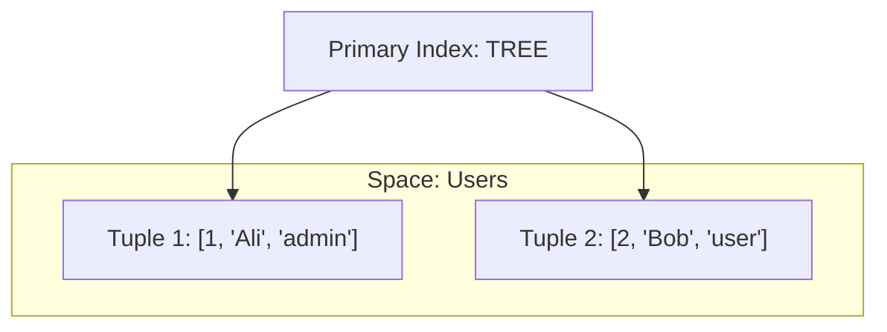

# 🕷️ Tarantool

## 📑 Содержание
1. [Что это? (DB + App Server)](#что-это-db--app-server)
2. [Структура данных (Tuple & Space)](#структура-данных-tuple--space)
3. [Движки (Memtx vs Vinyl)](#движки-memtx-vs-vinyl)
4. [Lua и Бизнес-логика](#lua-и-бизнес-логика)

---

## 1. 🤔 Что это? (DB + App Server)

**Tarantool** — это не просто база данных (как Redis), и не просто сервер приложений (как Node.js). Это **два в одном**.
Это In-Memory NoSQL база данных, к которой прикрутили полноценный язык программирования **Lua**.

> [!NOTE]
> **Главная фишка**: Вы можете писать бизнес-логику (хранимые процедуры) прямо *внутри* базы данных. Данные лежат в той же оперативной памяти, где крутится ваш код.
> **Результат**: Нулевые задержки на сеть (Network Overhead = 0).

---

## 2. 📦 Структура данных (Tuple & Space)

Tarantool не использует таблицы (как SQL) или ключи-значения (как Redis). Он использует **Space** и **Tuple**.

### 🌌 Space (Пространство)
Аналог **Таблицы** в SQL или Коллекции в MongoDB.

### 🍱 Tuple (Кортеж)
Аналог **Строки**. Это просто массив произвольной длины.
*   Пример: `[1, "Ivan", 25, "active"]`
*   В отличие от JSON (MongoDB), тут нет названий полей, только индексы (0, 1, 2...). Но можно настроить "Формат", чтобы обращаться по именам.



---

## 3. ⚙️ Движки (Memtx vs Vinyl)

Как и в MySQL (InnoDB/MyISAM), в Tarantool есть движки.

### 🚀 Memtx (In-Memory)
*   Все данные живут в **RAM** (оперативке).
*   Максимальная скорость.
*   Snapshots (снимки) и XLOG (логи транзакций) пишутся на диск для надежности.

### 💾 Vinyl (On-Disk)
*   Данные живут на **Диске** (HDD/SSD).
*   Используется LSM-Tree (Log-Structured Merge Tree).
*   Подходит, если данных больше, чем оперативки.

---

## 4. 🌙 Lua и Бизнес-логика

Вместо того чтобы делать `SELECT` из приложения в базу, вы пишете функцию на Lua внутри Tarantool.

**Пример (псевдокод):**
```lua
function transfer_money(from_id, to_id, amount)
    box.begin() -- Старт транзакции
    
    local sender = box.space.users:get(from_id)
    local receiver = box.space.users:get(to_id)
    
    if sender.balance < amount then
        box.rollback()
        return error("No money")
    end
    
    box.space.users:update(from_id, {{'-', 'balance', amount}})
    box.space.users:update(to_id, {{'+', 'balance', amount}})
    
    box.commit()
end
```

Приложение просто вызывает: `call transfer_money(1, 2, 100)`.

---

## 💡 Итог
Используйте Tarantool, когда вам нужен **Highload** и сложная логика обработки данных в реальном времени (биллинг, сессии, игровые механики).